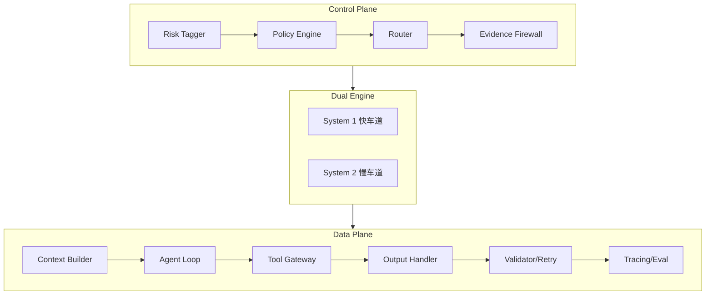

# AI Talk

个人 AI 学习笔记项目，记录 LLM 应用架构设计与开发实践。

## 内容

### 学习笔记 (`notes/`)

| 目录                  | 内容                        | 链接                                |
| --------------------- | --------------------------- | ----------------------------------- |
| `architecture/`       | LLM 应用架构设计            | [查看](./notes/architecture/)       |
| `claude-code/`        | Claude Code 完整使用指南    | [查看](./notes/claude-code/)        |
| `antigravity/`        | Google Antigravity 使用指南 | [查看](./notes/antigravity/)        |
| `ai-fundamentals/`    | AI 基础知识                 | [查看](./notes/ai-fundamentals/)    |
| `prompt-engineering/` | 提示工程                    | [查看](./notes/prompt-engineering/) |
| `tools-and-apis/`     | 工具与 API                  | [查看](./notes/tools-and-apis/)     |
| `project-meta/`       | 项目规划                    | [查看](./notes/project-meta/)       |

### 其他资源

| 目录        | 内容                 |
| ----------- | -------------------- |
| `library/`  | 论文、教程、参考资料 |
| `prompts/`  | Prompt 模板收集      |
| `sessions/` | 对话记录存档         |

## 快速导航

### AI 编程助手指南

- 📘 [Claude Code 完整指南](./notes/claude-code/) - Anthropic 终端 AI 助手
- 📗 [Google Antigravity 指南](./notes/antigravity/) - Google Agent-First IDE

### 架构设计

- 🏗️ [LLM 应用架构](./notes/architecture/) - 双引擎分层架构设计

## 架构设计

学习和设计中的 LLM 应用架构（双引擎分层）：

详见 [架构设计笔记](./notes/architecture/)

## 推荐阅读

- [Claude Code 完整使用指南](./notes/claude-code/)
- [Google Antigravity 使用指南](./notes/antigravity/)
