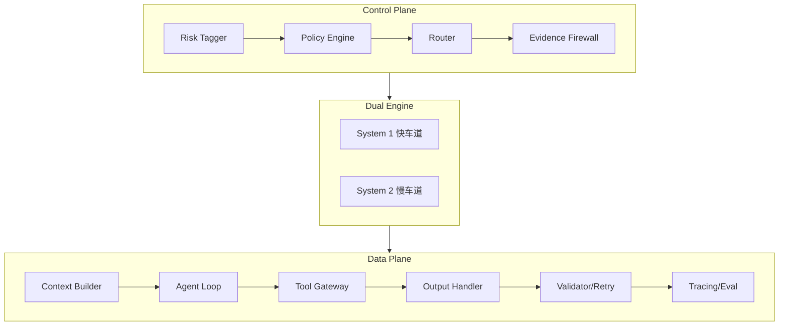

# AI Talk

个人 AI 学习笔记项目，记录 LLM 应用架构设计与开发实践。

## 内容

### 学习笔记 (`notes/`)

| 目录 | 内容 |
|------|------|
| `architecture/` | LLM 应用架构设计 |
| `claude-code/` | Claude Code 使用指南 |
| `ai-fundamentals/` | AI 基础知识 |
| `prompt-engineering/` | 提示工程 |
| `tools-and-apis/` | 工具与 API |
| `project-meta/` | 项目规划 |

### 其他资源

- `library/` - 论文、教程、参考资料
- `prompts/` - Prompt 模板收集
- `sessions/` - 对话记录存档

## 架构设计

学习和设计中的 LLM 应用架构（双引擎分层）：

详见 [架构设计笔记](./notes/architecture/)

## 推荐阅读

- [Claude Code 完整使用指南](./notes/claude-code/)
