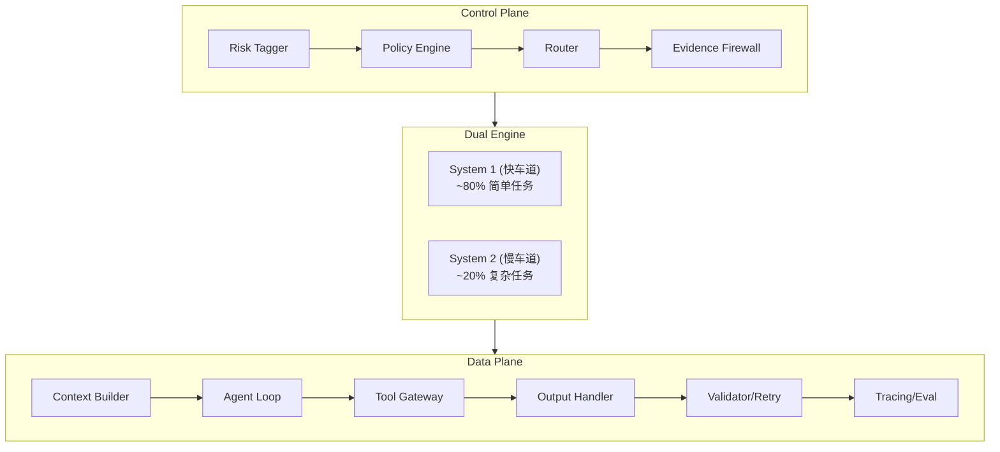

# AI Talk

AI 对话学习项目，专注于 LLM 应用架构设计与实践。

## 项目状态

当前处于**架构设计阶段**，文档和设计已完成，代码实现待开发。

## 技术栈

- **运行时**: Node.js
- **API**: OpenAI / Gemini
- **代码格式化**: Prettier

## 架构设计

项目采用"双引擎"分层架构：



- **System 1 (快车道)**: 处理简单任务（问答、基础查询）
- **System 2 (慢车道)**: 处理复杂任务（代码分析、深度推理）

详细设计见 `notes/architecture/`

## 目录结构

```
ai-talk/
├── notes/                  # 学习笔记
│   ├── architecture/       # 系统架构设计
│   ├── claude-code/        # Claude Code 使用指南
│   ├── ai-fundamentals/    # AI 基础知识
│   ├── prompt-engineering/ # 提示工程
│   ├── project-meta/       # 项目分析与规划
│   └── tools-and-apis/     # 工具与 API
├── library/                # 外部资料（论文、教程）
├── prompts/                # Prompt 模板
│   ├── system/             # 系统提示词
│   └── user/               # 用户提示词
├── sessions/               # 对话记录（按日期归档）
├── docs/                   # 项目文档
├── CLAUDE.md               # Claude Code 项目配置
└── .env.example            # 环境变量模板
```

## 快速开始

```bash
# 克隆仓库
git clone <repository-url>
cd ai-talk

# 安装依赖
npm install

# 配置环境变量
cp .env.example .env
# 编辑 .env 填入 API Key

# 格式化代码
npx prettier --write .
```

## 环境变量

| 变量 | 说明 |
|------|------|
| `OPENAI_API_KEY` | OpenAI API 密钥 |
| `GEMINI_API_KEY` | Google Gemini API 密钥 |

## 相关资源

- [Claude Code 使用指南](./notes/claude-code/README.md)
- [架构设计文档](./notes/architecture/)
