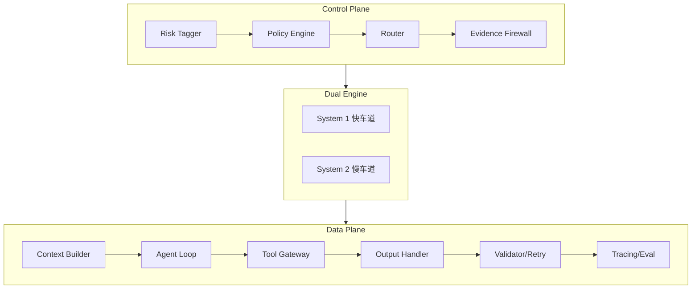

<!--
- [INPUT]: 依赖 /CLAUDE.md 的模块定位与索引
- [OUTPUT]: 输出本文件内容
- [POS]: 位于 项目根目录 的文档
- [PROTOCOL]: 变更时更新此头部，然后检查 CLAUDE.md
-->

# AI Talk

个人 AI 学习笔记项目，记录 LLM 应用架构设计与开发实践。

## 📖 文档站点

- **在线文档**: https://exposir.github.io/ai-talk/
- **完整目录**: [查看全部文档](./notes/guide/index.md)
- **项目规范**: [规范与最佳实践](./notes/project-meta/project-standards.md)
- **GEB 文档协议**: [分形文档系统](./notes/guide/geb-protocol-explained.md)

---

## 🚀 快速导航

### AI 编程助手

| 工具               | 说明                   | 文档                             |
| ------------------ | ---------------------- | -------------------------------- |
| 📘 **Claude Code** | Anthropic 终端 AI 助手 | [完整指南](./notes/claude-code/) |
| 📗 **Antigravity** | Google Agent-First IDE | [完整指南](./notes/antigravity/) |

### AI 资源

| 主题            | 说明                      | 文档                                                  |
| --------------- | ------------------------- | ----------------------------------------------------- |
| 🤖 **AI 模型**  | 业内最新 LLM 和多模态模型 | [模型汇总](./notes/ai-fundamentals/ai-models.md)      |
| 🔧 **开发工具** | AI 编程助手与开发工具     | [工具汇总](./notes/tools-and-apis/ai-coding-tools.md) |
| 🏗️ **架构设计** | LLM 应用双引擎分层架构    | [架构笔记](./notes/architecture/)                     |
| 🧩 **前端工程** | 下一代状态管理系统        | [奇点文档](./notes/frontend/singularity/README.md)   |
| 📚 **案例研究** | 优秀项目工程实践分析      | [Telegram 等](./notes/case-studies/)                  |
| 📰 **新闻观察** | 每日新闻总结与趋势分析    | [新闻汇总](./notes/news/daily-news.md)               |

Telegram 深入阅读：

- [服务端架构](./notes/case-studies/telegram/server-architecture.md)
- [安全模型](./notes/case-studies/telegram/security.md)
- [性能优化](./notes/case-studies/telegram/optimization.md)

---

## 📁 项目结构

```
ai-talk/
├── notes/                    # 学习笔记
│   ├── index.md              # 📑 文档目录
│   ├── claude-code/          # Claude Code 指南
│   ├── antigravity/          # Antigravity 指南
│   ├── architecture/         # 架构设计
│   ├── case-studies/         # 工程案例研究
│   ├── ai-fundamentals/      # AI 基础知识
│   ├── news/                 # 每日新闻总结
│   ├── tools-and-apis/       # 工具与 API
│   └── project-meta/         # 项目规划
├── docs/                     # VitePress 文档与配置
│   └── claude.zh-cn.md        # Claude 中文说明
├── library/                  # 论文、教程、参考资料
├── prompts/                  # Prompt 模板收集
└── sessions/                 # 对话记录存档
```

---

## 🏗️ 架构设计

学习和设计中的 LLM 应用架构（双引擎分层）：



详见 [架构设计笔记](./notes/architecture/)

---

## 🛠️ 本地开发

```bash
# 安装依赖
npm install

# 启动文档站点
npm run docs:dev

# 构建生产版本
npm run docs:build
```

---

## 📄 License

MIT
