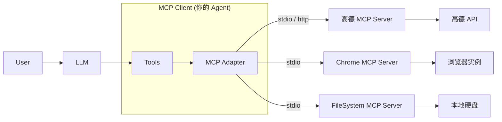

<!--
- [INPUT]: 依赖 @modelcontextprotocol/sdk, 外部 MCP Server (高德/Chrome)
- [OUTPUT]: 讲解如何接入和复用现有的 MCP Server
- [POS]: ai-agent-fullstack-course 的第 5 章
- [PROTOCOL]: 变更时更新此头部，然后检查 CLAUDE.md
-->

# 第 5 章: 高德 MCP + 浏览器 MCP：复用别人的 MCP Server 有多爽！

> **"不要重复造轮子。"** —— MCP 协议的最大价值在于生态复用。

上节我们学习了 MCP 的基础，了解了它如何通过标准协议打破进程边界。这就带来了一个巨大的好处：**任何人开发的 MCP
Server，你的 Agent 都可以直接经拿来用！**

本章我们将不再苦哈哈地手写 Tool，而是直接"借用"社区现成的 MCP
Server，瞬间赋予 Agent 强大的能力。

## 1. MCP 生态的魅力

想象一下，如果有大神分别实现了以下 MCP Server：

- **GitHub MCP**: 管理仓库、提 PR。
- **Postgres MCP**: 可以在数据库执行 SQL。
- **Slack MCP**: 发送消息通知。

你的 Agent 只需要实现一个 **MCP
Client**，就能同时拥有上述所有能力，而不需要你读懂它们底层的 SDK 文档。

架构上，MCP Client (你的 Agent) 通过标准协议连接各种 MCP
Server。这意味着你只需要关注业务逻辑，底层的"如何调用浏览器"、"如何调用高德地图"等复杂实现，全部交给现成的 MCP
Server 处理。

## 2. 实战目标：接入"三大金刚"

本节我们将演示如何在 LangChain 中接入以下三个强力 Server：

1.  **高德地图 (Gaode MCP)**
    - **能力**: 位置查询、POI 搜索、路线规划。
    - **前提**: 需要去高德开放平台申请一个 Web 服务类型的 API Key。
2.  **Chrome DevTools MCP**
    - **能力**: 控制浏览器、点击元素、截图、提取数据。
3.  **FileSystem MCP**
    - **能力**: 标准的文件读写、目录创建。

## 3. 接入方式

### 3.1 架构流程



### 3.2 核心代码逻辑 (LangChain 示例)

在 LangChain 中接入一个现成的 MCP Server 非常简单（伪代码示例）：

```javascript
import { MCPClient } from '@modelcontextprotocol/sdk';

// 1. 定义连接配置
const gaodeServer = {
  command: 'node',
  args: ['./path/to/gaode-mcp-server.js'],
  env: { AMAP_KEY: 'your_api_key' },
};

// 2. 初始化 Client
const client = new MCPClient(gaodeServer);
await client.connect();

// 3. 将 MCP Tools 转换为 LangChain Tools
const tools = await client.getLangChainTools();

// 4. 传给 LLM
const agent = await createReactAgent({
  llm: model,
  tools: tools,
});

// 5. Enjoy!
// 用户问："查一下北京天气，然后导航到天安门"
// Agent 会自动调用高德 MCP 工具
```

## 4. 为什么这很"爽"？

1.  **零代码封装**: 你不需要写任何 `http.get('https://restapi.amap.com/...')`
    的代码。
2.  **标准化接口**: 所有的 MCP Server 暴露给 LLM 的格式都是统一的。
3.  **解耦**: 高德 MCP
    Server 更新了新功能（比如支持了打车），你的 Agent 不需要改一行代码，重启就能用到新 Tool。

---

> 下一章，我们将深入代码，亲手编写一个连接 LangChain 与 MCP Server 的完整实例。
