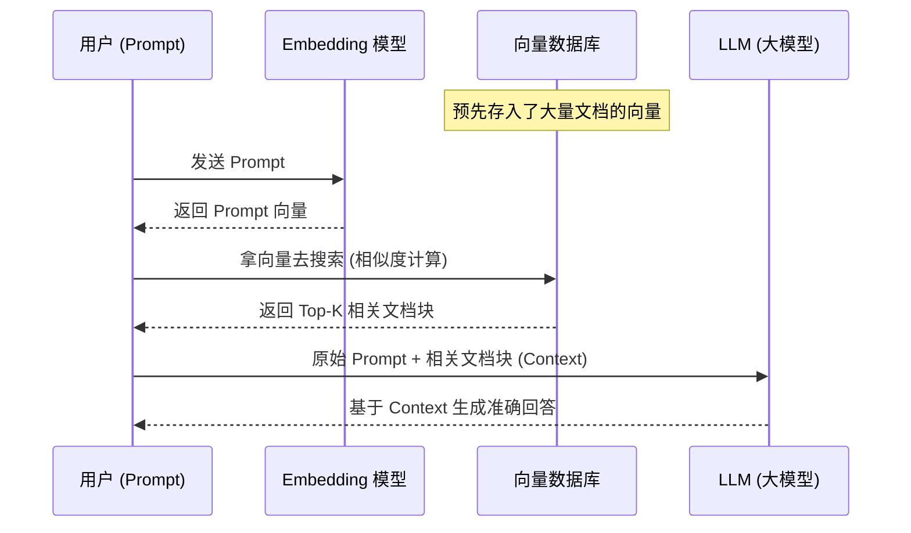

<!--
- [INPUT]: 依赖 Embedding Model 概念, 向量数据库概念
- [OUTPUT]: 讲解 RAG 原理、向量搜索、余弦相似度与 Embedding
- [POS]: ai-agent-fullstack-course 的第 6 章
- [PROTOCOL]: 变更时更新此头部，然后检查 CLAUDE.md
-->

# 第 6 章: RAG 实战 (一) - 向量化与语义搜索原理

> **"RAG 就是让大模型带着参考答案去考试。"**

## 1. 为什么需要 RAG？

大模型（LLM）的知识主要来源于训练时的公开数据集。对于训练截止时间之后发生的新闻，或者企业内部的私有文档，它是完全不知道的。

如果你强行问它，它往往不会说"我不知道"，而是可能会一本正经地胡说八道——这就是**幻觉 (Hallucination)**。

解决幻觉最直观的思路：
**用户提问 -> 先去内部知识库查相关资料 -> 把资料贴到 Prompt 里 -> 让 LLM 根据资料回答。**

这就是 **RAG (Retrieval-Augmented Generation，检索增强生成)**。

## 2. 核心难题：怎么"查"？

假设用户搜："水果的信息"。知识库里有关于"苹果"、"香蕉"、"草莓"的文档。

- **关键词搜索 (Keyword
  Search)**: 如果文档里刚好有"水果"这个词，能搜到。主要靠字面匹配。
- **语义搜索 (Semantic
  Search)**: 就算文档里没出现"水果"二字，但"苹果"和"水果"在语义上强相关，也应该被搜出来。

要实现语义搜索，我们需要**向量 (Vector)**。

## 3. 什么是向量？(Fruit vs Stone)

想象我们用两个维度来描述物体：

1.  **可食用性 (Edibility)** (0=无, 1=高)
2.  **硬度 (Hardness)** (0=软/流体, 1=硬)

我们可以把概念映射为二维向量：

- **香蕉**: `[0.9, 0.1]` (高食用性, 非常软)
- **苹果**: `[0.9, 0.5]` (高食用性, 硬度适中)
- **水果**: `[0.9, 0.3]` (泛指，硬度居中)
- **石头**: `[0.1, 0.9]` (不可食用, 极其硬)

我们把它们画在坐标系里：

```mermaid
xychart-beta
    title "物体在语义空间的位置 (示意图)"
    x-axis "硬度 (Hardness)" 0 --> 1
    y-axis "食用性 (Edibility)" 0 --> 1
    point [0.1, 0.9] "香蕉"
    point [0.5, 0.9] "苹果"
    point [0.3, 0.9] "水果"
    point [0.9, 0.1] "石头"
```

_(注：Mermaid xychart 仅作示意，真实向量需通过角度体现相似性)_

**直观结论**："苹果"、"香蕉"、"水果"这三个点靠得很近（夹角小）。而"石头"离它们很远（夹角大）。

### 余弦相似度 (Cosine Similarity)

在数学上，我们计算两个向量夹角的余弦值来判断相似度。

- 夹角越小 -> 余弦值越接近 1 -> **语义越相关**。
- 夹角越大 -> 余弦值越接近 -1 -> **语义越相反**。

虽然真实的 Embedding 向量可能有 768 维甚至 1536 维，人类无法想象高维空间，但原理是一样的：**计算向量的距离/夹角**。

## 4. Embedding Model：万物皆向量

这串数字 `[0.9, 0.5, ...]` 怎么来的？我们需要专门的模型：**嵌入模型 (Embedding
Model)**。

它不同于 LLM（负责生成文本），Embedding
Model 的唯一任务就是：**把输入（文本/图片/音频）压缩成一串向量**。

> **注意**：调用 Embedding Model 通常比 LLM 便宜非常多，甚至快得多。

```mermaid
graph LR
    Input[文本: "苹果"] --> EmbedModel[Embedding Model]
    EmbedModel -- "[0.01, 0.53, -0.21...]" --> Vector[向量]
```

## 5. 完整的 RAG 流程

加上向量化之后，现代 RAG 的标准流程如下：



1.  **数据入库 (Indexing)**: 把知识库文档通过 Embedding
    Model 转成向量，存入向量数据库 (Vector DB)。同时记录向量对应的原始文本。
2.  **检索 (Retrieval)**: 把用户的问题也转成向量，去 Vector
    DB 里找"最像"的那些向量。
3.  **生成 (Generation)**: 把找到的文档原文捞出来，作为上下文喂给 LLM。

---

**下一章预告**：知道了原理，我们将使用 **LangChain + 向量数据库**
亲手写一个 RAG 助手，让它回答我们私有文档里的问题！
