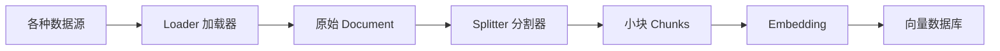

<!--
- [INPUT]: 依赖 LangChain Loaders & Splitters 概念
- [OUTPUT]: 讲解如何从不同数据源加载文档并进行切分
- [POS]: ai-agent-fullstack-course 的第 7 章
- [PROTOCOL]: 变更时更新此头部，然后检查 CLAUDE.md
-->

# 第 7 章: RAG 实战 (二) - 加载器 (Loader) 与 分割器 (Splitter)

> **"数据进入大模型的第一步：切碎它，消化它。"**

## 1. 从 "手搓数据" 到 "工业级处理"

在上一章的原理演示中，我们通常手动创建 `Document` 对象：

```javascript
const documents = [
  new Document({
    pageContent: '光光和东东是好朋友...',
    metadata: { char: '光光' },
  }),
];
```

但现实世界的数据不是现成的 JS 对象，它们散落在：

- 📄 **文件**: PDF, Word, Excel, Markdown
- 🌐 **网络**: 网页 URL, API 响应
- 📺 **媒体**: YouTube 视频字幕, 音频转录
- 💼 **应用**: Notion, Slack, Twitter

要处理这些数据，我们需要引入 RAG 流程中的 **ETL (Extract, Transform, Load)**
环节。



## 2. Document Loaders (加载器)

**Loader 的职责**：把各种奇怪格式的数据，统一转成标准的 `Document` 对象 (text +
metadata)。

LangChain 提供了超过 180+ 种 Loader，几乎覆盖了你能想到的所有数据源。

### 常用 Loader 举例

- **PDFLoader**:还在为解析 PDF 头秃？一行代码搞定。
- **WebBaseLoader**: 爬取网页内容，自动去除 HTML 标签噪声。
- **YoutubeLoader**: 直接提取视频字幕作为文档。
- **NotionLoader**: 同步你 Notion 笔记里的知识库。

```javascript
// 伪代码示例：加载一个 PDF
import { PDFLoader } from 'langchain/document_loaders/fs/pdf';

const loader = new PDFLoader('path/to/manual.pdf');
const docs = await loader.load();
// 返回: Document { pageContent: "...", metadata: { source: "...", page: 1 } }
```

## 3. Text Splitters (分割器)

**Splitter 的职责**：把一个长文档切成适合模型处理的小块 (Chunk)。

### 为什么要切分？

1.  **Token 限制**: Embedding 模型和大模型都有最大 Context 窗口限制（如 8k,
    32k）。直接塞一整本书会报错。
2.  **语义精度**: 如果把整本书变成一个向量，语义会被稀释得非常模糊。变成小块后，搜索 "东东是谁" 能精准定位到描写东东的那一段，而不是整本书。

### 核心参数

- **Chunk Size**: 每个块的大小（比如 1000 个字符）。
- **Chunk Overlap**: 相邻块之间的重叠量（比如 200 个字符）。
  - _为什么要有重叠？_ 防止关键信息刚好被切刀在中间切断，导致语义丢失。

```mermaid
graph TD
    Raw[原始长文档: "A B C D E F G H I ..."]

    subgraph "Chunk Overlap = 1"
    C1[Chunk 1: "A B C"]
    C2[Chunk 2:   "C D E"]
    C3[Chunk 3:     "E F G"]
    end

    Raw --> C1
    Raw --> C2
    Raw --> C3

    style C1 fill:#f9f,stroke:#333
    style C2 fill:#bbf,stroke:#333
    style C3 fill:#bfb,stroke:#333
```

### 常用 Splitter

- **CharacterTextSplitter**: 最简单，按字符数硬切。
- **RecursiveCharacterTextSplitter (推荐)**: 智能切分。优先按段落 `\n\n`
  切，不够再按行 `\n` 切，还不够再按句子 `.` 切。尽可能保持语义完整性。

```javascript
import { RecursiveCharacterTextSplitter } from 'langchain/text_splitter';

const splitter = new RecursiveCharacterTextSplitter({
  chunkSize: 1000,
  chunkOverlap: 200,
});

const splitDocs = await splitter.splitDocuments(docs);
// 原本 1 个大 PDF 文档 -> 变成了 100 个小切片文档
```

## 4. 实战预告

理论知识已经齐备：

- 第 4-5 章：工具调用 (Tool/MCP)
- 第 6 章：向量原理
- 第 7 章：数据处理 (Loader/Splitter)

下一章，我们将把这些积木搭起来，**从零开始写代码**，跑通一个完整的 "RAG 知识库问答" 流程！我们将加载一份真实的 Markdown 教程，切分、向量化，并构建一个能回答相关问题的 AI 助手。
