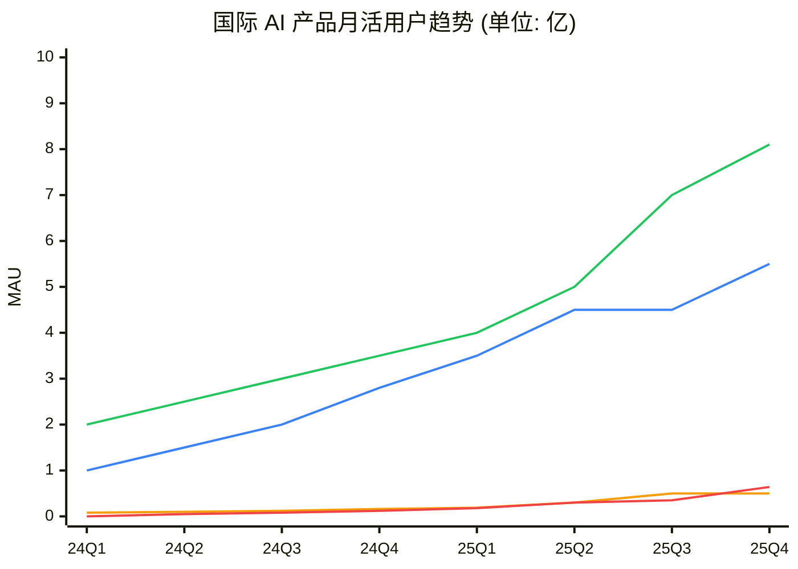
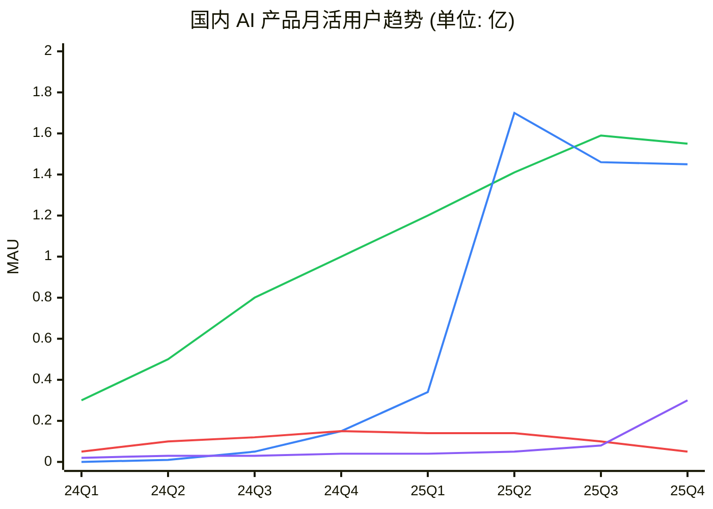

# AI 模型汇总

业内最新大语言模型（LLM）和多模态模型完整指南。

---

## 🌐 国际闭源模型

### OpenAI

OpenAI 是 LLM 领域的先驱，其 GPT 系列和推理模型 o 系列处于行业领先地位。

| 模型            | 发布时间 | 参数/架构 | 核心特点                                    | 上下文长度 | 定价 (输入/输出)          |
| --------------- | -------- | --------- | ------------------------------------------- | ---------- | ------------------------- |
| **GPT-5**       | 2025.8   | 未公开    | 多模态统一推理，幻觉大幅降低，内置思考能力  | 256K       | $15/$60 per 1M tokens     |
| **o3**          | 2025.4   | 推理模型  | System 2 深度推理，复杂问题求解，自我纠错   | 200K       | $20/$80 per 1M tokens     |
| **o3-mini**     | 2025.1   | 推理模型  | 轻量推理，3档推理强度可调，STEM 优化        | 128K       | $1.10/$4.40 per 1M tokens |
| **o4-mini**     | 2025.4   | 推理模型  | 新一代轻量推理，性价比最优                  | 128K       | $1.50/$6 per 1M tokens    |
| **GPT-4o**      | 2024.5   | 多模态    | 原生多模态（文本/图像/音频/视频），实时交互 | 128K       | $2.50/$10 per 1M tokens   |
| **GPT-4o-mini** | 2024.7   | 多模态    | 轻量版 GPT-4o，日常任务首选                 | 128K       | $0.15/$0.60 per 1M tokens |

**推荐用途**：

- 复杂推理 → o3/o3-mini
- 多模态任务 → GPT-4o/GPT-5
- 日常对话 → GPT-4o-mini

📎 **链接**：

| 类型        | 地址                                                 |
| ----------- | ---------------------------------------------------- |
| 官网        | [openai.com](https://openai.com)                     |
| API 平台    | [platform.openai.com](https://platform.openai.com)   |
| GitHub      | [github.com/openai](https://github.com/openai)       |
| 社区论坛    | [community.openai.com](https://community.openai.com) |
| Discord     | [discord.gg/openai](https://discord.gg/openai)       |
| X (Twitter) | [@OpenAI](https://x.com/OpenAI)                      |

---

### Anthropic

Anthropic 以安全性和可靠性著称，Claude 系列在编码和长文本处理方面表现卓越。

| 模型                  | 发布时间 | 核心特点                             | 上下文长度 | 定价 (输入/输出)       |
| --------------------- | -------- | ------------------------------------ | ---------- | ---------------------- |
| **Claude Opus 4.5**   | 2025.11  | 最强推理，混合推理模式，复杂代码项目 | 200K       | $15/$75 per 1M tokens  |
| **Claude Sonnet 4.5** | 2025.9   | 平衡性能与成本，Agent 和编码首选     | 200K       | $3/$15 per 1M tokens   |
| **Claude Opus 4**     | 2025.5   | 扩展思考，工具调用，记忆文件管理     | 200K       | $15/$75 per 1M tokens  |
| **Claude Sonnet 4**   | 2025.5   | 日常旗舰，低幻觉，编码能力强         | 200K       | $3/$15 per 1M tokens   |
| **Claude 3.5 Sonnet** | 2024.6   | 上代旗舰，性价比高，仍广泛使用       | 200K       | $3/$15 per 1M tokens   |
| **Claude 3.5 Haiku**  | 2024.10  | 极速响应，成本极低                   | 200K       | $0.80/$4 per 1M tokens |

**独特优势**：

- 200K 超长上下文，可处理整个代码库
- Constitutional AI，安全可控
- Artifacts 功能，实时预览代码/文档

📎 **链接**：

| 类型        | 地址                                                   |
| ----------- | ------------------------------------------------------ |
| 官网        | [anthropic.com](https://anthropic.com)                 |
| API 文档    | [docs.anthropic.com](https://docs.anthropic.com)       |
| GitHub      | [github.com/anthropics](https://github.com/anthropics) |
| Discord     | [discord.gg/anthropic](https://discord.gg/anthropic)   |
| X (Twitter) | [@AnthropicAI](https://x.com/AnthropicAI)              |

---

### Google

Google 的 Gemini 系列以多模态能力和超长上下文见长，深度整合 Google 生态。

| 模型                    | 发布时间 | 核心特点                     | 上下文长度 | 定价                       |
| ----------------------- | -------- | ---------------------------- | ---------- | -------------------------- |
| **Gemini 3 Deep Think** | 2025.11  | 迭代推理，复杂问题深度思考   | 1M         | 按需定价                   |
| **Gemini 3 Pro**        | 2025.11  | 最新旗舰，全面能力提升       | 2M         | $1.25/$5 per 1M tokens     |
| **Gemini 3 Flash**      | 2025.12  | 极速响应，成本极低，默认模型 | 1M         | $0.075/$0.30 per 1M tokens |
| **Gemini 2.5 Pro**      | 2025.6   | 思考模型，推理增强           | 1M→2M      | $1.25/$5 per 1M tokens     |
| **Gemini 2.5 Flash**    | 2025.6   | 速度优化，性价比极高         | 1M         | $0.075/$0.30 per 1M tokens |

**独特优势**：

- 高达 200 万 Token 上下文（行业最长）
- 原生多模态，理解视频/音频
- 深度整合 Google 搜索、Workspace

📎 **链接**：

| 类型        | 地址                                                                       |
| ----------- | -------------------------------------------------------------------------- |
| 官网        | [gemini.google.com](https://gemini.google.com)                             |
| 开发者平台  | [ai.google.dev](https://ai.google.dev)                                     |
| GitHub      | [github.com/google-gemini](https://github.com/google-gemini)               |
| Discord     | [discord.gg/google-dev-community](https://discord.gg/google-dev-community) |
| X (Twitter) | [@GoogleAI](https://x.com/GoogleAI)                                        |

---

### xAI (Grok)

Elon Musk 创立的 xAI，Grok 系列以实时信息获取和个性化交互著称。

| 模型             | 发布时间 | 核心特点                       | 上下文长度 |
| ---------------- | -------- | ------------------------------ | ---------- |
| **Grok 4.1**     | 2025.11  | 推理增强，多模态理解，减少幻觉 | 256K       |
| **Grok 4 Heavy** | 2025.7   | 最强版本，基准测试领先         | 256K       |
| **Grok 4**       | 2025.7   | 原生工具使用，实时搜索集成     | 256K       |
| **Grok 4 Fast**  | 2025.9   | 高性价比，2M 上下文            | 2M         |
| **Grok 3**       | 2025.2   | 超越 GPT-4o 部分基准           | 128K       |

**独特优势**：

- 实时 X (Twitter) 数据访问
- 无内容审查限制
- 个性化幽默交互风格

📎 **链接**：

| 类型        | 地址                                             |
| ----------- | ------------------------------------------------ |
| 官网        | [x.ai](https://x.ai)                             |
| GitHub      | [github.com/xai-org](https://github.com/xai-org) |
| X (Twitter) | [@xai](https://x.com/xai)                        |

---

### Cohere

面向企业的 LLM 提供商，专注于 RAG 和工具使用场景。

| 模型           | 发布时间 | 核心特点                       | 上下文长度 |
| -------------- | -------- | ------------------------------ | ---------- |
| **Command R+** | 2024.8   | 复杂 RAG，多步工具使用，企业级 | 128K       |
| **Command R**  | 2024.8   | 轻量版，高吞吐低延迟           | 128K       |
| **Command A**  | 2025     | 通用推荐模型                   | 128K       |

**独特优势**：

- 企业级安全和隐私
- 卓越的 RAG 和检索能力
- 多语言支持（100+ 语言）

📎 **链接**：

| 类型        | 地址                                                 |
| ----------- | ---------------------------------------------------- |
| 官网        | [cohere.com](https://cohere.com)                     |
| 文档        | [docs.cohere.com](https://docs.cohere.com)           |
| GitHub      | [github.com/cohere-ai](https://github.com/cohere-ai) |
| Discord     | [discord.gg/cohere](https://discord.gg/cohere)       |
| X (Twitter) | [@CohereAI](https://x.com/CohereAI)                  |

---

### Mistral AI

法国 AI 公司，以高效开源模型著称，性价比极高。

| 模型                  | 发布时间 | 参数规模           | 核心特点                   |
| --------------------- | -------- | ------------------ | -------------------------- |
| **Mistral Large 3**   | 2025.12  | 41B 活跃参数 (MoE) | 最新旗舰，稀疏 MoE 架构    |
| **Magistral Medium**  | 2025.6   | -                  | 推理模型，链式思考         |
| **Magistral Small**   | 2025.6   | -                  | 轻量推理模型               |
| **Devstral 2**        | 2025.12  | -                  | 编码专用模型               |
| **Devstral Small 2**  | 2025.12  | 24B                | 编码模型，超越 Qwen3 Coder |
| **Mistral Small 3.1** | 2025.3   | -                  | 高效轻量模型               |

📎 **链接**：

| 类型        | 地址                                                 |
| ----------- | ---------------------------------------------------- |
| 官网        | [mistral.ai](https://mistral.ai)                     |
| 文档        | [docs.mistral.ai](https://docs.mistral.ai)           |
| GitHub      | [github.com/mistralai](https://github.com/mistralai) |
| Discord     | [discord.gg/mistralai](https://discord.gg/mistralai) |
| X (Twitter) | [@MistralAI](https://x.com/MistralAI)                |

---

## 🇨🇳 国内大模型

### 百度文心 (ERNIE)

百度核心 AI 战略产品，深度整合百度搜索和智能云。

| 模型         | 发布时间 | 核心特点                                     | 日调用量  |
| ------------ | -------- | -------------------------------------------- | --------- |
| **文心 5.0** | 2025     | 原生全模态，多模态理解，创意写作，Agent 规划 | 16.5 亿次 |
| **文心 4.0** | 2024     | 理解、生成、逻辑、记忆全面升级               | -         |
| **文心 3.5** | 2023     | 通用对话，多场景应用                         | -         |

**生态优势**：

- 深度整合百度搜索、地图、网盘
- 企业级 API，支持私有化部署
- 文心一言 App 直接体验

📎 **链接**：

| 类型       | 地址                                                       |
| ---------- | ---------------------------------------------------------- |
| 官网       | [yiyan.baidu.com](https://yiyan.baidu.com)                 |
| API 平台   | [cloud.baidu.com](https://cloud.baidu.com)                 |
| 开发者文档 | [ai.baidu.com](https://ai.baidu.com)                       |
| GitHub     | [github.com/PaddlePaddle](https://github.com/PaddlePaddle) |

---

### 字节跳动豆包 (Doubao)

字节跳动旗下大模型，用户规模国内领先，深度整合抖音生态。

| 模型         | 发布时间 | 核心特点               | 用户规模    |
| ------------ | -------- | ---------------------- | ----------- |
| **豆包 2.0** | 2025     | 多模态，Agent 增强     | 1.57 亿月活 |
| **豆包 1.8** | 2024     | 多模态优化，Agent 场景 | -           |

**生态优势**：

- 日均调用超 50 万亿 Tokens
- 抖音、今日头条、飞书深度整合
- 视频生成能力强

📎 **链接**：

| 类型       | 地址                                                   |
| ---------- | ------------------------------------------------------ |
| 官网       | [doubao.com](https://www.doubao.com)                   |
| 开放平台   | [volcengine.com](https://www.volcengine.com)           |
| 开发者文档 | [volcengine.com/docs](https://www.volcengine.com/docs) |

---

### 智谱 GLM

清华系 AI 公司，技术实力强劲，即将港股上市。

| 模型         | 发布时间 | 参数规模 | 核心特点                             |
| ------------ | -------- | -------- | ------------------------------------ |
| **GLM-4.7**  | 2025     | 开源     | 编程 Agent 任务领先，WebDev 榜单第一 |
| **GLM-4**    | 2024     | 130B     | 多模态，长文本，工具调用             |
| **CodeGeeX** | 持续更新 | -        | 编程专用，IDE 插件                   |

**独特优势**：

- 与清华大学深度合作
- B 端商业化领先（2025 上半年收入 1.91 亿）
- 开源版本可本地部署

📎 **链接**：

| 类型     | 地址                                                     |
| -------- | -------------------------------------------------------- |
| 官网     | [zhipuai.cn](https://zhipuai.cn)                         |
| 开放平台 | [open.bigmodel.cn](https://open.bigmodel.cn)             |
| GitHub   | [github.com/THUDM](https://github.com/THUDM)             |
| 开源模型 | [github.com/THUDM/GLM-4](https://github.com/THUDM/GLM-4) |

---

### 科大讯飞星火 (Spark)

语音 AI 龙头，多模态能力强，国产算力自主可控。

| 模型          | 发布时间 | 核心特点                 |
| ------------- | -------- | ------------------------ |
| **星火 X1.5** | 2025.11  | 深度推理，全国产算力训练 |
| **星火 4.0**  | 2024     | 多模态，语音交互增强     |
| **星火医疗**  | 持续更新 | 达到主任医师水平         |

**独特优势**：

- 唯一基于全国产算力训练的通用大模型
- 语音多模态行业领先
- 医疗、教育垂直领域深耕

📎 **链接**：

| 类型       | 地址                                                 |
| ---------- | ---------------------------------------------------- |
| 官网       | [xinghuo.xfyun.cn](https://xinghuo.xfyun.cn)         |
| 开放平台   | [xfyun.cn/platform](https://www.xfyun.cn/platform)   |
| 开发者社区 | [xfyun.cn/community](https://www.xfyun.cn/community) |

---

### 月之暗面 Kimi

明星创业公司，长上下文能力国内领先，2025 年 C 轮融资 5 亿美元。

| 模型            | 发布时间 | 核心特点                        |
| --------------- | -------- | ------------------------------- |
| **Kimi K2**     | 2025     | 万亿参数，首个开源 Agentic 模型 |
| **K2 Thinking** | 2025     | 可解释思考过程，复杂逻辑推理    |
| **Kimi 1.5**    | 2024     | 200K 长上下文，联网搜索         |

**独特优势**：

- 长文本处理能力行业领先
- 付费用户月增速 170%+
- 专注技术突破，目标超越 Anthropic

📎 **链接**：

| 类型     | 地址                                                   |
| -------- | ------------------------------------------------------ |
| 官网     | [kimi.moonshot.cn](https://kimi.moonshot.cn)           |
| 开放平台 | [platform.moonshot.cn](https://platform.moonshot.cn)   |
| GitHub   | [github.com/MoonshotAI](https://github.com/MoonshotAI) |
| Discord  | [discord.gg/Kimi-AI](https://discord.gg/Kimi-AI)       |

---

### 阿里云通义千问 (Qwen)

阿里巴巴旗舰大模型，开源版本全球领先，多模态能力强。

| 模型            | 发布时间 | 参数规模 | 核心特点                    | 开源 |
| --------------- | -------- | -------- | --------------------------- | ---- |
| **Qwen3-Omni**  | 2025.9   | -        | 文本/图像/音频/视频实时处理 | ✅   |
| **Qwen3-Max**   | 2025.9   | -        | 最强 Qwen3 变体             | ❌   |
| **Qwen3**       | 2025.4   | 多版本   | 新一代通用模型              | ✅   |
| **Qwen2.5-Max** | 2025.1   | -        | 榜单测试领先                | ❌   |
| **Qwen2.5**     | 2024     | 0.5B-72B | 开源社区最受欢迎            | ✅   |
| **Qwen-VL**     | 2024     | 多版本   | 视觉语言模型                | ✅   |

**独特优势**：

- 开源版本全球下载量领先
- 中文能力最强之一
- 阿里云生态深度整合

📎 **链接**：

| 类型         | 地址                                               |
| ------------ | -------------------------------------------------- |
| 官网         | [qwen.ai](https://qwen.ai)                         |
| 阿里云百炼   | [bailian.aliyun.com](https://bailian.aliyun.com)   |
| GitHub       | [github.com/QwenLM](https://github.com/QwenLM)     |
| Hugging Face | [huggingface.co/Qwen](https://huggingface.co/Qwen) |
| Discord      | [discord.gg/CV4E9Y9](https://discord.gg/CV4E9Y9)   |
| 微信群       | 关注官方公众号"通义千问"入群                       |

---

### DeepSeek

深度求索，以高性价比和开源著称，推理模型超越 o1。

| 模型               | 发布时间 | 核心特点                  | 开源 |
| ------------------ | -------- | ------------------------- | ---- |
| **DeepSeek-V3.2**  | 2025.9   | 推理优先，Agent 专用      | ✅   |
| **DeepSeek-V3**    | 2025.3   | 高性能通用模型            | ✅   |
| **DeepSeek-R1**    | 2025.1   | 推理模型，部分指标超越 o1 | ✅   |
| **DeepSeek-V2**    | 2024     | MoE 架构，高效推理        | ✅   |
| **DeepSeek-Coder** | 2024     | 编程专用                  | ✅   |

**独特优势**：

- 开源模型性价比极高
- 推理能力国际领先
- API 价格仅为 OpenAI 1/10

📎 **链接**：

| 类型         | 地址                                                             |
| ------------ | ---------------------------------------------------------------- |
| 官网         | [deepseek.com](https://deepseek.com)                             |
| API 平台     | [platform.deepseek.com](https://platform.deepseek.com)           |
| GitHub       | [github.com/deepseek-ai](https://github.com/deepseek-ai)         |
| Hugging Face | [huggingface.co/deepseek-ai](https://huggingface.co/deepseek-ai) |
| Discord      | [discord.gg/Tc7c45Zzu5](https://discord.gg/Tc7c45Zzu5)           |
| X (Twitter)  | [@deepseek_ai](https://x.com/deepseek_ai)                        |

---

### 其他国内模型

| 模型           | 公司             | 核心特点                       | 链接                                               |
| -------------- | ---------------- | ------------------------------ | -------------------------------------------------- |
| **Yi-Large**   | 零一万物 (01.AI) | 中英双语，长上下文，李开复创立 | [01.ai](https://01.ai)                             |
| **MiniMax**    | MiniMax          | 语音合成领先，即将港股上市     | [minimax.chat](https://minimax.chat)               |
| **混元**       | 腾讯             | 微信生态整合                   | [hunyuan.tencent.com](https://hunyuan.tencent.com) |
| **盘古**       | 华为             | 企业级，私有化部署             | [huaweicloud.com](https://www.huaweicloud.com)     |
| **商汤日日新** | 商汤             | 多模态，视觉增强               | [sensetime.com](https://www.sensetime.com)         |

---

## 🔓 国际开源模型

### Meta Llama

Meta 开源的 Llama 系列是全球最流行的开源 LLM。

| 模型                 | 发布时间 | 参数规模    | 核心特点           |
| -------------------- | -------- | ----------- | ------------------ |
| **Llama 4 Maverick** | 2025.4   | MoE         | 增强推理和编码     |
| **Llama 4 Scout**    | 2025.4   | MoE         | 多模态，多语言     |
| **Llama 3.3**        | 2024.12  | 70B         | 最新 Llama 3 系列  |
| **Llama 3.1**        | 2024.7   | 8B/70B/405B | 长上下文，工具调用 |

📎 **链接**：

| 类型         | 地址                                                             |
| ------------ | ---------------------------------------------------------------- |
| 官网         | [llama.meta.com](https://llama.meta.com)                         |
| GitHub       | [github.com/meta-llama](https://github.com/meta-llama)           |
| Hugging Face | [huggingface.co/meta-llama](https://huggingface.co/meta-llama)   |
| Discord      | [discord.gg/llama-community](https://discord.gg/llama-community) |
| X (Twitter)  | [@AIatMeta](https://x.com/AIatMeta)                              |

---

### Google Gemma

Google 开源的轻量级模型，适合本地部署。

| 模型          | 参数规模  | 核心特点             |
| ------------- | --------- | -------------------- |
| **Gemma 2**   | 2B/9B/27B | 高效推理，可本地运行 |
| **CodeGemma** | 7B        | 编程专用             |
| **PaliGemma** | 3B        | 视觉语言模型         |

📎 **链接**：

| 类型         | 地址                                                                       |
| ------------ | -------------------------------------------------------------------------- |
| 开发者平台   | [ai.google.dev/gemma](https://ai.google.dev/gemma)                         |
| GitHub       | [github.com/google/gemma_pytorch](https://github.com/google/gemma_pytorch) |
| Hugging Face | [huggingface.co/google](https://huggingface.co/google)                     |
| Kaggle       | [kaggle.com/models/google/gemma](https://kaggle.com/models/google/gemma)   |

---

### Microsoft Phi

微软的小模型系列，以小参数高性能著称。

| 模型        | 参数规模    | 核心特点               |
| ----------- | ----------- | ---------------------- |
| **Phi-4**   | 14B         | 小模型高性能，研究导向 |
| **Phi-3.5** | 3.8B/7B/14B | 多尺寸，移动端优化     |

📎 **链接**：

| 类型         | 地址                                                                     |
| ------------ | ------------------------------------------------------------------------ |
| GitHub       | [github.com/microsoft/Phi-4](https://github.com/microsoft/Phi-4)         |
| Hugging Face | [huggingface.co/microsoft](https://huggingface.co/microsoft)             |
| Azure AI     | [azure.microsoft.com/ai](https://azure.microsoft.com/en-us/solutions/ai) |

---

## 📊 模型选择指南

### 按场景推荐

| 场景           | 推荐模型（按能力排序）                               |
| -------------- | ---------------------------------------------------- |
| **复杂推理**   | o3, Claude Opus 4.5, Gemini Deep Think, Grok 4 Heavy |
| **代码生成**   | Claude Opus 4.5, o3, Claude Sonnet 4.5, DeepSeek-V3  |
| **日常对话**   | GPT-4o-mini, Claude Haiku, Gemini 3 Flash, 豆包      |
| **长文档处理** | Gemini 2.5 Pro (2M), Claude (200K), Kimi (200K)      |
| **多模态**     | GPT-5, Gemini 3, Claude Opus 4.5, Qwen3-Omni         |
| **中文优化**   | DeepSeek, Qwen3, Kimi, 智谱 GLM                      |
| **本地部署**   | Qwen2.5-72B, Llama 3.1-70B, DeepSeek-V3, Phi-4       |
| **企业私有化** | Qwen, DeepSeek, GLM, 盘古 (均支持私有部署)           |

### 按成本推荐

| 预算            | 推荐模型                                            |
| --------------- | --------------------------------------------------- |
| **免费/低成本** | DeepSeek API, Gemini 3 Flash, GPT-4o-mini, 开源模型 |
| **中等预算**    | Claude Sonnet 4.5, GPT-4o, Gemini Pro               |
| **不限预算**    | Claude Opus 4.5, o3, GPT-5, Grok 4 Heavy            |

---

## 🏆 模型能力排名

> 基于 LMSYS Arena、SWE-bench、MMLU、GPQA
> Diamond 等权威基准测试，数据截至 2025 年 12 月。

### Arena Elo 排名 (LMSYS Chatbot Arena)

**测试说明**：用户向两个匿名模型发送相同问题，盲评选择更好的回答。采用类似国际象棋的 Elo 评分系统，基于数百万次人类投票计算排名。这是目前最权威的人类偏好评测。

📎 来源：[lmarena.ai](https://lmarena.ai) |
[chat.lmsys.org](https://chat.lmsys.org)

| 排名 | 模型              | 公司      | Elo 评分 | 备注           |
| ---- | ----------------- | --------- | -------- | -------------- |
| 1    | Gemini 3 Pro      | Google    | 1487     | 2025.11 新纪录 |
| 2    | GPT-5.1           | OpenAI    | 1475     | GPT-5 最新迭代 |
| 3    | Claude Opus 4.5   | Anthropic | 1468     | 代码能力最强   |
| 4    | Grok 4.1          | xAI       | 1462     | 实时数据       |
| 5    | o3                | OpenAI    | 1455     | 推理专用       |
| 6    | Claude Sonnet 4.5 | Anthropic | 1438     | 性价比高       |
| 7    | Gemini 2.5 Pro    | Google    | 1425     | 思考模型       |
| 8    | DeepSeek-V3.2     | DeepSeek  | 1412     | 开源最强       |
| 9    | GPT-4o            | OpenAI    | 1398     | 稳定可靠       |
| 10   | Qwen3-Max         | 阿里      | 1385     | 中文最强之一   |

### 代码能力 (SWE-bench Verified)

**测试说明**：从真实 GitHub 开源项目中提取 2294 个软件工程问题（bug 修复、功能实现），让模型自主阅读代码库并生成补丁。Verified 版本经人工验证确保问题有效。这是目前最接近真实开发场景的代码能力测试。

📎 来源：[swebench.com](https://www.swebench.com) |
[github.com/princeton-nlp/SWE-bench](https://github.com/princeton-nlp/SWE-bench)

| 排名 | 模型              | 得分      | 备注            |
| ---- | ----------------- | --------- | --------------- |
| 1    | Claude Opus 4.5   | **80.9%** | 🏆 首个突破 80% |
| 2    | Gemini 3 Flash    | 78.0%     | 编码专用优化    |
| 3    | GPT-5.1 Codex-Max | 77.9%     | OpenAI 最强编码 |
| 4    | Claude Sonnet 4.5 | 77.2%     | 性价比优选      |
| 5    | Gemini 3 Pro      | 76.2%     | Google 旗舰     |
| 6    | GPT-5             | 74.9%     | 多模态编码      |
| 7    | Claude Opus 4.1   | 74.5%     | 上代旗舰        |
| 8    | o3                | 71.7%     | 推理驱动编码    |
| 9    | Qwen3-235B        | 69.5%     | 开源编码第一    |
| 10   | DeepSeek-V3       | 68.2%     | 开源综合        |

> **注**：Gemini 3 Flash 得分高于 Pro 是因为 Flash 发布更晚（2025.12.17 vs
> 2025.11.18），专为"agentic
> coding"场景优化，Google 官方确认其在 SWE-bench 上超越 Pro。

### 推理能力 (GPQA Diamond)

**测试说明**：Google-Proof
Q&A 的钻石难度版本，包含 448 道由博士专家编写的研究生级科学问题（物理、化学、生物）。题目设计为即使搜索也难以直接找到答案，专门测试模型的深度推理能力。

📎 来源：[github.com/idavidrein/gpqa](https://github.com/idavidrein/gpqa)

| 排名 | 模型              | 得分      | 备注            |
| ---- | ----------------- | --------- | --------------- |
| 1    | Gemini 3 Pro      | **93.8%** | 🏆 科学推理最强 |
| 2    | GPT-5.2           | 92.4%     | 推理天花板      |
| 3    | GPT-5.1           | 88.1%     | 稳定高分        |
| 4    | Grok-4            | 87.5%     | xAI 旗舰        |
| 5    | Claude Opus 4.5   | 87.0%     | 逻辑推理强      |
| 6    | Gemini 2.5 Pro    | 86.4%     | Google 思考模型 |
| 7    | GPT-5             | 85.7%     | 基础版          |
| 8    | Claude Sonnet 4.5 | 83.4%     | 日常推理        |
| 9    | DeepSeek-V3.2     | 82.4%     | 开源推理        |
| 10   | o3-mini (high)    | 79.7%     | 轻量高效        |

### 通用知识 (MMLU)

**测试说明**：Massive Multitask Language
Understanding，包含 57 个学科的 15908 道选择题，涵盖 STEM、人文、社科等领域，从高中到研究生难度。是衡量模型知识广度的标准测试。

📎 来源：[github.com/hendrycks/test](https://github.com/hendrycks/test) |
[paperswithcode.com/dataset/mmlu](https://paperswithcode.com/dataset/mmlu)

| 排名 | 模型            | 得分      | 备注          |
| ---- | --------------- | --------- | ------------- |
| 1    | GPT-5           | **92.5%** | 🏆 知识最全面 |
| 2    | Claude Opus 4.5 | 90.8%     | MMMLU 口径    |
| 3    | DeepSeek-V3     | 88.5%     | 开源领先      |
| 4    | Llama 3.1 405B  | 88.0%     | 开源大模型    |
| 5    | GPT-4o          | 86.4%     | 上代旗舰      |
| 6    | Qwen3-235B      | 80.6%     | MMLU Pro      |

### 数学能力 (AIME)

**测试说明**：American Invitational Mathematics
Examination，美国数学邀请赛，难度介于 AMC 和 USAMO 之间。每题 0-999 整数答案，需要创造性解题思路，是测试数学推理的黄金标准。

📎 来源：[artofproblemsolving.com/wiki/index.php/AIME](https://artofproblemsolving.com/wiki/index.php/AIME)

| 排名 | 模型            | AIME 2024 | AIME 2025 | 备注        |
| ---- | --------------- | --------- | --------- | ----------- |
| 1    | o3              | **96.7%** | -         | 🏆 数学最强 |
| 2    | DeepSeek-V3.2   | -         | 93.1%     | 最新版本    |
| 3    | DeepSeek-R1     | 79.8%     | -         | 开源推理    |
| 4    | Qwen3-235B      | 75.2%     | -         | 阿里旗舰    |
| 5    | Claude Opus 4.5 | 72.0%     | -         | 综合能力    |

### 多模态理解 (MMMU)

**测试说明**：Massive Multi-discipline Multimodal
Understanding，包含 11.5K 道需要视觉理解的大学级问题，涵盖艺术、商业、科学等 30+ 学科。测试模型同时理解图像和文本的能力。

📎 来源：[mmmu-benchmark.github.io](https://mmmu-benchmark.github.io) |
[huggingface.co/datasets/MMMU/MMMU](https://huggingface.co/datasets/MMMU/MMMU)

| 排名 | 模型            | 得分      | 备注            |
| ---- | --------------- | --------- | --------------- |
| 1    | GPT-5.1         | **85.4%** | 🏆 视觉理解最强 |
| 2    | Gemini 3 Pro    | 81.0%     | MMMU-Pro        |
| 3    | Claude Opus 4.5 | 80.7%     | 图像/PDF 处理   |
| 4    | GPT-4o          | 78.5%     | 稳定多模态      |
| 5    | Qwen3-Omni      | 76.2%     | 全模态支持      |

### 开源模型排名

**排名依据**：综合 Hugging Face Open LLM
Leaderboard、LiveBench、各模型在上述基准测试中的表现，以及社区实际使用反馈。

📎 来源：[huggingface.co/spaces/open-llm-leaderboard](https://huggingface.co/spaces/open-llm-leaderboard/open_llm_leaderboard)
| [livebench.ai](https://livebench.ai)

| 排名 | 模型             | 公司     | 主要优势        | 推荐场景      |
| ---- | ---------------- | -------- | --------------- | ------------- |
| 1    | DeepSeek-V3.2    | DeepSeek | 综合最强        | 通用/推理     |
| 2    | Qwen3-235B-A22B  | 阿里     | 编码/中文       | 开发/中文任务 |
| 3    | Llama 4 Maverick | Meta     | 多语言/长上下文 | 多语言应用    |
| 4    | DeepSeek-R1      | DeepSeek | 数学/推理       | 科研/数学     |
| 5    | Qwen2.5-72B      | 阿里     | 稳定/文档丰富   | 生产部署      |
| 6    | Llama 3.3 70B    | Meta     | 指令跟随        | 结构化输出    |

### 性价比排名 (2025.12 价格)

**说明**：综合能力级别基于多项基准测试。性价比 = 能力 ÷ 价格，排名越靠前性价比越高。

| 排名 | 模型            | 输入/输出价格 (per 1M) | 综合能力 | 推荐场景   |
| ---- | --------------- | ---------------------- | -------- | ---------- |
| 1    | DeepSeek API    | $0.14 / $0.28          | S        | 大规模调用 |
| 2    | Gemini 3 Flash  | $0.075 / $0.30         | S        | 实时交互   |
| 3    | GPT-4o-mini     | $0.15 / $0.60          | A        | 日常任务   |
| 4    | Claude Haiku    | $0.80 / $4             | A        | 高并发     |
| 5    | Claude Sonnet   | $3 / $15               | S        | 开发主力   |
| 6    | GPT-4o          | $2.50 / $10            | S        | 通用场景   |
| 7    | Claude Opus 4.5 | $15 / $75              | S+       | 复杂任务   |
| 8    | o3              | $20 / $80              | S+       | 推理刚需   |

> **注**：DeepSeek API 和 Gemini 3
> Flash 均为 S 级能力但价格极低。DeepSeek 综合知识更强（MMLU 88.5%），Gemini 3
> Flash 编码和数学更强（SWE-bench 78%，AIME 95%）。

---

## ⚠️ 对齐税：跑分与体验的"温差"

> 为什么新版模型跑分更高，但用起来反而感觉"束手束脚"？这个现象叫做**对齐税（Alignment
> Tax）**。

### 什么是对齐税？

模型为了通过安全合规审核，在训练阶段（SFT 和 RLHF）引入大量安全样本和限制规则。结果是：

- ✅ **获得**：推理深度、逻辑一致性、合规性
- ❌ **损失**：表达广度、语义灵活度、创意发挥

### 为什么跑分高但体验差？

| 跑分测什么       | 日常使用需要什么     |
| ---------------- | -------------------- |
| 死知识、严谨推理 | 灵活应对、创意表达   |
| 标准化问题       | 开放式需求、边缘话题 |
| 无敏感内容       | 各种真实场景         |

**跑分不测"灵性"**：强力对齐让模型像"模范生"——写代码算数学很强，但聊天创作时枯燥乏味。

### 技术原因

1. **从"外挂拦截"到"内在骨髓"**
   - 早期：外层防火墙掐断输出
   - 现在：通过 RLHF 深度植入权重，模型不是"不能说"而是"不想说"

2. **过度防御（Over-refusal）**
   - 模型对敏感词产生"PTSD"，边缘话题也保守拒答
   - 输出大量"正确但无用的废话"

### 各模型对齐程度

| 模型               | 对齐程度 | 体验特点                         |
| ------------------ | -------- | -------------------------------- |
| Claude Opus/Sonnet | 🔴 高    | 极少拒答但很谨慎，输出优雅但保守 |
| GPT-4o/GPT-5       | 🟡 中    | 平衡安全与实用，偶尔拒答         |
| DeepSeek V3/R1     | 🟡 中    | 国内合规严格，推理强但表达受限   |
| Gemini             | 🟡 中    | Google 风格保守，避免争议        |
| 开源模型原版       | 🟢 低    | 限制较少，但可能有风险           |
| 社区去对齐版       | ⚫ 无    | 完全无限制，需自行承担责任       |

### 应对建议

1. **选择合适的模型**：创意任务用对齐较轻的模型
2. **提示词工程**：用角色扮演、假设场景绕过过度防御
3. **开源去对齐版**：社区有 `Uncensored` 微调版本，去掉官方限制
4. **理解局限**：跑分≠实际体验，根据任务选型

---

## 🔗 资源链接

### 模型排行榜

| 名称                 | 链接                                                                                      | 说明                   |
| -------------------- | ----------------------------------------------------------------------------------------- | ---------------------- |
| LMSYS Chatbot Arena  | [chat.lmsys.org](https://chat.lmsys.org)                                                  | 人类评测盲测榜，最权威 |
| Open LLM Leaderboard | [huggingface.co](https://huggingface.co/spaces/open-llm-leaderboard/open_llm_leaderboard) | 开源模型榜             |
| Artificial Analysis  | [artificialanalysis.ai](https://artificialanalysis.ai)                                    | 性能/价格综合分析      |
| LMArena              | [lmarena.ai](https://lmarena.ai)                                                          | 多维度模型对比         |

### 聚合 API

| 名称        | 链接                                   | 说明                  |
| ----------- | -------------------------------------- | --------------------- |
| OpenRouter  | [openrouter.ai](https://openrouter.ai) | 一个 API 访问所有模型 |
| Together AI | [together.ai](https://together.ai)     | 开源模型托管          |
| Replicate   | [replicate.com](https://replicate.com) | 模型按需运行          |
| Groq        | [groq.com](https://groq.com)           | 超快推理，免费额度    |

### 本地部署

| 名称      | 链接                                                            | 说明                  |
| --------- | --------------------------------------------------------------- | --------------------- |
| Ollama    | [ollama.ai](https://ollama.ai)                                  | 一键本地运行          |
| LM Studio | [lmstudio.ai](https://lmstudio.ai)                              | 桌面端模型管理        |
| vLLM      | [github.com/vllm-project](https://github.com/vllm-project/vllm) | 高性能推理引擎        |
| LocalAI   | [localai.io](https://localai.io)                                | OpenAI 兼容的本地 API |

### 社区论坛

| 名称                | 链接                                                       | 说明                 |
| ------------------- | ---------------------------------------------------------- | -------------------- |
| r/LocalLLaMA        | [reddit.com/r/LocalLLaMA](https://reddit.com/r/LocalLLaMA) | 本地模型讨论，最活跃 |
| r/ChatGPT           | [reddit.com/r/ChatGPT](https://reddit.com/r/ChatGPT)       | ChatGPT 使用技巧     |
| r/ClaudeAI          | [reddit.com/r/ClaudeAI](https://reddit.com/r/ClaudeAI)     | Claude 用户社区      |
| Hugging Face Forums | [discuss.huggingface.co](https://discuss.huggingface.co)   | 开源 AI 技术讨论     |

### 学习资源

| 名称                     | 链接                                                   | 说明              |
| ------------------------ | ------------------------------------------------------ | ----------------- |
| Hugging Face Course      | [huggingface.co/course](https://huggingface.co/course) | 免费 NLP/LLM 课程 |
| Prompt Engineering Guide | [promptingguide.ai](https://www.promptingguide.ai)     | 提示词工程指南    |
| LangChain Docs           | [langchain.com](https://www.langchain.com)             | LLM 应用开发框架  |
| LlamaIndex               | [llamaindex.ai](https://www.llamaindex.ai)             | RAG 框架文档      |

---

## 📈 公司用户数与盈利状况

> **📊 数据说明**：数据来源于公开报道和行业分析，统计时间为 2025 年 Q3-Q4。月活用户（MAU）数据可能因统计口径不同而有差异。

### 国际公司

| 公司/产品     | 主要 App     | 月活用户 (MAU)    | 2025 年预计收入   | 是否盈利    | 预计盈利时间 |
| ------------- | ------------ | ----------------- | ----------------- | ----------- | ------------ |
| **OpenAI**    | ChatGPT      | 8.1 亿 (2025.11)  | $116-130 亿       | ❌ 亏损     | 2029-2030    |
| **Anthropic** | Claude       | 5000 万 (2025.6)  | $90 亿 (年化目标) | ❌ 亏损     | 2028         |
| **Google**    | Gemini       | 4.5-6.5 亿        | 未单独披露        | ✅ (母公司) | -            |
| **xAI**       | Grok         | 6400 万 (2025.11) | $3-5 亿           | ❌ 亏损     | 未知         |
| **Cohere**    | Cohere API   | 1.7 万企业客户    | $0.7-2 亿 (年化)  | ❌ 亏损     | 未知         |
| **Mistral**   | Le Chat      | 100 万+ (首周)    | €6000 万          | ❌ 亏损     | 未知         |
| **Meta**      | Llama (开源) | N/A (开源)        | 未单独披露        | ✅ (母公司) | -            |

### 国内公司

| 公司/产品    | 主要 App  | 月活用户 (MAU)     | 2025 年预计收入   | 是否盈利    | 备注                    |
| ------------ | --------- | ------------------ | ----------------- | ----------- | ----------------------- |
| **字节豆包** | 豆包      | 1.59 亿 (2025.Q3)  | 未披露            | 未知        | 国内 MAU 第一           |
| **DeepSeek** | DeepSeek  | 1.46 亿 (2025.Q3)  | 未披露            | 未知        | API 定价极低            |
| **百度文心** | 文心一言  | 530 万 (2025.9)    | 未单独披露        | ✅ (母公司) | 日调用 16.5 亿次        |
| **月之暗面** | Kimi      | 990 万 (2025.Q3)   | 未披露            | ❌ 亏损     | 同比下滑，融资 5 亿美元 |
| **阿里千问** | 通义/千问 | 3000 万+ (2025.11) | 未单独披露        | ✅ (母公司) | 开源下载 6 亿次         |
| **智谱**     | 智谱清言  | 270 万付费开发者   | ¥1.91 亿 (上半年) | 未知        | 面向 B 端，即将港股上市 |
| **讯飞星火** | 讯飞星火  | 未披露             | 未单独披露        | ✅ (母公司) | 语音 AI 龙头            |
| **腾讯混元** | 元宝      | 未披露             | 未单独披露        | ✅ (母公司) | 微信生态整合            |

### 用户增长趋势

#### 国际市场月活用户（2023-2025 年）

| 产品        | 2023.Q4 | 2024.Q1 | 2024.Q2 | 2024.Q3 | 2024.Q4 | 2025.Q1 | 2025.Q2 | 2025.Q3 | 2025.Q4  |
| ----------- | ------- | ------- | ------- | ------- | ------- | ------- | ------- | ------- | -------- |
| **ChatGPT** | 1.8 亿  | 2 亿    | 2.5 亿  | 3 亿    | 3.5 亿  | 4 亿    | 5 亿    | 7 亿    | 8.1 亿   |
| **Gemini**  | -       | 1 亿    | 1.5 亿  | 2 亿    | 2.8 亿  | 3.5 亿  | 4.5 亿  | 4.5 亿  | 5-6.5 亿 |
| **Claude**  | 500 万  | 800 万  | 1000 万 | 1200 万 | 1600 万 | 1890 万 | 3000 万 | 5000 万 | 5000 万+ |
| **Grok**    | -       | -       | 500 万  | 800 万  | 1200 万 | 1760 万 | 3000 万 | 3500 万 | 6400 万  |

> **注**：ChatGPT 2025 年数据为周活用户，其他为月活用户。Gemini
> 2023年底正式发布，Grok 2024年中对外开放。

#### 国内市场月活用户（2023-2025 年）

| 产品         | 2023.Q4 | 2024.Q1 | 2024.Q2 | 2024.Q3 | 2024.Q4 | 2025.Q1 | 2025.Q2 | 2025.Q3 | 2025.Q4  |
| ------------ | ------- | ------- | ------- | ------- | ------- | ------- | ------- | ------- | -------- |
| **豆包**     | 1000 万 | 3000 万 | 5000 万 | 8000 万 | 1 亿    | 1.2 亿  | 1.41 亿 | 1.59 亿 | 1.55 亿  |
| **DeepSeek** | -       | -       | 100 万  | 500 万  | 1500 万 | 3370 万 | 1.7 亿  | 1.46 亿 | 1.45 亿  |
| **文心一言** | -       | -       | -       | -       | -       | 1100 万 | 1100 万 | 530 万  | 500 万   |
| **Kimi**     | 100 万  | 500 万  | 1000 万 | 1200 万 | 1500 万 | 1400 万 | 1400 万 | 990 万  | 450 万   |
| **千问**     | 100 万  | 200 万  | 300 万  | 300 万  | 400 万  | 400 万  | 500 万  | 800 万  | 3000 万+ |
| **智谱清言** | 50 万   | 100 万  | 150 万  | 200 万  | 250 万  | 270 万  | -       | -       | 270 万   |

> **注**：
>
> - 文心一言 2024 年数据未公开，2025 年为独立 App 数据
> - DeepSeek 于 2025.Q1 因 R1 模型爆发式增长，Q2 后趋于平稳
> - 千问于 2025.11 推出独立 App，23 天内突破 3000 万

#### 年度增长率对比

| 产品         | 2024 年增长 | 2025 年增长 | 备注               |
| ------------ | ----------- | ----------- | ------------------ |
| **ChatGPT**  | +94%        | +131%       | 持续领先           |
| **Gemini**   | +180%       | +125%       | 追赶势头强劲       |
| **豆包**     | +900%       | +55%        | 国内第一，增速放缓 |
| **DeepSeek** | -           | +860%       | 2025 年黑马        |
| **Claude**   | +220%       | +212%       | 稳定增长           |
| **Kimi**     | +1400%      | -70%        | 2024 爆发后下滑    |
| **文心一言** | -           | -           | 数据未公开         |

#### 增长趋势图

**国际市场 (2024-2025)**

| 颜色 | 产品    | 2025.Q4 数据 |
| ---- | ------- | ------------ |
| 🟢   | ChatGPT | 8.1 亿       |
| 🔵   | Gemini  | 5.5 亿       |
| 🟡   | Claude  | 5000 万      |
| 🔴   | Grok    | 6400 万      |

**国内市场 (2024-2025)**

| 颜色 | 产品     | 2025.Q4 数据 |
| ---- | -------- | ------------ |
| 🟢   | 豆包     | 1.55 亿      |
| 🔵   | DeepSeek | 1.45 亿      |
| 🔴   | Kimi     | 450 万       |
| 🟣   | 千问     | 3000 万+     |

### 关键洞察

#### ⚠️ 行业现状

- 头部 AI 公司普遍处于亏损状态，烧钱换增长
- OpenAI 预计 2025 年亏损 $80-85 亿，主要用于算力基础设施
- Anthropic 相对保守，计划 2028 年盈亏平衡
- 国内豆包、DeepSeek 凭借低价策略快速获客
- 企业级市场（B2B）收入占比高于消费级市场

#### 💡 选择建议

- **个人用户**：关注免费额度和功能，ChatGPT/Gemini/豆包 覆盖最广
- **开发者**：DeepSeek、Qwen 开源版本性价比最高
- **企业**：考虑 Anthropic、Cohere、智谱 的企业级服务和合规性
