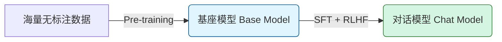
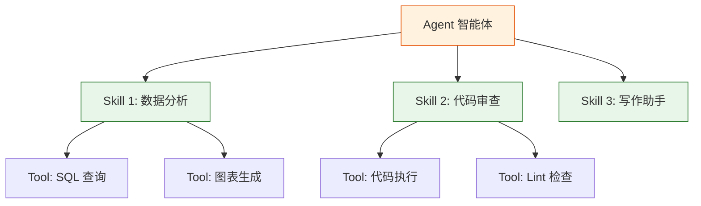
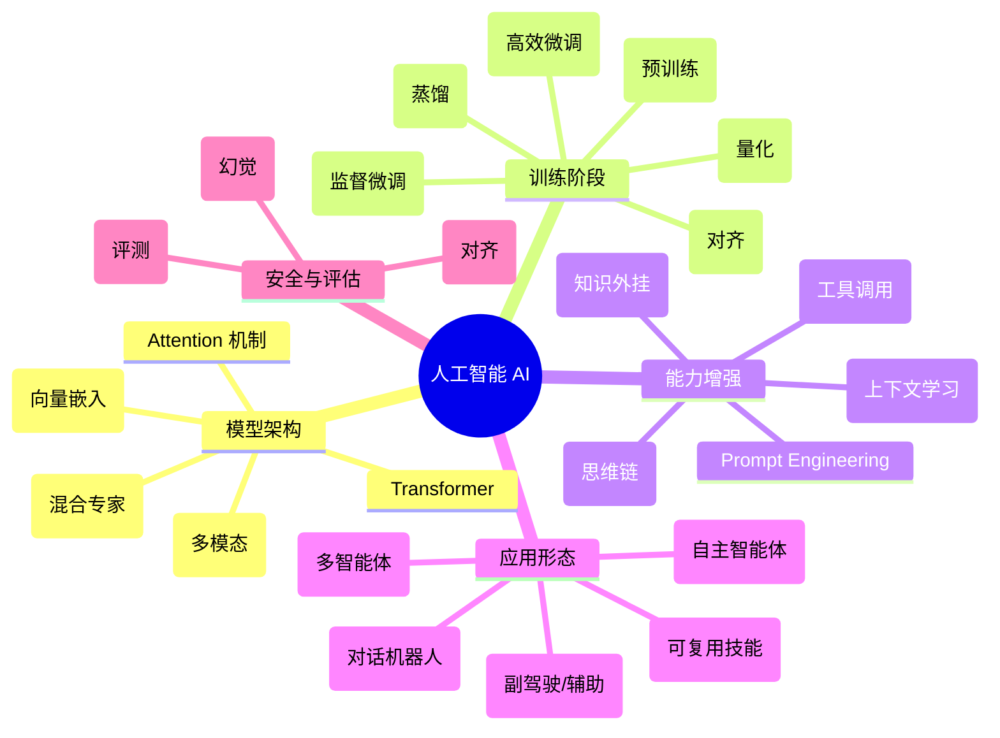

# AI 概念与关系图谱

本文档旨在梳理人工智能领域的核心概念，重点阐述它们在技术栈中的位置及其相互之间的逻辑关系。

## 1. 核心概念层级 (The AI Stack)

我们可以将现代 AI 技术栈分为四个主要层级：

### 1.1 基础设施层 (Infrastructure)

- **GPU/TPU**: 算力基础，AI 模型的"发动机"。
- **CUDA**: 链接硬件与软件的并行计算平台。

### 1.2 模型层 (Model Layer)

- **Transformer**: 现代 LLM 的基石架构，引入了自注意力机制（Self-Attention）。
- **Attention
  (注意力机制)**: 让模型在处理序列时动态关注最相关的部分，而非平均对待所有输入。
- **MoE (Mixture of Experts
  / 混合专家)**: 模型内部有多个"专家"子网络，每次只激活部分专家，实现大参数量但低计算成本（如 DeepSeek、Mixtral）。
- **Foundation Model
  (基座模型)**: 通过海量数据预训练得到的通用模型，拥有广泛知识但缺乏特定领域专精。
- **LLM
  (大语言模型)**: 参数量巨大（通常 >10B）的基座模型，展现出涌现能力（Emergent
  Abilities）。
- **Multimodal
  (多模态)**: 能同时理解和生成多种形式内容（文本、图像、音频、视频）的模型，如 GPT-4o、Gemini。
- **Embedding
  (向量嵌入)**: 将文本/图像等转换为高维向量，使语义相似的内容在向量空间中距离相近，是 RAG 和语义搜索的基础。
- **Tokenizer
  (分词器)**: 将文本切分为 Token 的工具，不同模型有不同分词策略（BPE、SentencePiece 等）。

### 1.3 训练与微调层 (Training & Tuning)

- **Pre-training (预训练)**: 让模型学习语言规律和世界知识（"通识教育"）。
- **SFT (监督微调)**: 使用高质量的问答数据，教模型如何遵循指令（"职业培训"）。
- **RLHF (人类反馈强化学习)**: 使用奖惩机制让模型对齐人类价值观（"道德规范"）。
- **DPO (直接偏好优化)**: RLHF 的简化替代方案，无需训练额外的奖励模型。
- **Alignment
  (对齐)**: 让 AI 行为符合人类意图和价值观的过程，安全研究的核心议题。
- **LoRA (低秩适配)**: 高效微调方法，只训练少量参数，大幅降低微调成本。
- **Quantization
  (量化)**: 将模型参数从高精度（FP16）压缩到低精度（INT8/INT4），减少显存占用，是本地部署的关键技术。
- **Knowledge Distillation
  (知识蒸馏)**: 用大模型（教师）训练小模型（学生），迁移能力同时压缩体积。
- **Synthetic Data (合成数据)**: 用 AI 生成训练数据，解决高质量数据稀缺问题。

### 1.4 应用与交互层 (Application Layer)

- **Prompt Engineering (提示词工程)**: 不改变模型参数，通过设计输入来引导输出。
- **In-Context Learning / ICL
  (上下文学习)**: 不更新参数，仅通过在 Prompt 中提供示例让模型学会任务。
- **Zero-shot / Few-shot**:
  Zero-shot 无需示例直接执行任务；Few-shot 提供少量示例引导。
- **Chain-of-Thought / CoT
  (思维链)**: 引导模型"一步步思考"，显著提升复杂推理能力。
- **RAG
  (检索增强生成)**: 给模型外挂知识库，解决幻觉和知识过时问题（"开卷考试"）。
- **Agent
  (智能体)**: 具备感知、规划、工具使用和执行能力的 AI 系统（"全能助手"）。
- **Multi-Agent (多智能体)**: 多个 Agent 协作完成复杂任务，各司其职。
- **Memory (记忆)**:
  Agent 的能力扩展——短期记忆（上下文）和长期记忆（向量数据库）。
- **Planning (规划)**: Agent 核心能力，将复杂任务分解为可执行的子步骤。
- **Reflection (反思)**: Agent 自我检查和纠错的能力，提升任务成功率。
- **Hallucination
  (幻觉)**: 模型生成看似合理但实际错误或不存在的信息，是 AI 安全的核心挑战。
- **Temperature /
  Top-p**: 控制生成随机性的参数。Temperature 越高越有创意但可能胡说；越低越确定但可能重复。
- **Benchmark
  (评测基准)**: 评估模型能力的标准化测试，如 MMLU（知识）、HumanEval（编程）、SWE-bench（工程）。
- **Spec (规格说明)**:
  AI 编程的核心范式——用自然语言描述"要什么"（What），让 AI 生成"怎么做"（How）。Spec 文件定义需求、约束和验收标准，Agent 据此自主实现代码。

---

## 2. 概念关系解析

### 2.1 训练流程的关系



- **关系**: 基座模型相当于"刚毕业的大学生"，有知识但不懂规矩；对话模型（如 ChatGPT）是经过 SFT 和 RLHF 后的"职场人"，能流畅交流并遵循指令。

### 2.2 RAG 与 Context Window 的关系

- **Context Window (上下文窗口)**: 模型一次能"记住"的短期记忆极限（如 128k
  tokens）。
- **RAG**: 外挂的长期记忆。
- **关系**: RAG 检索出相关信息，塞入 Context Window 中供模型参考。Context
  Window 越大，RAG 检索的内容可以越多、越完整，甚至可以塞入整本书。

### 2.3 Tool 与 Tool Use

- **Tool
  (工具)**: 模型可以调用的外部能力接口，是 Agent 与真实世界交互的桥梁。常见 Tool 类型包括：
  - **计算类**: 计算器、代码解释器 (Code Interpreter)
  - **检索类**: Web 搜索、向量数据库查询
  - **执行类**: 文件读写、API 调用、命令行操作
  - **生成类**: 图像生成、语音合成
- **Tool Use
  (工具调用)**: 模型不仅生成文本，还能生成结构化的工具调用指令（如 JSON 格式），由外部系统执行后返回结果。
- **Function Calling**: Tool
  Use 的一种实现方式，模型输出符合特定 schema 的函数调用请求。
- **Agent**: 以"解决问题"为核心，循环执行"思考-规划-行动-观察"的过程。

**关系**:

- Tool 是原子能力单元，每个 Tool 解决一个具体问题。
- 没有 Tool Use，模型只是"嘴强王者"，只能说不能做。
- Tool Use + 规划能力 = Agent 的雏形。

---

### 2.4 Skill 与 Agent

- **Skill (技能)**:
  Agent 可复用的能力模块，代表一组完成特定任务的知识、工具和流程的封装。例如"数据分析"、"代码审查"、"旅行规划"等。
- **关系**:
  - **Skill 是 Agent 能力的模块化单元**。一个 Agent 可以装载多个 Skill，按需调用。
  - **Tool 是原子操作，Skill 是组合方案**。Tool 像一把螺丝刀，Skill 像"组装家具"这个流程，包含了何时用螺丝刀、何时用锤子的一整套方法。
  - **Skill 可跨 Agent 共享**：不同 Agent 可以复用同一个 Skill 定义，实现能力的解耦和标准化。



---

## 3. 实际产品举例

### 3.1 LLM (大语言模型) 举例

| 模型                  | 厂商      | 特点                            |
| :-------------------- | :-------- | :------------------------------ |
| **GPT-4o / GPT-4.1**  | OpenAI    | 多模态旗舰，编程和推理能力强    |
| **Claude 4 / Opus 4** | Anthropic | 长文本处理、代码生成领先        |
| **Gemini 2.5 Pro**    | Google    | 超长上下文 (1M tokens)，多模态  |
| **DeepSeek-V3**       | DeepSeek  | 开源高性能，性价比极高          |
| **Qwen3**             | 阿里云    | 国产开源代表，多语言支持        |
| **Llama 3.3**         | Meta      | 开源生态最强，可本地部署        |
| **Kimi K2**           | 月之暗面  | 万亿参数，首个开源 Agentic 模型 |

### 3.2 RAG (检索增强生成) 举例

| 产品/功能                  | 类型     | 说明                             |
| :------------------------- | :------- | :------------------------------- |
| **Perplexity AI**          | 搜索引擎 | AI 原生搜索，实时检索 + 生成回答 |
| **ChatGPT with Browsing**  | 插件     | 联网搜索获取实时信息             |
| **Kimi 长文档**            | 产品功能 | 上传 PDF/网页，基于文档内容问答  |
| **Notion AI Q&A**          | 企业应用 | 在知识库中检索并生成答案         |
| **Cursor Codebase Chat**   | 开发工具 | 检索整个代码库回答问题           |
| **Dify / FastGPT**         | 开发平台 | 可视化搭建 RAG 应用              |
| **LlamaIndex / LangChain** | 开发框架 | RAG 应用开发的主流框架           |

### 3.3 Prompt Engineering 举例

| 技术/产品                      | 说明                                        |
| :----------------------------- | :------------------------------------------ |
| **System Prompt**              | 设定角色、行为规范（如 "你是一个专业翻译"） |
| **Few-shot Prompting**         | 提供示例让模型学习格式                      |
| **Chain-of-Thought (CoT)**     | "让我们一步步思考" 引导推理                 |
| **Claude Projects**            | 自定义 System Prompt + 知识库               |
| **GPTs Instructions**          | 为自定义助手编写详细指令                    |
| **Anthropic Prompt Generator** | 官方提示词优化工具                          |

### 3.4 训练与微调举例

| 产品/方法                   | 阶段     | 说明                           |
| :-------------------------- | :------- | :----------------------------- |
| **OpenAI Fine-tuning API**  | SFT      | 用自己的数据微调 GPT 模型      |
| **Anthropic Custom Models** | SFT      | 企业定制 Claude 模型           |
| **Hugging Face AutoTrain**  | SFT      | 自动化微调开源模型             |
| **LoRA / QLoRA**            | 高效微调 | 低成本微调方法，冻结大部分参数 |
| **RLHF (InstructGPT)**      | 对齐     | OpenAI 用人类反馈训练 ChatGPT  |
| **DPO (Llama 2)**           | 对齐     | Meta 的直接偏好优化方法        |

### 3.5 Tool 举例

| 产品/功能                    | 类型      | 说明                                             |
| :--------------------------- | :-------- | :----------------------------------------------- |
| **ChatGPT Code Interpreter** | 计算/执行 | 在沙箱中运行 Python 代码，处理数据分析、生成图表 |
| **ChatGPT Web Browsing**     | 检索      | 实时搜索互联网获取最新信息                       |
| **DALL·E (in ChatGPT)**      | 生成      | 根据文本描述生成图像                             |
| **Perplexity Search**        | 检索      | AI 驱动的搜索引擎，自动检索并总结来源            |
| **Cursor/Windsurf 文件操作** | 执行      | 读写项目文件、执行终端命令                       |
| **Claude Artifacts**         | 生成/执行 | 生成并预览代码、文档、图表                       |

### 3.6 Skill 举例

| 产品/功能                     | 说明                                             |
| :---------------------------- | :----------------------------------------------- |
| **GPTs (ChatGPT 自定义助手)** | 用户定义的专用技能包，封装特定领域知识和工具组合 |
| **Claude Projects**           | 为特定项目配置的知识库 + 指令 + 工具集           |
| **Coze Bot Skills**           | 字节跳动 Coze 平台的技能模块，可组合成复杂工作流 |
| **Dify Workflows**            | 可视化编排的 AI 工作流，封装多步骤任务           |
| **Langchain Tools + Chains**  | 开发框架中的可复用能力模块                       |

### 3.7 Agent 举例

| 产品/功能                    | 类型         | 说明                                         |
| :--------------------------- | :----------- | :------------------------------------------- |
| **Claude Code / Gemini CLI** | 编程 Agent   | 自主规划、编写、测试代码，完成复杂开发任务   |
| **Cursor Agent Mode**        | 编程 Agent   | 在 IDE 中自主执行多步骤代码修改              |
| **Devin (Cognition AI)**     | 编程 Agent   | 号称首个 AI 软件工程师，端到端完成开发任务   |
| **AutoGPT / AgentGPT**       | 通用 Agent   | 早期自主 Agent 框架，循环执行任务            |
| **OpenAI Operator**          | 浏览器 Agent | 自动操作网页完成任务（预订、购物等）         |
| **Anthropic Computer Use**   | 桌面 Agent   | 控制电脑执行复杂任务（点击、输入、截图）     |
| **Microsoft Copilot**        | 办公 Agent   | 整合 Office 全家桶，自动处理文档、邮件、会议 |
| **Kimi K2 Agent**            | 通用 Agent   | 月之暗面的万亿参数开源 Agentic 模型          |

### 3.8 层级关系示例

以 **"帮我分析这份销售数据并生成报告"** 为例：

```
Agent (Claude Code / GPT-4)
  └─ Skill: 数据分析技能
       ├─ Tool: Code Interpreter (执行 Python)
       ├─ Tool: 文件读取 (读取 CSV)
       └─ Tool: 图表生成 (matplotlib)
  └─ Skill: 报告撰写技能
       ├─ Tool: 文本生成
       └─ Tool: 文件写入 (保存 PDF)
```

---

## 4. 常见误区澄清

| 概念 A                 | 概念 B               | 核心区别                                                                                                                          |
| :--------------------- | :------------------- | :-------------------------------------------------------------------------------------------------------------------------------- |
| **Fine-tuning (微调)** | **RAG (检索增强)**   | **微调**是改变模型的大脑（内隐知识），适合学习新风格或固定模式；**RAG**是给模型翻书（外显知识），适合处理实时数据或海量私有文档。 |
| **LLM (大模型)**       | **AIGC (生成式 AI)** | **LLM** 是技术（How），**AIGC** 是应用场景/结果（What）。LLM 是实现 AIGC 的一种主要手段。                                         |
| **Token**              | **Character (字符)** | Token 是模型理解的最小单位。一般来说，1000 tokens ≈ 750 个英文单词 ≈ 400-500 个汉字。                                             |

---

## 5. 全景知识图谱


