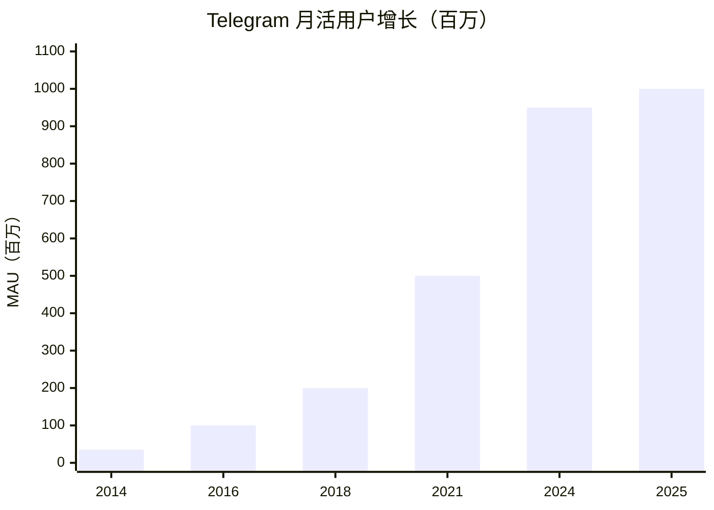
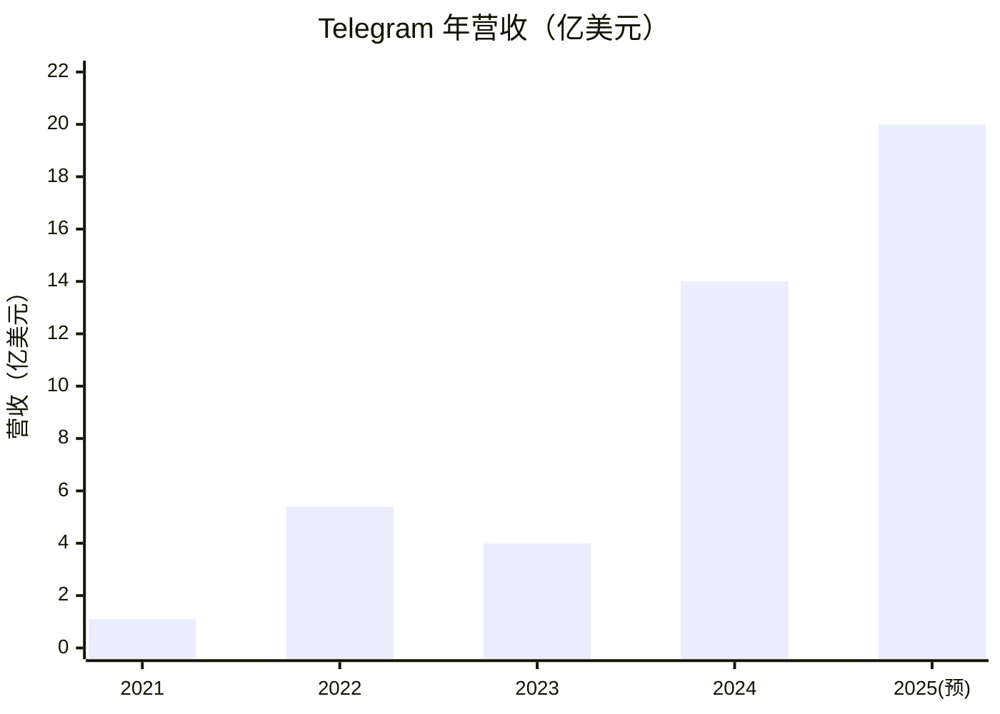

# Telegram 工程实践案例研究

> 🚧 **学习中** - 研究 Telegram 的优雅实现和核心算法

## 项目概况

### 基本信息

| 项目         | 信息                                                         |
| ------------ | ------------------------------------------------------------ |
| **名称**     | Telegram Messenger                                           |
| **成立时间** | 2013 年 8 月                                                 |
| **创始人**   | Pavel Durov（帕维尔·杜罗夫）、Nikolai Durov（尼古拉·杜罗夫） |
| **总部**     | 迪拜（Dubai, UAE）                                           |
| **团队规模** | 约 30 人（2025 年）[^team-size]                              |
| **估值**     | $300-400 亿美元（2025 年）[^valuation]                       |
| **开源**     | 客户端开源，服务端闭源                                       |

### 用户数据（2025 年）

| 指标         | 数据                                                               |
| ------------ | ------------------------------------------------------------------ |
| **月活用户** | 10 亿+ MAU[^mau]                                                   |
| **日活用户** | 5 亿 DAU（2025 年 10 月）[^dau-est]                                |
| **付费用户** | 1200-1500 万 Premium 订阅[^premium]                                |
| **营收**     | 14 亿美元（2024 年），预计 20 亿美元（2025 年）[^revenue]          |
| **利润**     | 5.4 亿美元（2024 年首次盈利），预计 7.2 亿美元（2025 年）[^profit] |
| **日增用户** | 平均 250 万新用户/天[^daily-growth]                                |

### 用户分布

- **性别**：男性 56.8%，女性 43.2%
- **年龄**：18-34 岁占 53.5%
- **地区**：亚洲占 38%（约 3.61 亿用户）
- **全球渗透率**：11.53% 世界人口，18.13% 社交媒体用户

数据来源：[^demographics]

## 文档目录

| 文件                                               | 说明                       |
| -------------------------------------------------- | -------------------------- |
| [protocol.md](./protocol.md)                       | MTProto 协议深度解析 🚧    |
| [client-architecture.md](./client-architecture.md) | 客户端架构与 TDLib 设计 🚧 |
| [server-architecture.md](./server-architecture.md) | 服务端架构推测 🚧          |
| [security.md](./security.md)                       | 安全模型与加密实现 🚧      |
| [optimization.md](./optimization.md)               | 性能优化与核心算法 🚧      |
| [lessons.md](./lessons.md)                         | 工程经验与 AI 应用启示 🚧  |

## 历年增长数据

### 用户增长历程

| 年份              | 月活用户（MAU） | 关键里程碑                                          |
| ----------------- | --------------- | --------------------------------------------------- |
| **2013**          | 启动            | 8 月 14 日上线，首年约 10 万 DAU                    |
| **2014**          | 3500 万         | 在俄罗斯推出后快速增长                              |
| **2016**          | 1 亿            | 突破 1 亿用户大关                                   |
| **2018**          | 2 亿            | 较 2016 年翻倍                                      |
| **2021**          | 5 亿            | WhatsApp 隐私政策争议期间 72 小时获得 2500 万新用户 |
| **2024 年 7 月**  | 9.5 亿          | 接近 10 亿用户                                      |
| **2025 年 1 月**  | 10 亿           | 正式突破 10 亿月活                                  |
| **2025 年 3 月**  | 10 亿+          | 官方确认里程碑                                      |
| **2025 年 10 月** | -               | DAU 达到 5 亿（估）[^dau-est]                       |

数据来源：[^mau-series]

**增长速度**：平均每天新增 250 万用户（2024-2025 年）[^daily-growth]



### 营收与盈利历程

| 年份              | 营收           | 利润            | 备注                              |
| ----------------- | -------------- | --------------- | --------------------------------- |
| **2021 年 4 月**  | 940 万美元/月  | -               | 引入公共频道广告                  |
| **2022 年 6 月**  | -              | -               | 推出 Telegram Premium             |
| **2022 年 12 月** | 4500 万美元/月 | -               | Premium 订阅破 100 万             |
| **2023**          | 3.42-4 亿美元  | 亏损            | 12 月单月收入 1.23 亿美元         |
| **2024**          | **14 亿美元**  | **+5.4 亿美元** | 🎉 **首次盈利**，同比增长约 250%+ |
| **2025**（预测）  | 20 亿美元      | +7.2 亿美元     | -                                 |

数据来源：[^revenue-series]

**营收构成**（2024 年）：

- **广告收入**：约 50%（主要来自大型公共频道）
- **Telegram Premium**：约 50%（1200-1500 万订阅用户 × $4.99/月）



### Premium 订阅增长

| 时间        | 订阅用户数   | 增长情况              |
| ----------- | ------------ | --------------------- |
| **2022.06** | 0            | Telegram Premium 上线 |
| **2022.12** | 100 万+      | 上线 6 个月即破百万   |
| **2024.01** | 500 万       | -                     |
| **2024.12** | 1200 万      | 全年增长 2.4 倍       |
| **2025**    | 1200-1500 万 | 约占总用户 1%         |

**订阅价格**：$4.99/月（统一定价）

数据来源：[^premium]

### 融资历程

| 时间          | 融资金额       | 方式       | 说明                            |
| ------------- | -------------- | ---------- | ------------------------------- |
| **2013-2017** | -              | 创始人自筹 | Pavel Durov 个人资金支持        |
| **2018.03**   | 17 亿美元      | ICO        | TON 区块链项目（后被 SEC 叫停） |
| **2021.03**   | 10 亿美元      | 公开债券   | 用于基础设施建设                |
| **2023.07**   | 2.1 亿美元     | 债务融资   | -                               |
| **2024.03**   | 3.3 亿美元     | 债务融资   | -                               |
| **累计**      | **40 亿美元+** | -          | 主要用于技术研发和基础设施      |

数据来源：[^funding]

### 关键转折点

1. **2021 年 1 月**：WhatsApp 隐私政策争议，Telegram 72 小时获得 2500 万新用户
2. **2022 年 6 月**：推出 Telegram Premium，开启商业化
3. **2024 年**：首次实现盈利（5.4 亿美元），证明商业模式可行
4. **2025 年 3 月**：突破 10 亿月活用户，成为全球第五大社交平台

## 为什么研究 Telegram？

Telegram 是现代软件工程的典范，也是**极致效率**的代表：

### 1. 惊人的人效比

- **30 人团队**支撑 **10 亿月活用户**
- **人均服务**: 每人服务 3300 万+ 用户
- **无 HR 部门**：通过编程竞赛招聘（Contest.com）
- **全员远程**：无办公室，扁平化管理

### 2. 技术自主性

- **MTProto 协议**：自研移动优先加密协议
- **TDLib**：跨平台核心库（C++）
- **服务端架构**：自建分布式系统
- **安全体系**：端到端加密，可验证构建

### 3. 极致性能

- **业界最快**：消息传递速度公认第一
- **流畅体验**：60fps 动画，秒开大文件
- **弱网优化**：移动网络环境下依然流畅
- **无限存储**：免费云存储所有消息和文件

### 4. 开源透明

- **客户端开源**：iOS/Android/Desktop 代码公开
- **可验证构建**：用户可验证 App 与源码一致
- **活跃社区**：大量第三方客户端

## 创始人

### Pavel Durov（帕维尔·杜罗夫）

- **身份**：Telegram CEO，VKontakte（俄罗斯社交网络）创始人
- **绰号**：'俄罗斯的扎克伯格'、'数字自由斗士'
- **理念**：
  - 极度重视用户隐私和言论自由
  - 拒绝向政府提供用户数据
  - 反对广告和数据售卖
- **风格**：技术驱动，极简主义，长期主义
- **社交媒体**：
  - 🐦 Twitter/X: [@durov](https://x.com/durov)
  - 📱 Telegram: [@durov](https://t.me/durov)

### Nikolai Durov（尼古拉·杜罗夫）

- **身份**：Telegram CTO，数学天才
- **贡献**：MTProto 协议主要设计者
- **背景**：国际数学奥林匹克金牌得主（三届 IMO 金牌）
- **角色**：不写 UI 代码，但设计了 MTProto 和 TDLib 核心架构
- **特点**：数学和密码学专家，所有客户端的技术基石
- **社交媒体**：
  - 🐦 Twitter/X: [@Kolja_Durov](https://twitter.com/Kolja_Durov)（保持低调，较少活跃）

## 核心团队与开发模式

Telegram 的开发模式在全球科技界都是异类：**30 人精英团队 + 特种部队式协作**。

### '特种部队'模式的特点

与大厂（腾讯、Meta）的千人团队不同，Telegram 采用**极少数天才程序员独立主导**的模式：

| 特征         | Telegram                  | 传统大厂         |
| ------------ | ------------------------- | ---------------- |
| **团队规模** | ~30 人核心团队            | 数千人           |
| **招聘方式** | 编程竞赛选拔              | HR 筛选 + 面试   |
| **开发模式** | 1-2 人主导一个平台        | 多人协作、流水线 |
| **汇报层级** | 扁平化，直接向 Durov 汇报 | 多层管理         |
| **代码风格** | 个人风格强烈、极致优化    | 中规中矩、规范化 |

### 招聘逻辑：Contest.com

Telegram **不发招聘广告**，而是通过举办高额奖金的编程竞赛筛选全球顶尖 1% 的开发者：

- **竞赛平台**：[Contest.com](https://contest.com/)
- **奖金**：通常 $100,000 - $500,000
- **目标**：找到最懂代码、最痴迷优化的极客
- **结果**：胜者直接获得 Offer，加入迪拜总部或远程工作

**历史竞赛**：

- **macOS 客户端竞赛**：催生了 Telegram for macOS (Swift)
- **Web 客户端竞赛**：催生了 Web A 和 Web K
- **算法竞赛**：选拔 MTProto 和压缩算法优化人才

---

### 各平台客户端的核心开发者

#### 1. Telegram Desktop (Windows/Linux/macOS Qt 版)

**核心开发者**：**John Preston**

| 项目         | 信息                                             |
| ------------ | ------------------------------------------------ |
| **身份**     | 传奇独行侠，核心团队元老                         |
| **贡献**     | 多年来几乎独自用 C++/Qt 写出整个 Desktop 版      |
| **特点**     | 代码质量极高，自己写了一套 UI 渲染引擎           |
| **现状**     | 至今 GitHub 提交记录绝大多数仍出自他手           |
| **GitHub**   | [@john-preston](https://github.com/john-preston) |
| **Telegram** | [@preston](https://t.me/preston)                 |

**名言**：'如果你查看 tdesktop 的 Git 历史，你会发现这是一个人的史诗。'

---

#### 2. Telegram for macOS (Swift 原生版)

**核心开发者**：**Mikhail Filimonov**

| 项目       | 信息                                                 |
| ---------- | ---------------------------------------------------- |
| **身份**   | 从竞赛选手到官方负责人                               |
| **职位**   | Director of Information Technology macOS at Telegram |
| **故事**   | 参加 Telegram macOS 竞赛，用 Swift 写出纯原生版本    |
| **结果**   | 打败官方旧版，Pavel Durov 直接将其版本'转正'         |
| **特点**   | 完美融合 macOS 特性（Touch Bar、手势、毛玻璃）       |
| **GitHub** | [@overtake](https://github.com/overtake)             |

---

#### 3. Telegram Web (Web K & Web A)

**Web K 开发者**：**Igor Zhukov**

| 项目        | 信息                                    |
| ----------- | --------------------------------------- |
| **身份**    | JavaScript 竞赛获胜者                   |
| **特点**    | 渲染性能更好，旧浏览器兼容性优秀        |
| **技术**    | 极致优化的 TypeScript，实现原生级流畅度 |
| **GitHub**  | [@zhukov](https://github.com/zhukov)    |
| **Twitter** | [@izhukov](https://twitter.com/izhukov) |

**Web A 开发者**：**Antony (Ajaxy)**

| 项目       | 信息                               |
| ---------- | ---------------------------------- |
| **身份**   | JavaScript 竞赛获胜者，🥇 第一名   |
| **特点**   | 界面更现代，功能迭代激进           |
| **技术**   | TypeScript + 自研 Teact 框架       |
| **GitHub** | [@Ajaxy](https://github.com/Ajaxy) |

**竞赛结果**：两人都太优秀，Telegram 决定**两个都雇佣**，让两版本长期共存、互相竞争（内卷），看谁迭代更快更好。

---

#### 4. Telegram for iOS

**核心开发者**：**Peter Iakovlev** 及早期的 **Ilya**

| 项目       | 信息                                                 |
| ---------- | ---------------------------------------------------- |
| **身份**   | 核心团队元老                                         |
| **地位**   | iOS 是 Telegram 最重视的平台（Durov 是果粉）         |
| **特点**   | 为性能完全抛弃苹果原生 UI 控件，自研一套 UI 框架     |
| **成就**   | 著名的'顺滑动画'和 120Hz ProMotion 支持              |
| **GitHub** | [@peter-iakovlev](https://github.com/peter-iakovlev) |

---

#### 5. Telegram for Android

**核心开发者**：**DrKLO (Nikolai Kudashov)**

| 项目       | 信息                                     |
| ---------- | ---------------------------------------- |
| **身份**   | 核心团队元老，Android 端基石             |
| **贡献**   | 底层优化，让 Telegram 在低端机上飞快运行 |
| **特点**   | 多年前就实现了极其复杂的主题引擎         |
| **现状**   | 虽有更多人参与，但他仍是主要贡献者       |
| **GitHub** | [@DrKLO](https://github.com/DrKLO)       |

---

### 幕后总设计师：Durov 兄弟

**Nikolai Durov（CTO）**：

- 设计 **MTProto 协议**和 **TDLib 核心库**
- 不写 UI，但他的架构是所有客户端的基础
- 两届国际数学奥林匹克（IMO）金牌得主
- 密码学和数学专家

**Pavel Durov（CEO）**：

- 产品经理 + 金主 + 像素级细节狂魔
- 设计 UI 交互逻辑，决定功能优先级
- 不惜成本支持团队（用个人财富支撑多年）
- 对性能和体验'吹毛求疵'

---

### 为什么这种模式有效？

#### 1. 极致的代码质量

- **个人责任制**：一个人主导一个平台，代码质量有保证
- **避免'大厂病'**：无需应对复杂的协作流程和妥协
- **技术驱动**：工程师直接决策，不受产品经理和市场干扰

#### 2. 惊人的迭代速度

- **扁平化沟通**：开发者直接与 Pavel Durov 沟通，无中间层
- **竞争机制**：Web A vs Web K 的内卷让双方都进步飞快
- **自主权**：开发者可以自由实验，不需要层层审批

#### 3. 独特的工程文化

- **炫技文化**：鼓励极致优化和创新（如自研 UI 框架）
- **长期主义**：不追求短期 KPI，专注打磨体验
- **精英认同**：通过竞赛加入的工程师有强烈的荣誉感

#### 4. 成本效率

- **30 人 = 大厂数千人的产出**
- **无 HR 部门**：通过竞赛自动筛选
- **全员远程**：无办公室成本

---

### 对 AI 应用开发的启示

Telegram 的'特种部队'模式给 AI 团队的借鉴：

1. **小而精的核心团队**：
   - 10-30 人核心团队，每人负责一个关键模块
   - 避免'人月神话'，警惕团队规模膨胀

2. **竞赛式招聘**：
   - 通过 Kaggle、Hackathon 选拔 AI 人才
   - 用实际项目考察能力，而非简历和面试

3. **模块化 + 个人主导**：
   - 核心逻辑层（类似 TDLib）：1-2 人主导
   - 平台适配层：各平台各自优化
   - 避免所有人都改同一份代码的混乱

4. **技术驱动决策**：
   - 让最懂技术的人做技术决策
   - 减少产品经理和管理层的干扰

5. **内部竞争机制**：
   - 可以让两个方案同时并行（如 Web A vs Web K）
   - 用结果说话，优胜劣汰

---

### 延伸阅读

- [Contest.com](https://contest.com/) - Telegram 官方编程竞赛平台
- [Pavel Durov's Channel](https://t.me/durov) - 创始人频道，偶尔会提到团队故事
- [Telegram Desktop GitHub](https://github.com/telegramdesktop/tdesktop) - 查看 John Preston 的提交历史

---

### 官方 GitHub 仓库汇总

#### 核心库

| 项目      | 说明                 | 仓库地址                                | Stars  |
| --------- | -------------------- | --------------------------------------- | ------ |
| **TDLib** | Telegram 核心库(C++) | [tdlib/td](https://github.com/tdlib/td) | 7.4k⭐ |

#### 官方客户端

| 平台                 | 语言              | 仓库地址                                                                            | Stars   |
| -------------------- | ----------------- | ----------------------------------------------------------------------------------- | ------- |
| **iOS**              | Swift/Objective-C | [TelegramMessenger/Telegram-iOS](https://github.com/TelegramMessenger/Telegram-iOS) | 6.1k⭐  |
| **Android**          | Java/Kotlin       | [DrKLO/Telegram](https://github.com/DrKLO/Telegram)                                 | 27.9k⭐ |
| **Desktop (Qt)**     | C++/Qt            | [telegramdesktop/tdesktop](https://github.com/telegramdesktop/tdesktop)             | 26.2k⭐ |
| **macOS (Native)**   | Swift             | [overtake/TelegramSwift](https://github.com/overtake/TelegramSwift)                 | 5.1k⭐  |
| **Web A**            | TypeScript/Teact  | [Ajaxy/telegram-tt](https://github.com/Ajaxy/telegram-tt)                           | 2.7k⭐  |
| **Web K (Webogram)** | TypeScript        | [zhukov/webogram](https://github.com/zhukov/webogram)                               | 7.9k⭐  |
| **Web K (Official)** | TypeScript        | [TelegramOrg/Telegram-web-k](https://github.com/TelegramOrg/Telegram-web-k)         | 500⭐   |

#### GitHub 组织

- **TelegramMessenger**: [github.com/telegrammessenger](https://github.com/telegrammessenger)
  - 16 个仓库，包括 iOS 客户端、Mini Apps SDK 等
- **TelegramOrg**: [github.com/TelegramOrg](https://github.com/TelegramOrg)
  - 统一的官方客户端组织
- **telegramdesktop**: [github.com/telegramdesktop](https://github.com/telegramdesktop)
  - Desktop 版本专用组织

## 客户端生态

Telegram 采取**'客户端完全开源，服务器闭源'**的策略，这在主流 IM 应用中极为罕见。与 WhatsApp、WeChat 等不同，Telegram
坚持在不同平台上使用**原生语言**开发，换取极致性能和流畅体验。

### 开源策略的意义

- **安全审计**：任何人都可以审查代码，发现潜在安全问题
- **可验证构建**：用户可以验证下载的应用与开源代码一致，无后门
- **社区贡献**：全球开发者可以提交 PR，改进功能
- **第三方生态**：基于开源代码和 TDLib，催生了丰富的第三方客户端

---

### 官方客户端

#### 1. 移动端：原生开发的极致体验

Telegram 拒绝使用 React Native 或 Flutter 等跨平台框架，坚持用原生语言开发，换来了业界最流畅的聊天体验。

**Telegram for iOS**

| 项目     | 信息                                                                                                 |
| -------- | ---------------------------------------------------------------------------------------------------- |
| **技术** | Swift / Objective-C                                                                                  |
| **代码** | ✅ [GitHub](https://github.com/TelegramMessenger/Telegram-iOS)                                       |
| **特点** | • 120Hz 流畅动画（ProMotion 设备）<br>• 自研异步渲染列表<br>• 完美遵循苹果设计语言<br>• 极低电量消耗 |
| **亮点** | Telegram 体验的标杆，很多 UI 组件为性能和定制化完全重写                                              |

**Telegram for Android**

| 项目     | 信息                                                                                                            |
| -------- | --------------------------------------------------------------------------------------------------------------- |
| **技术** | Java / Kotlin                                                                                                   |
| **代码** | ✅ [GitHub](https://github.com/DrKLO/Telegram)                                                                  |
| **特点** | • 原生开发，针对碎片化优化<br>• 丰富的自定义主题<br>• 可复现构建（Reproducible Builds）<br>• 支持旧设备流畅运行 |
| **安全** | 支持可验证构建，确保 Google Play 版本与源码一致                                                                 |

#### 2. 桌面端：两条技术路线

Telegram 在桌面端提供两个版本，满足不同用户需求：

**Telegram Desktop (TDesktop) - 跨平台版**

| 项目     | 信息                                                                         |
| -------- | ---------------------------------------------------------------------------- |
| **技术** | C++ / Qt                                                                     |
| **代码** | ✅ [GitHub](https://github.com/telegramdesktop/tdesktop)                     |
| **平台** | Windows / Linux / macOS                                                      |
| **优点** | • 功能更新最快<br>• 强大的群组管理<br>• 支持导出聊天记录<br>• 跨平台统一体验 |
| **缺点** | macOS 上与系统原生界面融合度稍差                                             |

**Telegram for macOS - 原生版**

| 项目     | 信息                                                                                                   |
| -------- | ------------------------------------------------------------------------------------------------------ |
| **技术** | Swift (Native)                                                                                         |
| **代码** | ✅ [GitHub](https://github.com/overtake/TelegramSwift)                                                 |
| **平台** | macOS 专享                                                                                             |
| **优点** | • 完美支持 macOS 特性（Touch Bar、手势、分享）<br>• 毛玻璃效果<br>• 原生通知中心<br>• 符合苹果设计规范 |
| **缺点** | 某些高级功能（如导出）可能比 Qt 版慢推出                                                               |

**💡 选择建议**：

- **Windows/Linux**：只能选 Telegram Desktop
- **macOS**：想要美观和原生体验选 Native 版，想要功能全面选 Desktop 版

#### 3. Web 端：良性竞争的产物

Telegram 通过 JavaScript 开发大赛选出两个优胜 Web 客户端，长期并存：

**Telegram Web A & Web K**

| 版本      | 技术             | 链接                                              | 特点                             |
| --------- | ---------------- | ------------------------------------------------- | -------------------------------- |
| **Web A** | TypeScript/React | ✅ [GitHub](https://github.com/Ajaxy/telegram-tt) | 界面更现代，功能迭代激进         |
| **Web K** | TypeScript       | ✅ [webk.telegram.org](https://webk.telegram.org) | 渲染性能更好，旧浏览器兼容性更好 |

**共同特性**：

- **PWA (Progressive Web Apps)**：无需安装，浏览器打开即用
- **接近原生体验**：流畅度媲美桌面应用
- **离线支持**：部分功能支持离线访问

---

### 第三方客户端

得益于开源代码和 TDLib，Telegram 拥有全球最活跃的第三方客户端生态。

#### 官方实验性客户端

| 客户端         | 平台    | 技术           | 特色                                                  |
| -------------- | ------- | -------------- | ----------------------------------------------------- |
| **Telegram X** | Android | Kotlin/Jetpack | Material Design 3<br>实验性新特性<br>更激进的 UI 设计 |

#### 社区增强版

| 客户端             | 平台    | 基于            | 特色                                    |
| ------------------ | ------- | --------------- | --------------------------------------- |
| **Nicegram**       | iOS     | 官方 iOS 版     | 标签页管理<br>隐藏频道<br>增强隐私功能  |
| **Plus Messenger** | Android | 官方 Android 版 | 自定义主题<br>额外设置项<br>增强文件夹  |
| **Nekogram**       | Android | 官方 Android 版 | 去广告<br>隐私增强<br>翻译功能          |
| **Unigram**        | Windows | TDLib           | UWP 原生<br>Windows 11 设计<br>流畅体验 |
| **exteraGram**     | Android | 官方 Android 版 | 极致隐私<br>去跟踪<br>开源              |
| **64Gram**         | Desktop | TDesktop        | 跨平台<br>增强功能<br>自定义 UI         |

**第三方客户端的优势**：

- 更多个性化选项（主题、字体、布局）
- 隐私增强功能（隐藏在线状态、已读回执）
- 实验性功能（文件夹增强、标签页）
- 针对特定用户群优化（隐私极客、主题爱好者）

**注意事项**：

- ⚠️ 使用第三方客户端需注意来源可靠性
- ⚠️ 部分功能可能违反 Telegram TOS（如群发消息）
- ⚠️ 官方不对第三方客户端安全性负责

---

### TDLib（Telegram Database Library）

TDLib 是所有 Telegram 客户端背后的**'统一大脑'**，用 C++ 编写的跨平台核心库。

#### 核心功能

| 模块         | 功能                                      |
| ------------ | ----------------------------------------- |
| **网络层**   | MTProto 协议实现<br>加密/解密<br>连接管理 |
| **数据库层** | SQLite 本地存储<br>增量同步<br>缓存管理   |
| **加密层**   | 端到端加密（Secret Chats）<br>密钥交换    |
| **API 层**   | JSON 化接口<br>多语言绑定（Python/JS/Go） |

#### 架构优势

```
┌─────────────────────────────────────┐
│   Platform UI (Swift/Kotlin/Qt)     │  ← 平台特定 UI（仅 20% 代码）
├─────────────────────────────────────┤
│         TDLib C++ Core               │  ← 核心逻辑（80% 代码复用）
│  ┌──────────┬──────────┬─────────┐  │
│  │ Network  │ Database │ Crypto  │  │
│  └──────────┴──────────┴─────────┘  │
├─────────────────────────────────────┤
│       MTProto Protocol               │  ← 自研加密协议
└─────────────────────────────────────┘
```

**为什么 TDLib 很重要？**

1. **代码复用**：80% 核心逻辑复用，不同平台只需关注 UI
2. **独立测试**：可单独测试 C++ 核心，保证质量
3. **性能保证**：C++ 实现高性能操作（加密、数据库）
4. **第三方友好**：任何人都可以用 TDLib 开发 Telegram 客户端

#### 开发资源

- **文档**：[TDLib Documentation](https://core.telegram.org/tdlib)
- **示例**：[TDLib Examples](https://github.com/tdlib/td/tree/master/example)
- **多语言绑定**：
  - Python: [python-telegram](https://github.com/alexander-akhmetov/python-telegram)
  - Node.js: [tdl](https://github.com/Bannerets/tdl)
  - Go: [go-tdlib](https://github.com/zelenin/go-tdlib)

---

### 技术选型启示

Telegram 的客户端策略给我们的启示：

1. **不妥协性能**：拒绝'一次编写，到处凑合'的跨平台方案
2. **核心逻辑复用**：通过 TDLib 实现 80% 代码复用
3. **平台特定优化**：各平台使用原生 UI 框架
4. **开放生态**：通过开源和 TDLib 培育第三方生态

**对 AI 应用的借鉴**：

- AI 核心逻辑层（模型调用、上下文管理）可参考 TDLib 模式
- 平台适配层（Web/CLI/API）各自优化
- 通过开放 SDK 培育第三方集成生态

## 核心技术亮点

### 1. MTProto 协议

自研的移动优先加密协议：

- **端到端加密**（Secret Chats）
- **优化的移动网络传输**
- **防止中间人攻击**
- **快速重连机制**

**文档**：[MTProto Protocol](https://core.telegram.org/mtproto)

### 2. 客户端架构

- **TDLib 核心库**：C++ 实现，跨平台复用
- **动画系统**：自定义动画框架，保证 60fps
- **内存优化**：高效的缓存和垃圾回收
- **多媒体处理**：图片/视频压缩和编码优化

### 3. 服务端架构（推测）

- **分布式数据中心**：全球多个数据中心
- **消息路由**：智能路由和负载均衡
- **无限云存储**：高效的存储和检索系统
- **高可用性**：99.9%+ 在线时间

### 4. 算法与优化

- **消息压缩算法**
- **图片/视频编码优化**（自研 RLOTTIE）
- **网络传输优化**（UDP 优先，TCP 回退）
- **本地搜索算法**（全文检索）

## 商业模式

### 收入来源

1. **Telegram Premium**（2022 年 6 月推出）
   - **订阅价格**：$4.99/月（全球统一定价）
   - **核心功能**：
     - 文件上传上限提升至 4GB（免费版 2GB）
     - 更快的下载速度
     - 专属贴纸和动画表情
     - 语音转文字
     - 高级聊天管理（文件夹数量翻倍）
   - **订阅用户**：1200-1500 万（2025 年）
   - **营收占比**：约 50%（2024 年）

2. **广告**（仅公共频道，2021 年引入）
   - **投放范围**：仅在大型公共频道展示（订阅数 1000+）
   - **不侵入区域**：私聊、群组、小频道零广告
   - **营收占比**：约 50%（2024 年）
   - **特点**：非侵入式，基于频道内容的相关性

3. **TON 区块链**（Telegram Open Network）
   - 加密货币和 Web3 基础设施（目前贡献较小）

### 财务表现

| 指标         | 2024 年    | 2025 年（预测） |
| ------------ | ---------- | --------------- |
| **营收**     | 14 亿美元  | 20 亿美元       |
| **利润**     | 5.4 亿美元 | 7.2 亿美元      |
| **利润率**   | 38.6%      | 36%             |
| **同比增长** | +250%+     | +43%            |

数据来源：[^revenue]

**盈利里程碑**：

- ✅ **2024 年首次盈利**，终结连续 11 年亏损
- 净利润率高达 38.6%，远超同行业平均水平（Meta 29%，X/Twitter 亏损）
- 证明'无侵入式广告 + 订阅'的商业模式可行

**融资与估值**：

- **累计融资**：40 亿美元+（ICO + 债券 + 债务融资）
- **当前估值**：300-400 亿美元（2025 年）[^valuation][^valuation]
- **早期资金**：主要由 Pavel Durov 个人资金支持（出售 VKontakte 股份）

## 学习资源

### 官方资源

- [Telegram API](https://core.telegram.org/) - 完整的 API 文档
- [MTProto Protocol](https://core.telegram.org/mtproto) - 协议规范
- [TDLib](https://core.telegram.org/tdlib) - 核心库文档
- [Telegram Blog](https://telegram.org/blog) - 官方博客
- [开源客户端](https://telegram.org/apps#source-code) - 所有开源代码

### 社区资源

- [Pavel Durov's Channel](https://t.me/durov) - 创始人频道
- [Telegram Tips](https://t.me/TelegramTips) - 官方技巧频道
- [Contest.com](https://contest.com/) - 编程竞赛平台

### 技术分析

- [Telegram Architecture Analysis](https://core.telegram.org/techfaq)
- [Security Whitepaper](https://core.telegram.org/security)
- [开源贡献指南](https://core.telegram.org/contribute)

## 值得学习的点

### 1. 如何用小团队做大产品

- **技术选型的智慧**：自研核心，复用基础
- **代码复用和抽象**：TDLib 跨平台复用 80% 代码
- **自动化和工具链**：通过竞赛招聘最优秀的工程师

### 2. 性能优化的极致追求

- **60fps 流畅动画**：所有交互必须流畅
- **秒开大文件**：2GB 文件秒开不卡顿
- **弱网环境优化**：2G 网络下依然可用

### 3. 跨平台开发策略

- **共享核心逻辑**（TDLib C++）：业务逻辑一次编写
- **平台特定 UI**：各平台使用原生 UI 框架
- **一致的用户体验**：所有平台功能和交互统一

### 4. 安全与隐私

- **端到端加密**：Secret Chats 完全加密
- **前向保密**：密钥定期更换
- **可验证的构建**：用户可验证 App 未被篡改
- **拒绝后门**：拒绝政府数据请求

## 对比分析

### 与其他 IM 应用对比

| 特性            | Telegram    | WhatsApp    | WeChat     | Signal       |
| --------------- | ----------- | ----------- | ---------- | ------------ |
| **团队规模**    | 30 人       | 数千人      | 数千人     | ~50 人       |
| **月活用户**    | 10 亿+      | 20 亿+      | 13 亿+     | 1 亿+        |
| **人效比**      | 3300 万/人  | ~67 万/人   | ~43 万/人  | ~200 万/人   |
| **2024 年营收** | 14 亿美元   | ~110 亿美元 | ~30 亿美元 | ~5000 万美元 |
| **2024 年利润** | 5.4 亿美元  | ~120 亿美元 | ~3 亿美元  | 亏损         |
| **利润率**      | 38.6%       | ~100%+      | ~10%       | -            |
| **开源**        | 客户端开源  | ❌          | ❌         | 完全开源     |
| **默认加密**    | ❌（可选）  | ✅          | ❌         | ✅           |
| **云存储**      | 无限免费    | 有限        | 有限       | ❌           |
| **跨平台**      | ✅ 所有平台 | ✅          | ✅         | ✅           |

**关键观察**：

- **人效比之王**：Telegram 30 人支撑 10 亿用户，人效比是 WhatsApp 的 49 倍
- **盈利效率**：利润率 38.6%，仅次于 WhatsApp（得益于 Meta 基础设施）
- **增长最快**：2024 年营收同比增长 250%+，远超同行[^revenue]
- **最轻团队**：在 10 亿级用户产品中，团队规模最小

## 成功因素总结

1. **技术驱动**：工程师主导产品，不妥协技术质量
2. **用户至上**：广告克制，不售数据，用户隐私优先
3. **长期主义**：不追求短期利益，专注长期价值
4. **极致效率**：30 人团队，无 HR，全员远程
5. **开放透明**：客户端开源，可验证构建
6. **自研核心**：MTProto、TDLib 等核心技术自主可控

## 对 AI 应用开发的启示

### 架构设计

参考 TDLib 模式：

- AI 核心逻辑层（模型调用、上下文管理）
- 平台适配层（Web/CLI/API）
- 最大化代码复用

### 性能优化

- **流式响应**（类似 Telegram 的消息流）
- **智能缓存**（Prompt Caching）
- **并发处理**（Parallel Function Calling）

### 团队效率

- **小而精**：核心团队保持小规模
- **技术优先**：由最优秀的工程师驱动
- **自动化**：工具链和测试自动化

## 参考来源

### 官方资料

- [Telegram Official Website](https://telegram.org/)
- [Telegram Applications](https://telegram.org/apps)
- [Telegram Blog - 700 Million Users and Premium](https://telegram.org/blog/700-million-and-premium)

### 用户数据

- [Telegram messenger global MAU 2014-2025 - Statista](https://www.statista.com/statistics/234038/telegram-messenger-mau-users/)
- [Telegram Users Statistics 2026 - DemandSage](https://www.demandsage.com/telegram-statistics/)
- [How Many People Use Telegram in 2026? - Backlinko](https://backlinko.com/telegram-users)
- [Telegram Statistics 2025 - Digital Web Solutions](https://www.digitalwebsolutions.com/blog/telegram-users-statistics/)
- [Telegram Revenue and Usage Statistics - Business of Apps](https://www.businessofapps.com/data/telegram-statistics/)

### 营收与财务

- [Telegram Revenue Hits $1B - Resourcera](https://resourcera.com/data/social/telegram-revenue/)
- [How Telegram hit $1B revenue - Latka](https://getlatka.com/companies/telegram-messenger)
- [Telegram Posts 150% Revenue Growth, $540M Profit in 2024 - AInvest](https://www.ainvest.com/news/telegram-posts-150-revenue-growth-540-million-profit-2024-2505/)
- [Telegram global IAP revenue - Statista](https://www.statista.com/statistics/1342640/telegram-in-app-revenue/)
- [Telegram Tracks for First Profitable Year - Yahoo Finance](https://finance.yahoo.com/news/telegram-tracks-first-profitable-1-160522206.html)

### Premium 订阅

- [Telegram Premium tops 1 million subscribers - TechCrunch](https://techcrunch.com/2022/12/06/telegram-premium-tops-1-million-subscribers/)
- [Telegram Premium subscribers worldwide 2022-2024 - Statista](https://www.statista.com/statistics/1344164/telegram-paying-subscribers/)
- [Telegram Statistics in 2025 - RichAds Blog](https://richads.com/blog/telegram-statistics/)

### 团队与文化

- [Telegram Team Size Analysis - Startuppedia](https://startuppedia.in/trending/trending/pavel-durov-led-telegram-is-now-a-30-billion-company-that-operates-with-just-30-employees-working-remotely-serving-over-1-billion-users-10589688)
- [Pavel Durov Interview with Tucker Carlson](https://www.youtube.com/watch?v=1RjB7ez4fYg)

[^team-size]: [Startuppedia](https://startuppedia.in/trending/trending/pavel-durov-led-telegram-is-now-a-30-billion-company-that-operates-with-just-30-employees-working-remotely-serving-over-1-billion-users-10589688) 对团队规模与估值的汇总。
[^valuation]: [Startuppedia](https://startuppedia.in/trending/trending/pavel-durov-led-telegram-is-now-a-30-billion-company-that-operates-with-just-30-employees-working-remotely-serving-over-1-billion-users-10589688) 对估值区间的引用。
[^mau]: [Statista](https://www.statista.com/statistics/234038/telegram-messenger-mau-users/) 与 [Business of Apps](https://www.businessofapps.com/data/telegram-statistics/) 的 MAU 数据汇总。
[^mau-series]: [Statista](https://www.statista.com/statistics/234038/telegram-messenger-mau-users/) 的 MAU 历史曲线。
[^dau-est]: [DemandSage](https://www.demandsage.com/telegram-statistics/) 与 [Business of Apps](https://www.businessofapps.com/data/telegram-statistics/) 的 DAU 估算整理。
[^daily-growth]: [DemandSage](https://www.demandsage.com/telegram-statistics/) 的日增用户估算整理。
[^demographics]: [DemandSage](https://www.demandsage.com/telegram-statistics/) 与 [Backlinko](https://backlinko.com/telegram-users) 的用户分布汇总。
[^revenue-series]: [Resourcera](https://resourcera.com/data/social/telegram-revenue/) 与 [Latka](https://getlatka.com/companies/telegram-messenger) 的营收历年整理。
[^revenue]: [AInvest](https://www.ainvest.com/news/telegram-posts-150-revenue-growth-540-million-profit-2024-2505/) 与 [Yahoo Finance](https://finance.yahoo.com/news/telegram-tracks-first-profitable-1-160522206.html) 的营收与盈利报道汇总。
[^profit]: [AInvest](https://www.ainvest.com/news/telegram-posts-150-revenue-growth-540-million-profit-2024-2505/) 的利润数据整理。
[^premium]: [TechCrunch](https://techcrunch.com/2022/12/06/telegram-premium-tops-1-million-subscribers/) 与 [Statista](https://www.statista.com/statistics/1344164/telegram-paying-subscribers/) 的订阅用户数据。
[^funding]: [Latka](https://getlatka.com/companies/telegram-messenger) 与 [Resourcera](https://resourcera.com/data/social/telegram-revenue/) 的融资信息整理。

---

**最后更新**：2025 年 10 月（基于 2024 年财报和 2025 年公开数据）
