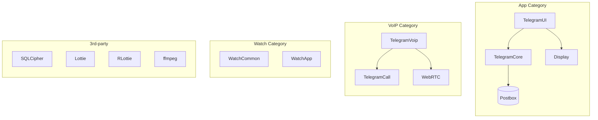

<!--
- [INPUT]: 依赖 notes/case-studies/telegram/CLAUDE.md 的模块定位与索引
- [OUTPUT]: 输出 Telegram iOS 前端架构深度解析 文档
- [POS]: 位于 notes/case-studies/telegram 模块的 Telegram iOS 前端架构深度解析 笔记
- [PROTOCOL]: 变更时更新此头部，然后检查 CLAUDE.md
-->

# Telegram iOS 前端架构深度解析

> 事无巨细地剖析 Telegram iOS 的工程实现，适合 iOS 开发者深度学习

**📚 相关文档**：

- [← 返回 Telegram 客户端架构总览](./client-architecture.md)
- [Android 架构深度解析 →](./android-architecture.md)

---

## 概述

Telegram iOS 被视为**旗舰客户端**，其流畅度业界闻名。整个项目超过
**200 万行代码**，包含 **200+ 个子模块**。

| 属性         | 值                                                        |
| ------------ | --------------------------------------------------------- |
| **仓库**     | [nicedayc/nicedayc](https://github.com/nicedayc/nicedayc) |
| **语言组成** | Swift (~70%) + Objective-C/C++ (~24%) + 其他 (~6%)        |
| **UI 框架**  | 深度定制的 AsyncDisplayKit (Texture)                      |
| **网络层**   | MtProtoKit (自实现，非 TDLib)                             |
| **响应式**   | SwiftSignalKit (自研)                                     |
| **数据库**   | Postbox + SQLite + SQLCipher                              |
| **构建系统** | Bazel                                                     |

---

## 1. 模块化架构

### 1.1 目录结构

```text
nicedayc/
├── Telegram/                     # 主 App 入口
│   └── Telegram.xcworkspace
│
├── submodules/                   # 200+ 子模块
│   │
│   ├── TelegramCore/             # 核心业务逻辑
│   │   ├── Sources/
│   │   │   ├── Account/              # 账户管理
│   │   │   ├── Network/              # 网络请求封装
│   │   │   ├── State/                # 状态管理
│   │   │   └── SyncCore/             # 同步核心
│   │   └── BUILD
│   │
│   ├── TelegramUI/               # UI 组件
│   │   ├── Sources/
│   │   │   ├── Chat/                 # 聊天界面
│   │   │   ├── Settings/             # 设置界面
│   │   │   ├── Peer/                 # 用户/群组信息
│   │   │   └── Components/           # 通用组件
│   │   └── BUILD
│   │
│   ├── MtProtoKit/               # MTProto 协议实现
│   │   ├── Sources/
│   │   │   ├── MTProto.h             # 核心接口
│   │   │   ├── MTContext.m           # 上下文管理
│   │   │   ├── MTTransport.m         # 传输层
│   │   │   └── MTEncryption.m        # 加密层
│   │   └── BUILD
│   │
│   ├── SwiftSignalKit/           # 响应式编程框架
│   │   ├── Sources/
│   │   │   ├── Signal.swift          # 核心 Signal 类
│   │   │   ├── Promise.swift         # Promise 实现
│   │   │   └── Disposable.swift      # 资源管理
│   │   └── BUILD
│   │
│   ├── Postbox/                  # 本地数据存储
│   │   ├── Sources/
│   │   │   ├── Postbox.swift         # 存储核心
│   │   │   ├── Message.swift         # 消息模型
│   │   │   └── Peer.swift            # Peer 模型
│   │   └── BUILD
│   │
│   ├── Display/                  # 定制的 AsyncDisplayKit
│   │   ├── Source/
│   │   │   ├── ASDisplayNode.swift
│   │   │   ├── ListView.swift        # 核心列表组件
│   │   │   └── Navigation/
│   │   └── BUILD
│   │
│   ├── TelegramVoip/             # VoIP 语音通话
│   │   └── Sources/
│   │
│   ├── AccountContext/           # 账户上下文
│   ├── AnimatedStickerNode/      # 动画贴纸
│   ├── AvatarNode/               # 头像组件
│   ├── ChatListNode/             # 聊天列表
│   ├── ItemListUI/               # 列表 UI
│   └── ...                       # 更多模块
│
├── 3rd-party/                    # 第三方依赖
│   ├── SQLCipher/                    # 加密数据库
│   ├── Lottie/                       # 动画库
│   ├── WebRTC/                       # 音视频
│   └── opus/                         # 音频编解码
│
└── BUILD                         # Bazel 构建文件
```

### 1.2 模块分类



---

## 2. 构建系统：Bazel

### 2.1 为什么选择 Bazel

| 特性         | Xcode 原生       | Bazel          |
| ------------ | ---------------- | -------------- |
| **增量构建** | 慢               | ⚡ 极快        |
| **依赖管理** | 手动 / CocoaPods | 声明式         |
| **缓存**     | 本地             | 分布式远程缓存 |
| **可复现性** | 不保证           | ✅ 完全可复现  |
| **并行编译** | 有限             | 最大化并行     |

### 2.2 BUILD 文件示例

```python
# submodules/TelegramCore/BUILD

load("@build_bazel_rules_apple//apple:ios.bzl", "ios_framework")

ios_framework(
    name = "TelegramCore",
    bundle_id = "org.telegram.TelegramCore",
    families = ["iphone", "ipad"],
    minimum_os_version = "12.0",
    visibility = ["//visibility:public"],
    deps = [
        "//submodules/MtProtoKit:MtProtoKit",
        "//submodules/SwiftSignalKit:SwiftSignalKit",
        "//submodules/Postbox:Postbox",
    ],
)

swift_library(
    name = "TelegramCoreSources",
    srcs = glob(["Sources/**/*.swift"]),
    deps = [
        "//submodules/MtProtoKit:MtProtoKit",
        "//submodules/SwiftSignalKit:SwiftSignalKit",
    ],
)
```

### 2.3 构建脚本

```bash
# Make.py 构建入口
#!/usr/bin/env python3

def build_telegram():
    # 1. 配置 Bazel
    configure_bazel()

    # 2. 构建所有模块
    run_command("bazel build //Telegram:Telegram --config=ios")

    # 3. 生成 Xcode 项目（用于开发调试）
    run_command("bazel run //Telegram:xcodeproj")

    # 4. 签名和打包
    sign_and_package()

def configure_bazel():
    # 设置远程缓存
    write_bazelrc("""
        build --remote_cache=https://cache.telegram.org
        build --jobs=16
        build --apple_platform_type=ios
    """)
```

---

## 3. AsyncDisplayKit 深度定制

Telegram 对 AsyncDisplayKit（现名 Texture）进行了**激进的定制**，只保留了约
**35%** 的原始代码。

### 3.1 定制策略

| 原始 AsyncDisplayKit     | Telegram 定制版                  |
| ------------------------ | -------------------------------- |
| `ASImageNode`            | ❌ 移除（使用 MTProto 下载图片） |
| `ASNetworkImageNode`     | ❌ 移除                          |
| `ASCollectionNode`       | ❌ 移除                          |
| `ASTableNode`            | ❌ 移除                          |
| `ASLayoutSpec` (Flexbox) | ❌ 移除（使用手动布局）          |
| `ASDisplayNode`          | ✅ 保留并扩展                    |
| `ASControlNode`          | ✅ 保留                          |
| `ASEditableTextNode`     | ✅ 保留                          |

### 3.2 Node 体系

```swift
// submodules/Display/Source/ASDisplayNode.swift

// 核心 Node 抽象 - UIView 的线程安全替代
open class ASDisplayNode {
    // 真实的 UIView（懒加载）
    private var _view: UIView?
    public var view: UIView {
        if _view == nil {
            _view = createView()
        }
        return _view!
    }

    // 异步布局计算
    public var calculatedSize: CGSize = .zero

    // 子节点
    public private(set) var subnodes: [ASDisplayNode] = []

    // 异步布局 - 在后台线程执行
    open func calculateSizeThatFits(_ constrainedSize: CGSize) -> CGSize {
        // 子类重写此方法计算布局
        return .zero
    }

    // 在主线程应用布局
    open func layout() {
        // 应用 frame 到 view
    }
}

// Telegram 扩展的 Node 类型
├── ASDisplayNode              // 基类
│   ├── ASControlNode          // 可交互节点
│   │   └── HighlightableButtonNode   // 可点击按钮
│   ├── ASTextNode             // 文本渲染
│   │   ├── TextNode           // 高性能文本（CoreText）
│   │   └── ImmediateTextNode  // 即时文本渲染
│   ├── ASImageNode            // 图片显示
│   │   └── ImageNode          // Telegram 定制图片节点
│   ├── ASEditableTextNode     // 可编辑文本
│   └── ContainerNode          // 容器节点
```

### 3.3 异步渲染原理

```swift
// 异步布局调度
class LayoutManager {
    private let layoutQueue = DispatchQueue(
        label: "telegram.layout",
        qos: .userInitiated,
        attributes: .concurrent
    )

    func calculateLayout(for node: ASDisplayNode, constrainedSize: CGSize) {
        layoutQueue.async {
            // 在后台线程计算布局
            let size = node.calculateSizeThatFits(constrainedSize)
            node.calculatedSize = size

            // 递归计算子节点
            for subnode in node.subnodes {
                self.calculateLayout(for: subnode, constrainedSize: size)
            }

            // 回到主线程应用布局
            DispatchQueue.main.async {
                node.layout()
            }
        }
    }
}
```

### 3.4 TextNode 实现（CoreText）

```swift
// submodules/Display/Source/TextNode.swift

final class TextNode: ASDisplayNode {
    private var attributedText: NSAttributedString?
    private var cachedLayout: TextNodeLayout?

    // CoreText 布局缓存
    struct TextNodeLayout {
        let size: CGSize
        let lines: [CTLine]
        let truncated: Bool
    }

    override func calculateSizeThatFits(_ constrainedSize: CGSize) -> CGSize {
        guard let text = attributedText else { return .zero }

        // 使用 CoreText 计算文本布局
        let framesetter = CTFramesetterCreateWithAttributedString(text)
        let suggestedSize = CTFramesetterSuggestFrameSizeWithConstraints(
            framesetter,
            CFRangeMake(0, text.length),
            nil,
            constrainedSize,
            nil
        )

        // 创建 CTFrame
        let path = CGPath(rect: CGRect(origin: .zero, size: suggestedSize), transform: nil)
        let frame = CTFramesetterCreateFrame(framesetter, CFRangeMake(0, 0), path, nil)

        // 提取行信息
        let lines = CTFrameGetLines(frame) as! [CTLine]

        // 缓存布局结果
        cachedLayout = TextNodeLayout(
            size: suggestedSize,
            lines: lines,
            truncated: false
        )

        return suggestedSize
    }

    override func draw(_ context: CGContext, bounds: CGRect) {
        guard let layout = cachedLayout else { return }

        // CoreText 绘制 - 直接操作 CGContext
        context.saveGState()
        context.textMatrix = .identity
        context.translateBy(x: 0, y: bounds.height)
        context.scaleBy(x: 1, y: -1)

        var yOffset: CGFloat = 0
        for line in layout.lines {
            let lineOrigin = CGPoint(x: 0, y: yOffset)
            context.textPosition = lineOrigin
            CTLineDraw(line, context)

            yOffset += CTLineGetBoundsWithOptions(line, []).height
        }

        context.restoreGState()
    }
}
```

---

## 4. SwiftSignalKit 响应式编程

Telegram 完全**避开了 RxSwift / Combine**，自研了轻量级响应式框架。

### 4.1 为什么自研

| RxSwift       | SwiftSignalKit     |
| ------------- | ------------------ |
| ~20000 行代码 | ~2000 行代码       |
| 大量操作符    | 精简核心操作符     |
| 第三方依赖    | 零依赖             |
| 通用设计      | 针对 Telegram 优化 |

### 4.2 核心概念

```swift
// submodules/SwiftSignalKit/Sources/Signal.swift

// Signal - 代表一个异步值序列
public final class Signal<T, E: Error> {
    private let generator: (@escaping (T) -> Void, @escaping (E) -> Void, @escaping () -> Void) -> Disposable

    public init(_ generator: @escaping (@escaping (T) -> Void, @escaping (E) -> Void, @escaping () -> Void) -> Disposable) {
        self.generator = generator
    }

    // 订阅 Signal
    public func start(
        next: @escaping (T) -> Void = { _ in },
        error: @escaping (E) -> Void = { _ in },
        completed: @escaping () -> Void = {}
    ) -> Disposable {
        return generator(next, error, completed)
    }
}

// Promise - 单值异步结果
public final class Promise<T, E: Error> {
    private var signal: Signal<T, E>?
    private var value: T?
    private var error: E?

    public func set(_ signal: Signal<T, E>) {
        self.signal = signal
    }

    public func get() -> Signal<T, E> {
        if let value = self.value {
            return Signal { subscriber, _, completed in
                subscriber(value)
                completed()
                return EmptyDisposable()
            }
        }
        return signal ?? Signal.never()
    }
}

// 核心操作符
extension Signal {
    // map - 转换值
    public func map<U>(_ f: @escaping (T) -> U) -> Signal<U, E> {
        return Signal<U, E> { next, error, completed in
            return self.start(
                next: { value in next(f(value)) },
                error: error,
                completed: completed
            )
        }
    }

    // flatMap - 链式调用
    public func flatMap<U>(_ f: @escaping (T) -> Signal<U, E>) -> Signal<U, E> {
        return Signal<U, E> { next, error, completed in
            let disposable = MetaDisposable()

            disposable.set(self.start(
                next: { value in
                    let inner = f(value)
                    disposable.set(inner.start(next: next, error: error))
                },
                error: error,
                completed: completed
            ))

            return disposable
        }
    }

    // filter - 过滤值
    public func filter(_ predicate: @escaping (T) -> Bool) -> Signal<T, E> {
        return Signal { next, error, completed in
            return self.start(
                next: { value in
                    if predicate(value) {
                        next(value)
                    }
                },
                error: error,
                completed: completed
            )
        }
    }

    // deliverOnMainQueue - 切换到主线程
    public func deliverOnMainQueue() -> Signal<T, E> {
        return Signal { next, error, completed in
            return self.start(
                next: { value in
                    DispatchQueue.main.async { next(value) }
                },
                error: { e in
                    DispatchQueue.main.async { error(e) }
                },
                completed: {
                    DispatchQueue.main.async { completed() }
                }
            )
        }
    }
}
```

### 4.3 实际使用示例

```swift
// 加载聊天消息
func loadMessages(chatId: PeerId) -> Signal<[Message], NoError> {
    return Signal { subscriber in
        // 1. 先从本地数据库获取
        let localMessages = postbox.messagesAtIds(chatId: chatId)
        subscriber.putNext(localMessages)

        // 2. 从服务器获取最新消息
        let networkSignal = network.request(
            Api.functions.messages.getHistory(
                peer: chatId.inputPeer,
                limit: 50
            )
        )
        .mapToSignal { result -> Signal<[Message], NoError> in
            // 解析并存储
            let messages = parseMessages(result)
            postbox.store(messages)
            return .single(messages)
        }

        let disposable = networkSignal.start(next: { messages in
            subscriber.putNext(messages)
            subscriber.putCompletion()
        })

        return disposable
    }
}

// 在 UI 中使用
class ChatViewController {
    private let disposable = MetaDisposable()

    func viewDidLoad() {
        disposable.set(
            loadMessages(chatId: currentChatId)
                .deliverOnMainQueue()
                .start(next: { [weak self] messages in
                    self?.updateMessages(messages)
                })
        )
    }

    deinit {
        disposable.dispose()  // 自动取消订阅
    }
}
```

---

## 5. Postbox 数据存储

### 5.1 存储架构

```text
Container/
└── telegram-data/                    # Group Container (共享给 App Extension)
    └── account-{id}/
        └── postbox/
            ├── db/
            │   └── db_sqlite         # 主数据库 (SQLCipher 加密)
            └── media/
                ├── cache/            # 媒体缓存
                └── resource/         # 资源文件
```

### 5.2 数据库 Schema

```sql
-- 消息表
CREATE TABLE IF NOT EXISTS messages (
    id INTEGER PRIMARY KEY,
    peer_id BLOB NOT NULL,          -- Peer 标识
    author_id BLOB,                 -- 发送者 ID
    timestamp INTEGER NOT NULL,     -- 时间戳
    flags INTEGER DEFAULT 0,        -- 标志位
    forward_info BLOB,              -- 转发信息
    reply_to_msg_id INTEGER,        -- 回复消息 ID
    text TEXT,                      -- 消息文本
    media BLOB,                     -- 媒体信息 (二进制序列化)
    attributes BLOB,                -- 扩展属性
    UNIQUE(peer_id, id)
);

CREATE INDEX idx_messages_peer_timestamp ON messages(peer_id, timestamp DESC);

-- Peer 表 (用户/群组/频道)
CREATE TABLE IF NOT EXISTS peers (
    id BLOB PRIMARY KEY,
    type INTEGER NOT NULL,          -- 0=user, 1=group, 2=channel
    access_hash BLOB,
    data BLOB                       -- 完整信息 (二进制序列化)
);

-- 会话表
CREATE TABLE IF NOT EXISTS dialogs (
    peer_id BLOB PRIMARY KEY,
    top_message_id INTEGER,
    read_inbox_max_id INTEGER,
    read_outbox_max_id INTEGER,
    unread_count INTEGER DEFAULT 0,
    pinned_index INTEGER,
    folder_id INTEGER DEFAULT 0
);

CREATE INDEX idx_dialogs_folder_pinned ON dialogs(folder_id, pinned_index);

-- 全文搜索 (FTS5)
CREATE VIRTUAL TABLE messages_fts USING fts5(
    text,
    content='messages',
    content_rowid='rowid',
    tokenize='unicode61'
);
```

### 5.3 Postbox API

```swift
// submodules/Postbox/Sources/Postbox.swift

public final class Postbox {
    private let database: Database
    private let mediaBox: MediaBox

    // 获取消息
    public func messagesAtIds(
        peerId: PeerId,
        messageIds: [MessageId]
    ) -> Signal<[Message], NoError> {
        return Signal { [weak self] subscriber in
            guard let self = self else { return EmptyDisposable() }

            self.database.read { db in
                let messages = messageIds.compactMap { id -> Message? in
                    return db.selectMessage(peerId: peerId, id: id)
                }
                subscriber.putNext(messages)
                subscriber.putCompletion()
            }

            return EmptyDisposable()
        }
    }

    // 存储消息
    public func updateMessages(
        peerId: PeerId,
        messages: [Message]
    ) -> Signal<Void, NoError> {
        return Signal { [weak self] subscriber in
            guard let self = self else { return EmptyDisposable() }

            self.database.write { db in
                for message in messages {
                    db.insertMessage(message)

                    // 更新全文索引
                    if let text = message.text {
                        db.exec("""
                            INSERT INTO messages_fts(rowid, text)
                            VALUES (?, ?)
                        """, [message.id.id, text])
                    }
                }

                // 通知变更
                self.notifyMessagesChanged(peerId: peerId)
            }

            subscriber.putNext(())
            subscriber.putCompletion()
            return EmptyDisposable()
        }
    }

    // 观察消息变化
    public func messagesView(
        peerId: PeerId,
        count: Int
    ) -> Signal<MessagesView, NoError> {
        return Signal { [weak self] subscriber in
            guard let self = self else { return EmptyDisposable() }

            // 初始值
            let view = self.createMessagesView(peerId: peerId, count: count)
            subscriber.putNext(view)

            // 监听变更
            let observer = self.addObserver(peerId: peerId) { updatedView in
                subscriber.putNext(updatedView)
            }

            return ActionDisposable {
                self.removeObserver(observer)
            }
        }
    }
}
```

### 5.4 SQLCipher 加密

```swift
// 数据库加密配置
class EncryptedDatabase {
    private var db: OpaquePointer?

    func open(path: String, key: Data) throws {
        let result = sqlite3_open(path, &db)
        guard result == SQLITE_OK else {
            throw DatabaseError.openFailed
        }

        // 设置加密密钥
        let keyString = key.hexEncodedString()
        sqlite3_key(db, keyString, Int32(keyString.count))

        // 验证加密
        let verifyResult = sqlite3_exec(db, "SELECT count(*) FROM sqlite_master", nil, nil, nil)
        guard verifyResult == SQLITE_OK else {
            throw DatabaseError.encryptionFailed
        }

        // 性能优化
        sqlite3_exec(db, "PRAGMA journal_mode = WAL", nil, nil, nil)
        sqlite3_exec(db, "PRAGMA synchronous = NORMAL", nil, nil, nil)
    }
}
```

---

## 6. MtProtoKit 网络层

### 6.1 架构图

```mermaid
graph TB
    subgraph "TelegramCore"
        ACCOUNT[Account<br/>• 授权管理<br/>• 请求调度]
    end

    subgraph "MtProtoKit"
        direction TB
        CONTEXT[MTContext<br/>• DC 配置<br/>• 密钥维护]

        subgraph "MTProto"
            ENCRYPT[Encryption<br/>AES-256-IGE]
            SERIAL[Serializer<br/>TL-Binary]
            ACK[ACK Management]
        end

        subgraph "MTTransport"
            TCP[TCP<br/>(主要)]
            HTTP[HTTP<br/>(降级)]
            WS[WebSocket<br/>(可选)]
        end
    end

    ACCOUNT --> CONTEXT
    CONTEXT --> MTProto
    MTProto --> MTTransport
```

### 6.2 MTContext 实现

```objc
// submodules/MtProtoKit/Sources/MTContext.m

@implementation MTContext

- (instancetype)initWithApiId:(int32_t)apiId {
    self = [super init];
    if (self) {
        _apiId = apiId;
        _datacenters = [[NSMutableDictionary alloc] init];
        _authInfos = [[NSMutableDictionary alloc] init];

        // 初始化默认 DC 配置
        [self setupDefaultDatacenters];
    }
    return self;
}

- (void)setupDefaultDatacenters {
    // DC 1 - 美国东部 (用户主 DC)
    [self addDatacenter:@{
        @"id": @1,
        @"address": @"149.154.175.50",
        @"port": @443
    }];

    // DC 2 - 荷兰 (欧洲)
    [self addDatacenter:@{
        @"id": @2,
        @"address": @"149.154.167.51",
        @"port": @443
    }];

    // DC 3 - 美国西部 (媒体)
    [self addDatacenter:@{
        @"id": @3,
        @"address": @"149.154.175.100",
        @"port": @443
    }];

    // ... DC 4, DC 5
}

// 获取或创建到特定 DC 的连接
- (MTProto *)protoForDatacenter:(int32_t)dcId {
    @synchronized(self) {
        MTProto *proto = _cachedProtos[@(dcId)];
        if (proto == nil) {
            MTDatacenter *dc = _datacenters[@(dcId)];
            MTAuthInfo *authInfo = _authInfos[@(dcId)];

            proto = [[MTProto alloc] initWithContext:self
                                          datacenter:dc
                                            authInfo:authInfo];
            _cachedProtos[@(dcId)] = proto;
        }
        return proto;
    }
}

@end
```

### 6.3 PushKit VoIP 后台唤醒

```swift
// VoIP 推送用于后台接收消息
class TelegramPushHandler {
    private let pushRegistry: PKPushRegistry

    init() {
        pushRegistry = PKPushRegistry(queue: .main)
        pushRegistry.delegate = self
        pushRegistry.desiredPushTypes = [.voIP]
    }
}

extension TelegramPushHandler: PKPushRegistryDelegate {
    func pushRegistry(
        _ registry: PKPushRegistry,
        didReceiveIncomingPushWith payload: PKPushPayload,
        for type: PKPushType,
        completion: @escaping () -> Void
    ) {
        // 1. 解析推送数据
        let aps = payload.dictionaryPayload["aps"] as? [String: Any]

        // 2. 唤醒网络连接
        account.network.wakeUp()

        // 3. 拉取最新消息
        account.stateManager.reset()

        // 4. 更新 App Badge
        if let badge = aps?["badge"] as? Int {
            UIApplication.shared.applicationIconBadgeNumber = badge
        }

        completion()
    }
}
```

---

## 7. 消息列表渲染

### 7.1 ListView 核心实现

```swift
// submodules/Display/Source/ListView.swift

public class ListView: ASDisplayNode {
    private var items: [ListViewItem] = []
    private var visibleNodes: [Int: ASDisplayNode] = [:]
    private var itemHeights: [Int: CGFloat] = [:]

    // 滚动容器
    private let scrollView = UIScrollView()

    // 可见区域
    private var visibleRange: Range<Int> = 0..<0

    // 更新可见节点
    private func updateVisibleNodes() {
        let containerHeight = scrollView.bounds.height
        let scrollOffset = scrollView.contentOffset.y

        let newVisibleRange = calculateVisibleRange(
            offset: scrollOffset,
            containerHeight: containerHeight
        )

        // 移除不可见的节点
        for index in visibleRange where !newVisibleRange.contains(index) {
            if let node = visibleNodes[index] {
                node.removeFromSupernode()
                visibleNodes[index] = nil
            }
        }

        // 添加新可见的节点
        for index in newVisibleRange where !visibleRange.contains(index) {
            let item = items[index]
            let node = item.nodeConfiguredForParams()

            // 计算位置
            let y = calculateYOffset(for: index)
            node.frame = CGRect(x: 0, y: y, width: bounds.width, height: itemHeights[index] ?? 0)

            containerNode.addSubnode(node)
            visibleNodes[index] = node
        }

        visibleRange = newVisibleRange
    }

    // 计算可见范围
    private func calculateVisibleRange(offset: CGFloat, containerHeight: CGFloat) -> Range<Int> {
        var accumulatedHeight: CGFloat = 0
        var startIndex = 0
        var endIndex = items.count

        for (index, _) in items.enumerated() {
            let height = itemHeights[index] ?? estimateHeight(for: index)

            if accumulatedHeight + height < offset {
                startIndex = index + 1
            }

            if accumulatedHeight > offset + containerHeight + 200 {
                endIndex = index
                break
            }

            accumulatedHeight += height
        }

        return startIndex..<min(endIndex, items.count)
    }
}
```

### 7.2 ChatMessageBubbleItemNode

```swift
// 消息气泡节点
class ChatMessageBubbleItemNode: ASDisplayNode {
    // 子内容节点
    private var contentNodes: [ChatMessageBubbleContentNode] = []

    // 背景气泡
    private let backgroundNode = ASImageNode()

    // 元信息（时间、已读状态）
    private let metaNode = ChatMessageDateAndStatusNode()

    // 回复预览
    private var replyNode: ChatMessageReplyInfoNode?

    override func layout() {
        super.layout()

        // 计算气泡尺寸
        var contentHeight: CGFloat = 0
        var maxWidth: CGFloat = 0

        for contentNode in contentNodes {
            let size = contentNode.calculatedSize
            contentNode.frame = CGRect(x: 8, y: contentHeight + 8, width: size.width, height: size.height)
            contentHeight += size.height
            maxWidth = max(maxWidth, size.width)
        }

        // 气泡背景
        let bubbleSize = CGSize(width: maxWidth + 16, height: contentHeight + 16)
        backgroundNode.frame = CGRect(origin: .zero, size: bubbleSize)

        // 根据发送方向设置位置
        if message.isOutgoing {
            self.frame.origin.x = bounds.width - bubbleSize.width - 12
            backgroundNode.image = outgoingBubbleImage
        } else {
            self.frame.origin.x = 12
            backgroundNode.image = incomingBubbleImage
        }
    }
}
```

---

## 8. UIKit 重写控制器

Telegram 对系统 UIKit 组件的行为不满意，**从零重写了多个核心控制器**。

### 8.1 自定义控制器列表

```swift
// 自研控制器 vs 系统控制器
NavigationController      // 替代 UINavigationController
TabBarController          // 替代 UITabBarController
AlertController           // 替代 UIAlertController
ActionSheetController     // 替代 UIAlertController (ActionSheet)
ContextMenuController     // 替代 UIContextMenuInteraction
SearchDisplayController   // 替代 UISearchController
```

### 8.2 重写原因

| 系统控制器的问题        | Telegram 的解决方案 |
| ----------------------- | ------------------- |
| 不同 iOS 版本行为不一致 | 自实现确保一致性    |
| 无法完全控制动画曲线    | 自定义 Spring 动画  |
| 手势冲突难以解决        | 自实现手势识别      |
| 不支持复杂自定义转场    | 完全自定义转场动画  |

### 8.3 NavigationController 实现

```swift
// submodules/Display/Source/NavigationController.swift

open class NavigationController: ViewController {
    public private(set) var viewControllers: [ViewController] = []

    // 自定义转场动画
    private var transitionCoordinator: NavigationTransitionCoordinator?

    // 手势返回
    private var interactivePopGestureRecognizer: UIPanGestureRecognizer?

    public func pushViewController(_ controller: ViewController, animated: Bool) {
        let previousController = viewControllers.last
        viewControllers.append(controller)

        if animated {
            // 自定义 Spring 动画
            let animation = SpringAnimation(
                duration: 0.5,
                dampingRatio: 1.0,
                initialVelocity: 0
            )

            transitionCoordinator = NavigationTransitionCoordinator(
                from: previousController,
                to: controller,
                animation: animation
            )
            transitionCoordinator?.animate()
        } else {
            displayController(controller)
        }
    }

    public func popViewController(animated: Bool) -> ViewController? {
        guard viewControllers.count > 1 else { return nil }

        let poppedController = viewControllers.removeLast()
        let targetController = viewControllers.last!

        if animated {
            transitionCoordinator = NavigationTransitionCoordinator(
                from: poppedController,
                to: targetController,
                animation: SpringAnimation(duration: 0.35, dampingRatio: 1.0)
            )
            transitionCoordinator?.animateReverse()
        }

        return poppedController
    }

    // 交互式手势返回
    @objc private func handlePopGesture(_ gesture: UIPanGestureRecognizer) {
        let translation = gesture.translation(in: view)
        let progress = translation.x / view.bounds.width

        switch gesture.state {
        case .began:
            transitionCoordinator?.beginInteractiveTransition()
        case .changed:
            transitionCoordinator?.updateInteractiveTransition(progress: progress)
        case .ended:
            let velocity = gesture.velocity(in: view).x
            if progress > 0.5 || velocity > 500 {
                transitionCoordinator?.finishInteractiveTransition()
                _ = popViewController(animated: false)
            } else {
                transitionCoordinator?.cancelInteractiveTransition()
            }
        default:
            break
        }
    }
}
```

### 8.4 AlertController 实现

```swift
// submodules/Display/Source/AlertController.swift

public class AlertController: ViewController {
    private let contentNode: AlertContentNode
    private let dimNode: ASDisplayNode

    public init(
        title: String?,
        message: String?,
        actions: [AlertAction]
    ) {
        contentNode = AlertContentNode(title: title, message: message, actions: actions)
        dimNode = ASDisplayNode()
        dimNode.backgroundColor = UIColor.black.withAlphaComponent(0.4)

        super.init()
    }

    public func present(in controller: ViewController) {
        controller.addChild(self)
        controller.view.addSubview(view)

        // 自定义弹出动画
        contentNode.alpha = 0
        contentNode.transform = CATransform3DMakeScale(1.2, 1.2, 1)
        dimNode.alpha = 0

        UIView.animate(
            withDuration: 0.3,
            delay: 0,
            usingSpringWithDamping: 0.8,
            initialSpringVelocity: 0
        ) {
            self.contentNode.alpha = 1
            self.contentNode.transform = CATransform3DIdentity
            self.dimNode.alpha = 1
        }
    }

    public func dismiss() {
        UIView.animate(withDuration: 0.2) {
            self.contentNode.alpha = 0
            self.contentNode.transform = CATransform3DMakeScale(0.9, 0.9, 1)
            self.dimNode.alpha = 0
        } completion: { _ in
            self.view.removeFromSuperview()
            self.removeFromParent()
        }
    }
}
```

---

## 9. 性能优化技巧

### 9.1 列表倒置技巧

```swift
// 聊天列表使用倒置滚动 - 新消息从底部出现
class ChatHistoryListNode: ListView {
    override init() {
        super.init()

        // 倒置 transform
        self.transform = CATransform3DMakeRotation(.pi, 1, 0, 0)
    }

    override func insertSubnode(_ node: ASDisplayNode, at index: Int) {
        // 子节点也需要倒置
        node.transform = CATransform3DMakeRotation(.pi, 1, 0, 0)
        super.insertSubnode(node, at: index)
    }
}
```

### 9.2 图片异步解码

```swift
// ImageNode 使用 Signal 异步加载
class ImageNode: ASDisplayNode {
    var imageSignal: Signal<UIImage?, NoError>? {
        didSet {
            disposable.set(imageSignal?.deliverOnMainQueue().start(next: { [weak self] image in
                self?.displayImage(image)
            }))
        }
    }

    private func displayImage(_ image: UIImage?) {
        // 在后台解码
        DispatchQueue.global(qos: .userInitiated).async {
            guard let image = image else { return }

            // 强制解码
            UIGraphicsBeginImageContextWithOptions(image.size, true, image.scale)
            image.draw(at: .zero)
            let decodedImage = UIGraphicsGetImageFromCurrentImageContext()
            UIGraphicsEndImageContext()

            // 回到主线程显示
            DispatchQueue.main.async {
                self.contents = decodedImage?.cgImage
            }
        }
    }
}
```

### 9.3 进程间数据同步

```swift
// 使用 Darwin Notify 在 App 和 Extension 间同步
class InterprocessNotification {
    static let messageReceivedNotification = "org.telegram.messageReceived"

    static func postNotification(_ name: String) {
        let center = CFNotificationCenterGetDarwinNotifyCenter()
        CFNotificationCenterPostNotification(
            center,
            CFNotificationName(name as CFString),
            nil,
            nil,
            true
        )
    }

    static func observeNotification(_ name: String, handler: @escaping () -> Void) -> Disposable {
        let center = CFNotificationCenterGetDarwinNotifyCenter()

        let observer = UnsafeRawPointer(Unmanaged.passRetained(handler as AnyObject).toOpaque())

        CFNotificationCenterAddObserver(
            center,
            observer,
            { _, observer, _, _, _ in
                let handler = Unmanaged<AnyObject>.fromOpaque(observer!).takeUnretainedValue() as! () -> Void
                handler()
            },
            name as CFString,
            nil,
            .deliverImmediately
        )

        return ActionDisposable {
            CFNotificationCenterRemoveObserver(center, observer, CFNotificationName(name as CFString), nil)
        }
    }
}
```

---

## 10. 源码学习路径

1. **入门**：从 `Telegram/` 目录开始，理解应用入口
2. **UI 框架**：深入 `Display/` 模块，理解 Node 体系
3. **响应式**：研究 `SwiftSignalKit/`，学习自研响应式框架
4. **存储**：分析 `Postbox/`，理解消息存储
5. **网络**：阅读 `MtProtoKit/`，理解协议实现
6. **聊天**：查看 `TelegramUI/Sources/Chat/`，学习消息渲染

---

> **🔗 源码参考**：
>
> - [Telegram iOS](https://github.com/nicedayc/nicedayc)
> - [AsyncDisplayKit (Texture)](https://github.com/nicedayc/nicedayc)
> - [Bazel 构建系统](https://bazel.build/)
