<!--
- [INPUT]: 依赖 notes/case-studies/telegram/CLAUDE.md 的模块定位与索引
- [OUTPUT]: 输出 Telegram Web K (tweb) 前端架构深度解析 文档
- [POS]: 位于 notes/case-studies/telegram 模块的 Telegram Web K (tweb) 前端架构深度解析 笔记
- [PROTOCOL]: 变更时更新此头部，然后检查 CLAUDE.md
-->

# Telegram Web K (tweb) 前端架构深度解析

> 事无巨细地剖析 Telegram Web
> K 的原生 TypeScript 工程实现，适合前端开发者深度学习

**📚 相关文档**：

- [← 返回 Telegram 客户端架构总览](./client-architecture.md)
- [← Web Z 架构深度解析](./web-z-architecture.md)

---

## 概述

**Web K** (tweb) 是 Telegram 的另一个官方 Web 客户端，与 Web
Z 采用完全不同的技术路线：**零框架依赖**，纯原生 TypeScript 实现。

| 属性         | 值                                                          |
| ------------ | ----------------------------------------------------------- |
| **访问地址** | `web.telegram.org/k`                                        |
| **仓库**     | [morethanwords/tweb](https://github.com/morethanwords/tweb) |
| **开发者**   | morethanwords                                               |
| **核心框架** | 无（原生 TypeScript + 原生 DOM API）                        |
| **语言组成** | TypeScript (~90%), SCSS, HTML                               |
| **协议实现** | 自实现 MTProto（非 GramJS）                                 |
| **前身**     | Webogram (AngularJS) 重写                                   |

---

## 📊 架构可视化

### 系统总体架构

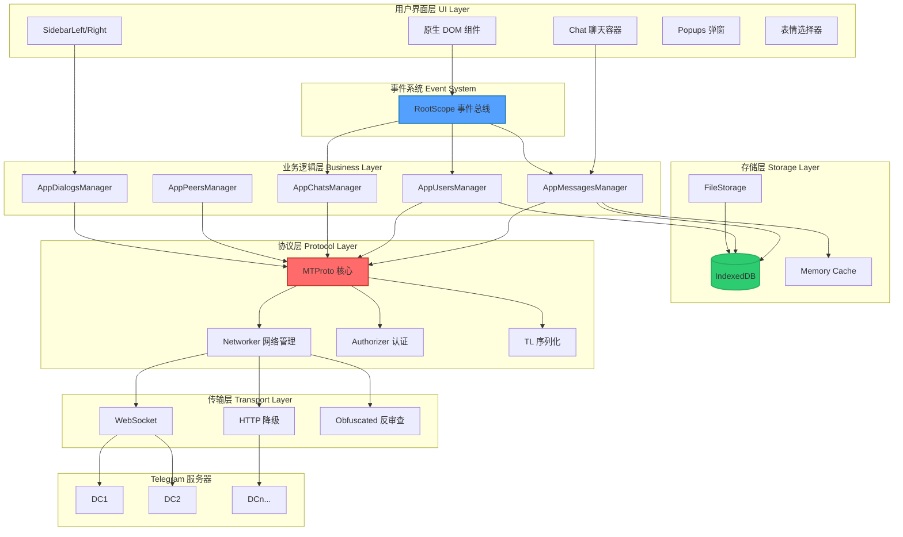

---

### 组件层次结构

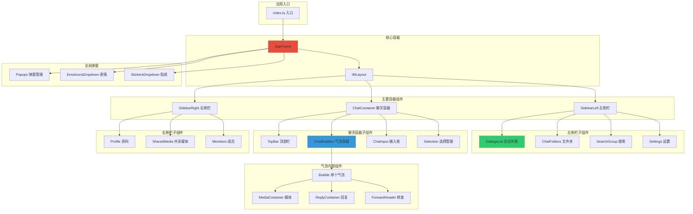

---

### MTProto 认证流程时序图

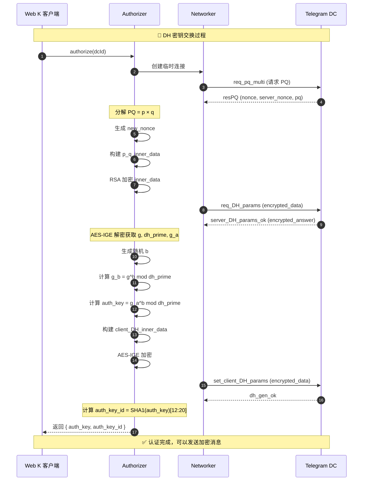

---

### 消息发送流程时序图

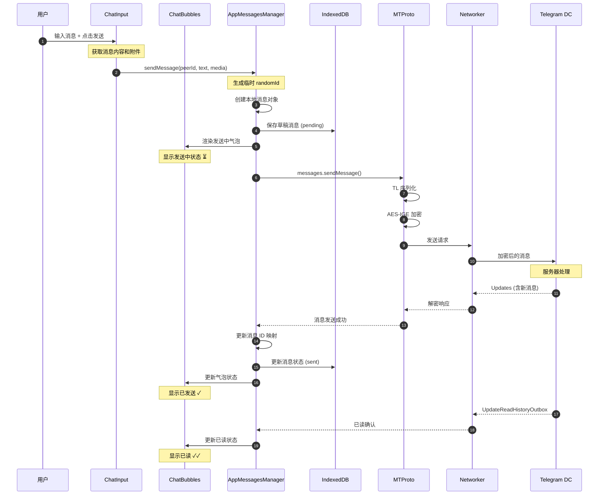

---

### 消息接收流程时序图

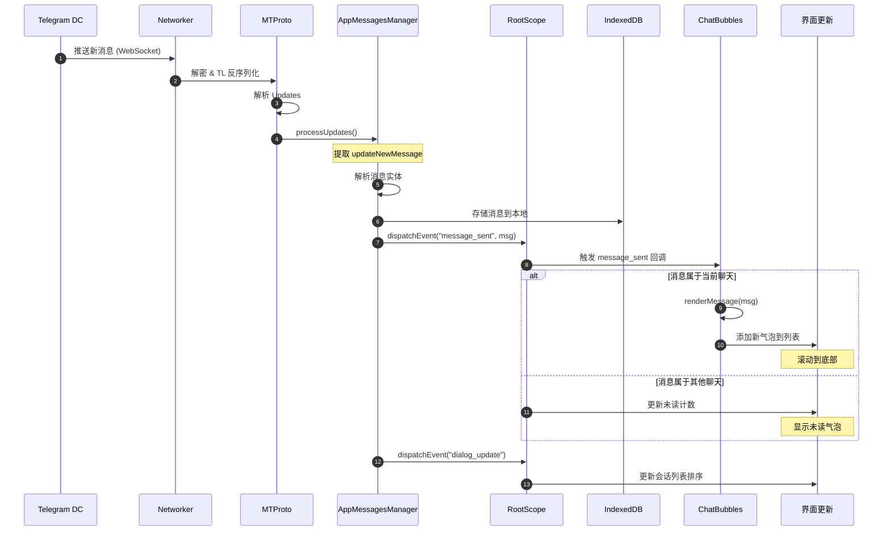

---

### IndexedDB 存储架构图

```mermaid
graph TB
    subgraph "IndexedDB: tweb"
        subgraph "messages Store"
            MSG_KEY["🔑 Key: [peerId, mid]"]
            MSG_IDX1["📇 Index: date"]
            MSG_IDX2["📇 Index: peerId"]
            MSG_DATA["📦 Data: Message Object"]
        end

        subgraph "dialogs Store"
            DLG_KEY["🔑 Key: peerId"]
            DLG_IDX1["📇 Index: pinned"]
            DLG_IDX2["📇 Index: folderId"]
            DLG_DATA["📦 Data: Dialog Object"]
        end

        subgraph "users Store"
            USR_KEY["🔑 Key: id"]
            USR_DATA["📦 Data: User Object"]
        end

        subgraph "chats Store"
            CHT_KEY["🔑 Key: id"]
            CHT_DATA["📦 Data: Chat/Channel Object"]
        end

        subgraph "files Store"
            FILE_KEY["🔑 Key: fileId"]
            FILE_DATA["📦 Data: Blob (媒体文件)"]
        end

        subgraph "session Store"
            SESS_KEY["🔑 Key: dcId"]
            SESS_DATA["📦 Data: Session Info"]
        end
    end

    subgraph "Memory Cache"
        MC_MSG["💾 messages Map"]
        MC_USER["💾 users Map"]
        MC_CHAT["💾 chats Map"]
        MC_FILE["💾 files Map (50MB LRU)"]
    end

    subgraph "AppStorage API"
        GET["get(store, key)"]
        SET["set(store, value)"]
        SET_MANY["setMany(store, values)"]
        GET_RANGE["getRange(store, index, range)"]
        DELETE["delete(store, key)"]
    end

    GET --> MSG_KEY
    GET --> DLG_KEY
    GET --> USR_KEY
    GET --> CHT_KEY
    GET --> FILE_KEY

    MC_MSG -.-> MSG_DATA
    MC_USER -.-> USR_DATA
    MC_FILE -.-> FILE_DATA

    style MSG_DATA fill:#3498db
    style DLG_DATA fill:#2ecc71
    style FILE_DATA fill:#e74c3c
```

---

### 事件系统流程图

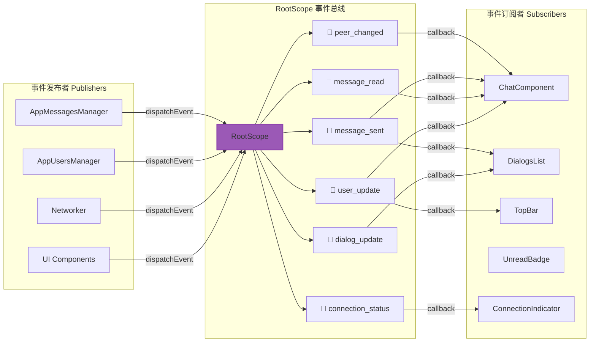

---

### 虚拟滚动工作原理图

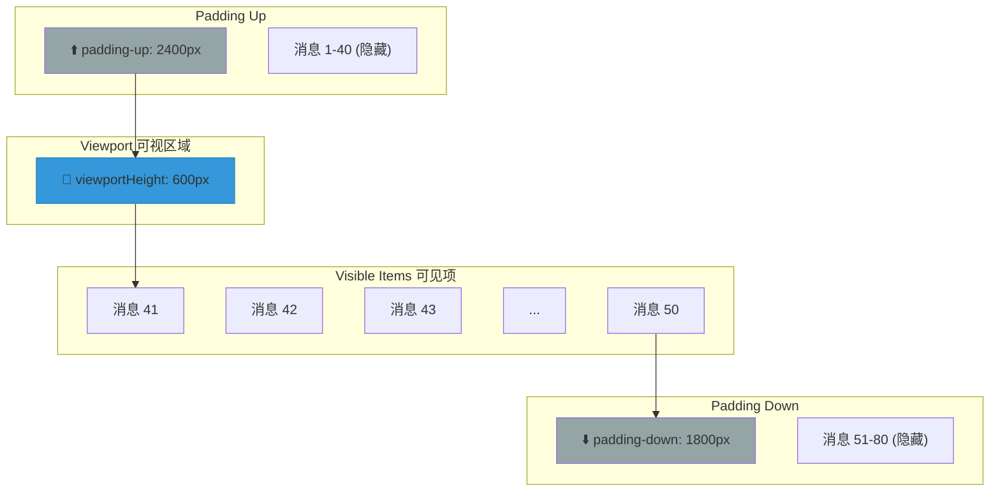

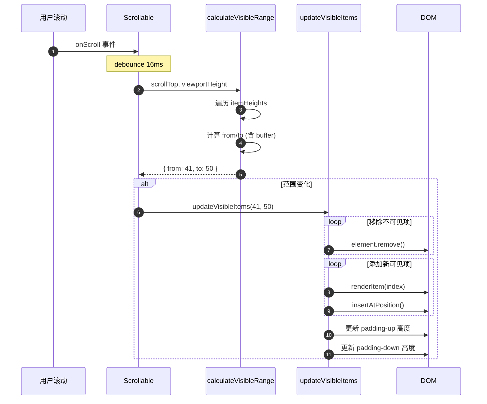

---

### TL 序列化流程图

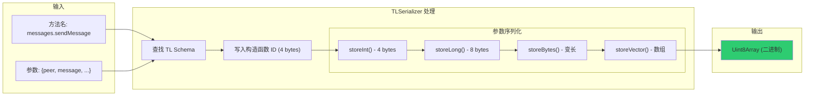

---

### 类继承关系图

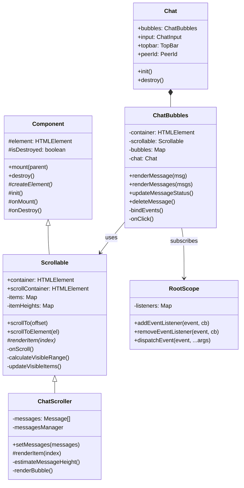

---

### 数据流状态图

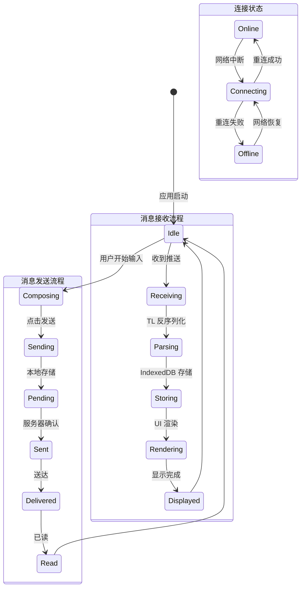

---

### 模块依赖关系图

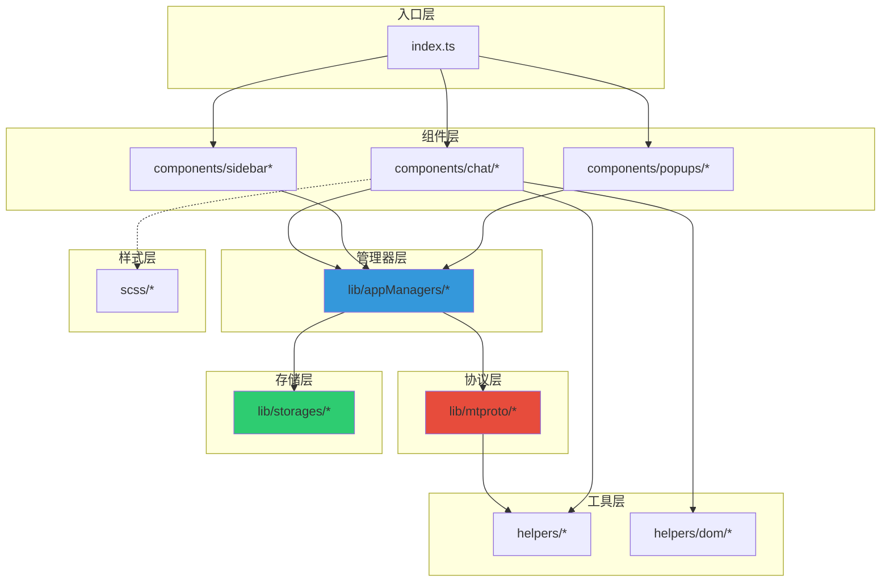

---

## Web Z vs Web K 核心差异

| 维度         | Web Z (telegram-tt)     | Web K (tweb)              |
| ------------ | ----------------------- | ------------------------- |
| **UI 框架**  | Teact (自研 React-like) | 无框架（原生 DOM）        |
| **MTProto**  | GramJS (第三方)         | 完全自实现                |
| **组件模式** | 函数式 + Hooks          | 类式 (Class-based)        |
| **状态管理** | 类 Redux                | 发布-订阅模式             |
| **构建产物** | 较大                    | 更小                      |
| **首屏速度** | 较慢                    | ⚡ 更快                   |
| **DOM 操作** | VDOM 抽象               | 直接操作原生 DOM          |
| **事件绑定** | JSX 属性绑定            | addEventListener 原生绑定 |
| **代码风格** | 声明式                  | 命令式                    |

---

## 1. 项目结构

```text
tweb/
├── src/
│   ├── components/               # UI 组件（混合架构：Class-based .ts + Solid .tsx）
│   │   ├── chat/                     # 聊天相关组件
│   │   ├── sidebarLeft/              # 左侧边栏
│   │   ├── sidebarRight/             # 右侧边栏
│   │   ├── popups/                   # 弹窗组件
│   │   ├── mediaEditor/              # 图片/视频编辑器 📸
│   │   ├── stories/                  # 动态 (Stories) 📸
│   │   ├── solidJsTabs/              # Solid.js 实现的标签页
│   │   ├── buttonTsx.tsx             # Solid 组件示例
│   │   └── ...
│   │
│   ├── lib/                      # 核心库
│   │   ├── mtproto/                  # MTProto 协议实现 (Worker based)
│   │   │   ├── mtproto.worker.ts         # Worker 入口
│   │   │   ├── networker.ts              # 网络层
│   │   │   └── ...
│   │   ├── appManagers/              # 业务管理器
│   │   ├── storages/                 # 存储层
│   │   ├── solidjs/                  # Solid.js 集成桥接 (defineSolidElement)
│   │   ├── rlottie/                  # RLottie WASM 绑定
│   │   └── serviceWorker/            # PWA 相关
│   │
│   ├── helpers/                  # 工具函数
│   ├── scss/                     # 样式
│   ├── solid/                    # Solid.js 核心 (packages/solid)
│   ├── sw.ts                     # Service Worker 入口
│   └── index.ts                  # 应用入口
│
├── public/                       # 静态资源
└── vite.config.ts                # 构建配置
```

---

## 2. 无框架 UI 架构

Web K 最大的特点是**完全不依赖任何 UI 框架**，直接使用原生 DOM API 构建 UI。

### 2.1 Class-based 组件模式

```typescript
// src/components/chat/bubbles.ts
// 消息气泡管理器

export default class ChatBubbles {
  private container: HTMLElement;
  private scrollable: Scrollable;
  private bubbles: Map<number, HTMLElement> = new Map();
  private chat: Chat;

  constructor(chat: Chat, container: HTMLElement) {
    this.chat = chat;
    this.container = container;
    this.scrollable = new Scrollable(container);

    this.bindEvents();
  }

  private bindEvents() {
    // 直接绑定 DOM 事件
    this.container.addEventListener('click', this.onClick.bind(this));
    this.container.addEventListener('scroll', this.onScroll.bind(this));
  }

  private onClick(e: MouseEvent) {
    const target = e.target as HTMLElement;
    const bubble = target.closest('.bubble') as HTMLElement;
    if (bubble) {
      const messageId = +bubble.dataset.mid!;
      this.handleBubbleClick(messageId, e);
    }
  }

  // 渲染单条消息
  public renderMessage(message: Message): HTMLElement {
    const bubble = document.createElement('div');
    bubble.className = 'bubble';
    bubble.dataset.mid = String(message.id);

    if (message.out) {
      bubble.classList.add('is-out');
    }

    // 消息内容
    const content = document.createElement('div');
    content.className = 'bubble-content';

    if (message.message) {
      const text = document.createElement('div');
      text.className = 'message';
      text.innerHTML = this.formatText(message.message);
      content.appendChild(text);
    }

    if (message.media) {
      const media = this.renderMedia(message.media);
      content.appendChild(media);
    }

    // 元信息（时间、状态）
    const meta = this.renderMeta(message);
    content.appendChild(meta);

    bubble.appendChild(content);

    // 缓存引用
    this.bubbles.set(message.id, bubble);

    return bubble;
  }

  // 批量渲染消息
  public renderMessages(messages: Message[]): void {
    const fragment = document.createDocumentFragment();

    for (const message of messages) {
      const bubble = this.renderMessage(message);
      fragment.appendChild(bubble);
    }

    this.container.appendChild(fragment);
  }

  // 更新消息状态
  public updateMessageStatus(messageId: number, status: MessageStatus): void {
    const bubble = this.bubbles.get(messageId);
    if (!bubble) return;

    const statusEl = bubble.querySelector('.message-status');
    if (statusEl) {
      statusEl.className = `message-status status-${status}`;
    }
  }

  // 删除消息
  public deleteMessage(messageId: number): void {
    const bubble = this.bubbles.get(messageId);
    if (bubble) {
      bubble.remove();
      this.bubbles.delete(messageId);
    }
  }

  public destroy(): void {
    this.container.removeEventListener('click', this.onClick);
    this.container.removeEventListener('scroll', this.onScroll);
    this.bubbles.clear();
  }
}
```

### 2.2 组件生命周期管理

```typescript
// 手动管理组件生命周期
abstract class Component {
  protected element: HTMLElement;
  protected isDestroyed: boolean = false;

  constructor(options: ComponentOptions) {
    this.element = this.createElement();
    this.init();
  }

  protected abstract createElement(): HTMLElement;

  protected init(): void {
    // 子类重写初始化逻辑
  }

  public mount(parent: HTMLElement): void {
    parent.appendChild(this.element);
    this.onMount();
  }

  protected onMount(): void {
    // 子类重写挂载后逻辑
  }

  public destroy(): void {
    if (this.isDestroyed) return;

    this.onDestroy();
    this.element.remove();
    this.isDestroyed = true;
  }

  protected onDestroy(): void {
    // 子类重写销毁逻辑（移除事件监听等）
  }
}
```

### 2.3 为什么选择无框架？

| 框架方案       | Web K 做法       | 理由                |
| -------------- | ---------------- | ------------------- |
| React/Vue VDOM | 直接操作真实 DOM | 避免 VDOM diff 开销 |
| 框架调度器     | 自控更新时机     | 更精确的性能控制    |
| 组件抽象       | 原生类封装       | 零运行时开销        |
| 响应式系统     | 手动订阅更新     | 避免代理/观察者开销 |

---

## 3. 自实现 MTProto 协议

Web K **从零实现**了完整的 MTProto 协议，这是它与 Web Z 最大的技术差异。

### 3.1 协议架构

```text
┌────────────────────────────────────────────────────────────┐
│                      Application Layer                      │
│                  (appMessagesManager, etc.)                  │
└──────────────────────────┬─────────────────────────────────┘
                           │
┌──────────────────────────▼─────────────────────────────────┐
│                       MTProto API                           │
│  ┌─────────────────────────────────────────────────────┐   │
│  │                   invokeApi()                        │   │
│  │  - TL 序列化请求                                     │   │
│  │  - 等待响应                                          │   │
│  │  - 处理错误/重试                                     │   │
│  └─────────────────────────────────────────────────────┘   │
└──────────────────────────┬─────────────────────────────────┘
                           │
┌──────────────────────────▼─────────────────────────────────┐
│                       Networker                             │
│  ┌─────────────────────────────────────────────────────┐   │
│  │  • 消息序列化 (msg_id, seq_no)                       │   │
│  │  • 加密 (AES-256-IGE)                               │   │
│  │  • ACK 管理                                          │   │
│  │  • 重传机制                                          │   │
│  └─────────────────────────────────────────────────────┘   │
└──────────────────────────┬─────────────────────────────────┘
                           │
┌──────────────────────────▼─────────────────────────────────┐
│                      Transport Layer                        │
│  ┌─────────────┐  ┌─────────────┐  ┌─────────────────────┐ │
│  │  WebSocket  │  │    HTTP     │  │  Obfuscated         │ │
│  │  (主要)     │  │   (降级)    │  │  (反审查)           │ │
│  └─────────────┘  └─────────────┘  └─────────────────────┘ │
└────────────────────────────────────────────────────────────┘
```

### 3.2 核心类实现

```typescript
// src/lib/mtproto/mtproto.ts

export class MTProto {
  private networkers: Map<number, Networker> = new Map();
  private authorizer: Authorizer;
  private dcConfigurator: DcConfigurator;

  constructor() {
    this.authorizer = new Authorizer();
    this.dcConfigurator = new DcConfigurator();
  }

  // 发起 API 调用
  public async invokeApi<T>(
    method: string,
    params: object = {},
    options: InvokeOptions = {},
  ): Promise<T> {
    const { dcId = 2, timeout = 30000 } = options;

    // 1. 获取或创建 Networker
    const networker = await this.getNetworker(dcId);

    // 2. 构建 TL 对象
    const serializer = new TLSerializer();
    serializer.storeMethod(method, params);
    const message = serializer.getBytes();

    // 3. 发送并等待响应
    return new Promise((resolve, reject) => {
      const timeoutId = setTimeout(() => {
        reject(new Error('Request timeout'));
      }, timeout);

      networker.sendRequest(message, (result, error) => {
        clearTimeout(timeoutId);

        if (error) {
          reject(error);
        } else {
          resolve(result as T);
        }
      });
    });
  }

  // 获取 Networker（延迟创建）
  private async getNetworker(dcId: number): Promise<Networker> {
    if (this.networkers.has(dcId)) {
      return this.networkers.get(dcId)!;
    }

    // 获取 DC 配置
    const dcConfig = await this.dcConfigurator.getDcConfig(dcId);

    // 执行认证（如果需要）
    const authKey = await this.authorizer.authorize(dcId);

    // 创建 Networker
    const networker = new Networker(dcConfig, authKey);
    this.networkers.set(dcId, networker);

    return networker;
  }
}
```

### 3.3 TL 序列化/反序列化

```typescript
// src/lib/mtproto/tl/serialization.ts

export class TLSerializer {
  private buffer: ArrayBuffer;
  private view: DataView;
  private offset: number = 0;

  constructor(maxSize: number = 2048) {
    this.buffer = new ArrayBuffer(maxSize);
    this.view = new DataView(this.buffer);
  }

  // 写入 Int32
  public storeInt(value: number): void {
    this.view.setInt32(this.offset, value, true); // little-endian
    this.offset += 4;
  }

  // 写入 Int64
  public storeLong(value: bigint): void {
    const low = Number(value & BigInt(0xffffffff));
    const high = Number((value >> BigInt(32)) & BigInt(0xffffffff));
    this.storeInt(low);
    this.storeInt(high);
  }

  // 写入字符串/字节
  public storeBytes(bytes: Uint8Array): void {
    const len = bytes.length;

    if (len < 254) {
      this.view.setUint8(this.offset++, len);
    } else {
      this.view.setUint8(this.offset++, 254);
      this.view.setUint8(this.offset++, len & 0xff);
      this.view.setUint8(this.offset++, (len >> 8) & 0xff);
      this.view.setUint8(this.offset++, (len >> 16) & 0xff);
    }

    new Uint8Array(this.buffer, this.offset).set(bytes);
    this.offset += len;

    // 4 字节对齐
    while (this.offset % 4 !== 0) {
      this.view.setUint8(this.offset++, 0);
    }
  }

  // 写入方法调用
  public storeMethod(method: string, params: object): void {
    const constructor = TL_SCHEMA.methods[method];
    if (!constructor) {
      throw new Error(`Unknown method: ${method}`);
    }

    // 写入构造函数 ID
    this.storeInt(constructor.id);

    // 写入参数
    for (const param of constructor.params) {
      const value = params[param.name];
      this.storeValue(value, param.type);
    }
  }

  private storeValue(value: any, type: string): void {
    switch (type) {
      case 'int':
        this.storeInt(value);
        break;
      case 'long':
        this.storeLong(BigInt(value));
        break;
      case 'string':
        this.storeBytes(new TextEncoder().encode(value));
        break;
      case 'bytes':
        this.storeBytes(value);
        break;
      // ... 其他类型
    }
  }

  public getBytes(): Uint8Array {
    return new Uint8Array(this.buffer, 0, this.offset);
  }
}
```

### 3.4 AES-IGE 加密实现

```typescript
// src/lib/mtproto/crypto/aesIge.ts

export async function aesEncryptIge(
  data: Uint8Array,
  key: Uint8Array,
  iv: Uint8Array,
): Promise<Uint8Array> {
  const blockSize = 16;
  const paddedData = padTo16Bytes(data);
  const result = new Uint8Array(paddedData.length);

  // IV 分为两部分
  let ivp = iv.slice(0, blockSize); // 前 16 字节
  let iv2p = iv.slice(blockSize); // 后 16 字节

  // 导入密钥
  const cryptoKey = await crypto.subtle.importKey(
    'raw',
    key,
    { name: 'AES-CBC' },
    false,
    ['encrypt'],
  );

  // IGE 模式：每个块依赖前一个明文和密文
  for (let i = 0; i < paddedData.length; i += blockSize) {
    const block = paddedData.slice(i, i + blockSize);

    // XOR with previous ciphertext
    const xored = xor(block, ivp);

    // AES ECB encrypt
    const encrypted = await aesEncryptBlock(cryptoKey, xored);

    // XOR with previous plaintext
    const cipherBlock = xor(new Uint8Array(encrypted), iv2p);

    result.set(cipherBlock, i);

    // 更新 IV
    ivp = cipherBlock;
    iv2p = block;
  }

  return result;
}

function xor(a: Uint8Array, b: Uint8Array): Uint8Array {
  const result = new Uint8Array(a.length);
  for (let i = 0; i < a.length; i++) {
    result[i] = a[i] ^ b[i];
  }
  return result;
}

async function aesEncryptBlock(
  key: CryptoKey,
  block: Uint8Array,
): Promise<ArrayBuffer> {
  const iv = new Uint8Array(16); // ECB 模式用全零 IV
  const result = await crypto.subtle.encrypt(
    { name: 'AES-CBC', iv },
    key,
    block,
  );
  return result.slice(0, 16); // 只取第一个块
}
```

---

## 4. IndexedDB 存储层

Web K 大量使用 IndexedDB 进行本地缓存，实现近乎离线的体验。

### 4.1 存储架构

```text
┌─────────────────────────────────────────────────────────┐
│                     IndexedDB                            │
│                                                          │
│  ┌─────────────────────────────────────────────────┐    │
│  │  Object Store: messages                          │    │
│  │  Key: peerId + messageId                         │    │
│  │  Indexes: date, media type                       │    │
│  └─────────────────────────────────────────────────┘    │
│                                                          │
│  ┌─────────────────────────────────────────────────┐    │
│  │  Object Store: dialogs                           │    │
│  │  Key: peerId                                     │    │
│  │  Indexes: pinned, folder                         │    │
│  └─────────────────────────────────────────────────┘    │
│                                                          │
│  ┌─────────────────────────────────────────────────┐    │
│  │  Object Store: users / chats                     │    │
│  │  Key: id                                         │    │
│  └─────────────────────────────────────────────────┘    │
│                                                          │
│  ┌─────────────────────────────────────────────────┐    │
│  │  Object Store: files                             │    │
│  │  Key: fileId                                     │    │
│  │  Value: Blob (图片/视频/文档)                    │    │
│  └─────────────────────────────────────────────────┘    │
└─────────────────────────────────────────────────────────┘
```

### 4.2 存储封装

```typescript
// src/lib/storages/storage.ts

export class AppStorage {
  private db: IDBDatabase | null = null;
  private dbName = 'tweb';
  private dbVersion = 10;

  private stores = {
    messages: { keyPath: ['peerId', 'mid'] },
    dialogs: { keyPath: 'peerId' },
    users: { keyPath: 'id' },
    chats: { keyPath: 'id' },
    files: { keyPath: 'id' },
  };

  public async init(): Promise<void> {
    return new Promise((resolve, reject) => {
      const request = indexedDB.open(this.dbName, this.dbVersion);

      request.onerror = () => reject(request.error);

      request.onsuccess = () => {
        this.db = request.result;
        resolve();
      };

      request.onupgradeneeded = (event) => {
        const db = (event.target as IDBOpenDBRequest).result;
        this.createStores(db);
      };
    });
  }

  private createStores(db: IDBDatabase): void {
    for (const [name, options] of Object.entries(this.stores)) {
      if (!db.objectStoreNames.contains(name)) {
        const store = db.createObjectStore(name, options);

        // 创建索引
        if (name === 'messages') {
          store.createIndex('date', 'date', { unique: false });
          store.createIndex('peerId', 'peerId', { unique: false });
        }
        if (name === 'dialogs') {
          store.createIndex('pinned', 'pinned', { unique: false });
        }
      }
    }
  }

  // 保存数据
  public async set<T>(storeName: string, value: T): Promise<void> {
    const transaction = this.db!.transaction(storeName, 'readwrite');
    const store = transaction.objectStore(storeName);

    return new Promise((resolve, reject) => {
      const request = store.put(value);
      request.onsuccess = () => resolve();
      request.onerror = () => reject(request.error);
    });
  }

  // 批量保存
  public async setMany<T>(storeName: string, values: T[]): Promise<void> {
    const transaction = this.db!.transaction(storeName, 'readwrite');
    const store = transaction.objectStore(storeName);

    for (const value of values) {
      store.put(value);
    }

    return new Promise((resolve, reject) => {
      transaction.oncomplete = () => resolve();
      transaction.onerror = () => reject(transaction.error);
    });
  }

  // 获取数据
  public async get<T>(
    storeName: string,
    key: IDBValidKey,
  ): Promise<T | undefined> {
    const transaction = this.db!.transaction(storeName, 'readonly');
    const store = transaction.objectStore(storeName);

    return new Promise((resolve, reject) => {
      const request = store.get(key);
      request.onsuccess = () => resolve(request.result);
      request.onerror = () => reject(request.error);
    });
  }

  // 范围查询
  public async getRange<T>(
    storeName: string,
    indexName: string,
    range: IDBKeyRange,
  ): Promise<T[]> {
    const transaction = this.db!.transaction(storeName, 'readonly');
    const store = transaction.objectStore(storeName);
    const index = store.index(indexName);

    return new Promise((resolve, reject) => {
      const request = index.getAll(range);
      request.onsuccess = () => resolve(request.result);
      request.onerror = () => reject(request.error);
    });
  }

  // 删除数据
  public async delete(storeName: string, key: IDBValidKey): Promise<void> {
    const transaction = this.db!.transaction(storeName, 'readwrite');
    const store = transaction.objectStore(storeName);

    return new Promise((resolve, reject) => {
      const request = store.delete(key);
      request.onsuccess = () => resolve();
      request.onerror = () => reject(request.error);
    });
  }
}
```

### 4.3 文件缓存

```typescript
// 媒体文件缓存
export class FileStorage {
  private storage: AppStorage;
  private memoryCache: Map<string, Blob> = new Map();
  private maxMemoryCacheSize = 50 * 1024 * 1024; // 50MB
  private currentMemorySize = 0;

  constructor(storage: AppStorage) {
    this.storage = storage;
  }

  public async getFile(fileId: string): Promise<Blob | undefined> {
    // 1. 先查内存缓存
    if (this.memoryCache.has(fileId)) {
      return this.memoryCache.get(fileId);
    }

    // 2. 再查 IndexedDB
    const cached = await this.storage.get<{ id: string; blob: Blob }>(
      'files',
      fileId,
    );

    if (cached) {
      // 加入内存缓存
      this.addToMemoryCache(fileId, cached.blob);
      return cached.blob;
    }

    return undefined;
  }

  public async saveFile(fileId: string, blob: Blob): Promise<void> {
    // 保存到 IndexedDB
    await this.storage.set('files', { id: fileId, blob });

    // 加入内存缓存
    this.addToMemoryCache(fileId, blob);
  }

  private addToMemoryCache(fileId: string, blob: Blob): void {
    // 检查是否需要清理
    while (this.currentMemorySize + blob.size > this.maxMemoryCacheSize) {
      const firstKey = this.memoryCache.keys().next().value;
      if (!firstKey) break;

      const removed = this.memoryCache.get(firstKey)!;
      this.currentMemorySize -= removed.size;
      this.memoryCache.delete(firstKey);
    }

    this.memoryCache.set(fileId, blob);
    this.currentMemorySize += blob.size;
  }
}
```

---

## 5. 自定义滚动组件

Web K 实现了高性能的自定义滚动组件，支持虚拟滚动。

### 5.1 Scrollable 核心实现

```typescript
// src/helpers/scrollable.ts

export class Scrollable {
  public container: HTMLElement;
  public scrollContainer: HTMLElement;

  private splitUp: HTMLElement | null = null;
  private paddings: { up: HTMLElement; down: HTMLElement };

  private items: Map<number, HTMLElement> = new Map();
  private itemHeights: Map<number, number> = new Map();

  private visibleFrom: number = 0;
  private visibleTo: number = 0;

  private onScrollDebounced: () => void;

  constructor(container: HTMLElement, options: ScrollableOptions = {}) {
    this.container = container;
    this.scrollContainer = this.createScrollContainer();

    this.paddings = {
      up: this.createPadding('up'),
      down: this.createPadding('down'),
    };

    this.onScrollDebounced = debounce(this.onScroll.bind(this), 16);
    this.scrollContainer.addEventListener('scroll', this.onScrollDebounced);
  }

  private createScrollContainer(): HTMLElement {
    const el = document.createElement('div');
    el.className = 'scrollable scrollable-y';
    this.container.appendChild(el);
    return el;
  }

  private createPadding(position: 'up' | 'down'): HTMLElement {
    const el = document.createElement('div');
    el.className = `scrollable-padding scrollable-padding-${position}`;
    return el;
  }

  // 核心：计算可见区域
  private onScroll(): void {
    const scrollTop = this.scrollContainer.scrollTop;
    const viewportHeight = this.scrollContainer.clientHeight;

    const { from, to } = this.calculateVisibleRange(scrollTop, viewportHeight);

    if (from !== this.visibleFrom || to !== this.visibleTo) {
      this.updateVisibleItems(from, to);
      this.visibleFrom = from;
      this.visibleTo = to;
    }
  }

  private calculateVisibleRange(
    scrollTop: number,
    viewportHeight: number,
  ): { from: number; to: number } {
    let accumulatedHeight = 0;
    let from = 0;
    let to = 0;

    const buffer = viewportHeight; // 上下各缓冲一屏

    for (const [index, height] of this.itemHeights) {
      if (accumulatedHeight + height < scrollTop - buffer) {
        from = index + 1;
      }

      if (accumulatedHeight < scrollTop + viewportHeight + buffer) {
        to = index + 1;
      }

      accumulatedHeight += height;
    }

    return { from, to };
  }

  // 更新可见项
  private updateVisibleItems(from: number, to: number): void {
    // 移除不可见的项
    for (const [index, element] of this.items) {
      if (index < from || index >= to) {
        element.remove();
        this.items.delete(index);
      }
    }

    // 添加新可见项
    for (let i = from; i < to; i++) {
      if (!this.items.has(i)) {
        const element = this.renderItem(i);
        if (element) {
          this.items.set(i, element);
          this.insertAtPosition(element, i);
        }
      }
    }

    // 更新 padding 高度
    this.updatePaddings(from, to);
  }

  private updatePaddings(from: number, to: number): void {
    let upHeight = 0;
    let downHeight = 0;

    for (const [index, height] of this.itemHeights) {
      if (index < from) {
        upHeight += height;
      } else if (index >= to) {
        downHeight += height;
      }
    }

    this.paddings.up.style.height = `${upHeight}px`;
    this.paddings.down.style.height = `${downHeight}px`;
  }

  // 子类重写此方法
  protected renderItem(index: number): HTMLElement | null {
    throw new Error('Must be implemented by subclass');
  }

  // 滚动到指定位置
  public scrollTo(offset: number, behavior: ScrollBehavior = 'smooth'): void {
    this.scrollContainer.scrollTo({
      top: offset,
      behavior,
    });
  }

  // 滚动到指定元素
  public scrollToElement(
    element: HTMLElement,
    position: 'start' | 'center' | 'end' = 'center',
  ): void {
    const containerRect = this.scrollContainer.getBoundingClientRect();
    const elementRect = element.getBoundingClientRect();

    let offset: number;

    switch (position) {
      case 'start':
        offset = element.offsetTop;
        break;
      case 'center':
        offset =
          element.offsetTop - containerRect.height / 2 + elementRect.height / 2;
        break;
      case 'end':
        offset = element.offsetTop - containerRect.height + elementRect.height;
        break;
    }

    this.scrollTo(offset);
  }

  public destroy(): void {
    this.scrollContainer.removeEventListener('scroll', this.onScrollDebounced);
    this.items.clear();
    this.itemHeights.clear();
  }
}
```

### 5.2 消息列表滚动

```typescript
// 消息列表专用滚动
export class ChatScroller extends Scrollable {
  private messages: Message[] = [];
  private messagesManager: AppMessagesManager;

  constructor(container: HTMLElement, messagesManager: AppMessagesManager) {
    super(container);
    this.messagesManager = messagesManager;
  }

  public setMessages(messages: Message[]): void {
    this.messages = messages;

    // 预计算所有消息高度
    for (let i = 0; i < messages.length; i++) {
      const estimatedHeight = this.estimateMessageHeight(messages[i]);
      this.itemHeights.set(i, estimatedHeight);
    }

    this.onScroll();
  }

  protected renderItem(index: number): HTMLElement | null {
    const message = this.messages[index];
    if (!message) return null;

    const bubble = this.renderBubble(message);

    // 渲染后记录真实高度
    requestAnimationFrame(() => {
      const realHeight = bubble.getBoundingClientRect().height;
      if (realHeight !== this.itemHeights.get(index)) {
        this.itemHeights.set(index, realHeight);
        this.updatePaddings(this.visibleFrom, this.visibleTo);
      }
    });

    return bubble;
  }

  private estimateMessageHeight(message: Message): number {
    let height = 40; // 基础高度

    if (message.message) {
      height += Math.ceil(message.message.length / 40) * 20;
    }

    if (message.media?.photo) {
      height += 200;
    }

    if (message.media?.document) {
      height += 60;
    }

    return height;
  }

  private renderBubble(message: Message): HTMLElement {
    // 调用 ChatBubbles 渲染逻辑
    return this.chat.bubbles.renderMessage(message);
  }
}
```

---

## 6. 事件系统

Web K 使用发布-订阅模式处理全局事件。

### 6.1 事件总线

```typescript
// src/lib/rootScope.ts

type EventMap = {
  peer_changed: (peerId: PeerId) => void;
  message_sent: (message: Message) => void;
  message_read: (peerId: PeerId, maxId: number) => void;
  user_update: (user: User) => void;
  dialog_update: (dialog: Dialog) => void;
  connection_status: (status: 'online' | 'connecting' | 'offline') => void;
};

class RootScope {
  private listeners: Map<string, Set<Function>> = new Map();

  public addEventListener<K extends keyof EventMap>(
    event: K,
    callback: EventMap[K],
  ): void {
    if (!this.listeners.has(event)) {
      this.listeners.set(event, new Set());
    }
    this.listeners.get(event)!.add(callback);
  }

  public removeEventListener<K extends keyof EventMap>(
    event: K,
    callback: EventMap[K],
  ): void {
    this.listeners.get(event)?.delete(callback);
  }

  public dispatchEvent<K extends keyof EventMap>(
    event: K,
    ...args: Parameters<EventMap[K]>
  ): void {
    const callbacks = this.listeners.get(event);
    if (callbacks) {
      callbacks.forEach((callback) => {
        try {
          (callback as Function)(...args);
        } catch (error) {
          console.error(`Error in ${event} handler:`, error);
        }
      });
    }
  }
}

export const rootScope = new RootScope();
```

### 6.2 组件中使用

```typescript
// 在组件中订阅事件
class ChatComponent {
  constructor() {
    this.bindEvents();
  }

  private bindEvents(): void {
    rootScope.addEventListener('message_sent', this.onMessageSent);
    rootScope.addEventListener('message_read', this.onMessageRead);
    rootScope.addEventListener('connection_status', this.onConnectionChange);
  }

  private onMessageSent = (message: Message): void => {
    if (message.peerId === this.currentPeerId) {
      this.addMessage(message);
    }
  };

  private onMessageRead = (peerId: PeerId, maxId: number): void => {
    if (peerId === this.currentPeerId) {
      this.updateReadStatus(maxId);
    }
  };

  private onConnectionChange = (status: string): void => {
    this.updateConnectionIndicator(status);
  };

  public destroy(): void {
    rootScope.removeEventListener('message_sent', this.onMessageSent);
    rootScope.removeEventListener('message_read', this.onMessageRead);
    rootScope.removeEventListener('connection_status', this.onConnectionChange);
  }
}
```

---

## 7. SCSS 样式系统

### 7.1 变量系统

```scss
// src/scss/_variables.scss

:root {
  // 主题色
  --primary-color: #3390ec;
  --primary-color-rgb: 51, 144, 236;

  // 背景色
  --bg-color: #ffffff;
  --secondary-bg-color: #f4f4f5;
  --message-out-bg-color: #effdde;

  // 文字颜色
  --primary-text-color: #000000;
  --secondary-text-color: #707579;

  // 尺寸
  --border-radius: 10px;
  --border-radius-medium: 8px;

  // 动画
  --transition-duration: 0.2s;
  --layer-transition: 0.3s cubic-bezier(0.4, 0, 0.2, 1);
}

// 暗色主题
html[data-theme='dark'] {
  --bg-color: #212121;
  --secondary-bg-color: #181818;
  --primary-text-color: #ffffff;
  --secondary-text-color: #aaaaaa;
  --message-out-bg-color: #8774e1;
}
```

### 7.2 气泡样式

```scss
// src/scss/partials/_bubble.scss

.bubble {
  position: relative;
  max-width: 480px;
  margin: 2px 0;

  &-content {
    padding: 6px 9px 5px 9px;
    border-radius: var(--border-radius);
    background: var(--secondary-bg-color);
  }

  // 发出的消息
  &.is-out {
    align-self: flex-end;

    .bubble-content {
      background: var(--message-out-bg-color);
    }
  }

  // 气泡尾巴
  &.with-tail {
    &::before {
      content: '';
      position: absolute;
      bottom: 0;
      width: 11px;
      height: 20px;
      background: inherit;
    }

    &.is-in::before {
      left: -5px;
      border-radius: 0 0 12px 0;
    }

    &.is-out::before {
      right: -5px;
      border-radius: 0 0 0 12px;
    }
  }

  // 消息文本
  .message {
    word-break: break-word;
    white-space: pre-wrap;
    line-height: 1.3125;
  }

  // 元信息
  .time {
    display: inline-flex;
    align-items: center;
    font-size: 12px;
    color: var(--secondary-text-color);

    .tgico-checks {
      margin-left: 3px;
    }
  }

  // 动画
  &.is-sending {
    opacity: 0.7;

    .time {
      &::after {
        content: '';
        width: 12px;
        height: 12px;
        border: 2px solid var(--primary-color);
        border-radius: 50%;
        border-top-color: transparent;
        animation: spin 1s linear infinite;
      }
    }
  }
}

@keyframes spin {
  to {
    transform: rotate(360deg);
  }
}
```

---

## 8. 性能优化技巧

### 8.1 DOM 操作优化

```typescript
// 批量 DOM 更新
export function batchDOM(callback: () => void): void {
  // 使用 requestAnimationFrame 合并更新
  requestAnimationFrame(() => {
    callback();
  });
}

// 使用 DocumentFragment 减少重排
export function appendChildren(
  parent: HTMLElement,
  children: HTMLElement[],
): void {
  const fragment = document.createDocumentFragment();
  children.forEach((child) => fragment.appendChild(child));
  parent.appendChild(fragment);
}

// 避免强制同步布局
export function getComputedDimensions(element: HTMLElement): DOMRect {
  // 缓存结果，避免频繁触发 reflow
  if (!element._cachedRect || element._rectInvalid) {
    element._cachedRect = element.getBoundingClientRect();
    element._rectInvalid = false;
  }
  return element._cachedRect;
}
```

### 8.2 图片懒加载

```typescript
// src/helpers/lazyLoad.ts

class LazyLoadQueue {
  private queue: Array<{
    element: HTMLImageElement | HTMLVideoElement;
    src: string;
    onLoad?: () => void;
  }> = [];

  private observer: IntersectionObserver;
  private loading: Set<HTMLElement> = new Set();
  private maxConcurrent = 5;

  constructor() {
    this.observer = new IntersectionObserver(this.onIntersection.bind(this), {
      rootMargin: '200px',
      threshold: 0,
    });
  }

  public add(
    element: HTMLImageElement | HTMLVideoElement,
    src: string,
    onLoad?: () => void,
  ): void {
    this.queue.push({ element, src, onLoad });
    this.observer.observe(element);
  }

  private onIntersection(entries: IntersectionObserverEntry[]): void {
    for (const entry of entries) {
      if (entry.isIntersecting) {
        const item = this.queue.find((q) => q.element === entry.target);
        if (item) {
          this.observer.unobserve(entry.target);
          this.loadItem(item);
        }
      }
    }
  }

  private async loadItem(item: (typeof this.queue)[0]): Promise<void> {
    // 控制并发数
    while (this.loading.size >= this.maxConcurrent) {
      await new Promise((r) => setTimeout(r, 50));
    }

    this.loading.add(item.element);

    try {
      await new Promise<void>((resolve, reject) => {
        item.element.onload = () => resolve();
        item.element.onerror = () => reject();
        item.element.src = item.src;
      });

      item.onLoad?.();
    } finally {
      this.loading.delete(item.element);
    }
  }
}

export const lazyLoadQueue = new LazyLoadQueue();
```

### 8.3 任务调度

```typescript
// src/helpers/schedulers.ts

// 高优先级：UI 更新
export function onFrame(callback: () => void): void {
  requestAnimationFrame(callback);
}

// 中优先级：数据处理
export function onTick(callback: () => void): void {
  queueMicrotask(callback);
}

// 低优先级：后台任务
export function onIdle(callback: () => void): void {
  if ('requestIdleCallback' in window) {
    requestIdleCallback(callback);
  } else {
    setTimeout(callback, 1);
  }
}

// 防抖
export function debounce<T extends (...args: any[]) => any>(
  fn: T,
  ms: number,
): T {
  let timeoutId: number;

  return function (this: any, ...args: any[]) {
    clearTimeout(timeoutId);
    timeoutId = window.setTimeout(() => fn.apply(this, args), ms);
  } as T;
}

// 节流
export function throttle<T extends (...args: any[]) => any>(
  fn: T,
  ms: number,
): T {
  let lastCall = 0;
  let timeoutId: number;

  return function (this: any, ...args: any[]) {
    const now = Date.now();
    const remaining = ms - (now - lastCall);

    clearTimeout(timeoutId);

    if (remaining <= 0) {
      lastCall = now;
      fn.apply(this, args);
    } else {
      timeoutId = window.setTimeout(() => {
        lastCall = Date.now();
        fn.apply(this, args);
      }, remaining);
    }
  } as T;
}
```

---

---

## 9. Service Worker 与 PWA

Web K 实现了完整的 PWA (Progressive Web App) 功能。

### 9.1 Service Worker 架构

```text
┌──────────────────────────────────────────────────────────────┐
│                      Service Worker                           │
│  ┌────────────────────────────────────────────────────────┐  │
│  │                    sw.ts 入口                           │  │
│  │  • 缓存策略管理                                         │  │
│  │  • 离线资源回退                                         │  │
│  │  • 推送通知处理                                         │  │
│  └────────────────────────────────────────────────────────┘  │
│                                                               │
│  ┌────────────────────────────────────────────────────────┐  │
│  │              src/lib/serviceWorker/                     │  │
│  │  • 与主线程通信                                         │  │
│  │  • 消息推送注册                                         │  │
│  │  • 缓存版本管理                                         │  │
│  └────────────────────────────────────────────────────────┘  │
└──────────────────────────────────────────────────────────────┘
```

### 9.2 缓存策略

```typescript
// sw.ts (简化示例)

const CACHE_NAME = 'tweb-v1';
const STATIC_ASSETS = [
  '/',
  '/index.html',
  '/main.js',
  '/style.css',
  // ... 静态资源列表
];

// 安装时预缓存
self.addEventListener('install', (event) => {
  event.waitUntil(
    caches.open(CACHE_NAME).then((cache) => {
      return cache.addAll(STATIC_ASSETS);
    }),
  );
});

// 网络优先，失败回退缓存
self.addEventListener('fetch', (event) => {
  event.respondWith(
    fetch(event.request)
      .then((response) => {
        // 克隆并缓存
        const clone = response.clone();
        caches.open(CACHE_NAME).then((cache) => {
          cache.put(event.request, clone);
        });
        return response;
      })
      .catch(() => {
        return caches.match(event.request);
      }),
  );
});
```

### 9.3 Web Push 通知

```typescript
// 推送通知注册
async function registerPush(): Promise<void> {
  const registration = await navigator.serviceWorker.ready;

  const subscription = await registration.pushManager.subscribe({
    userVisibleOnly: true,
    applicationServerKey: VAPID_PUBLIC_KEY,
  });

  // 向 Telegram 服务器注册
  const token = JSON.stringify({
    endpoint: subscription.endpoint,
    keys: {
      p256dh: btoa(
        String.fromCharCode(...new Uint8Array(subscription.getKey('p256dh')!)),
      ),
      auth: btoa(
        String.fromCharCode(...new Uint8Array(subscription.getKey('auth')!)),
      ),
    },
  });

  await mtproto.invokeApi('account.registerDevice', {
    token_type: 10, // WebPush
    token,
  });
}
```

---

## 10. Web Workers 多线程架构

Web K 使用 Web Workers 将繁重任务从主线程分离。

### 10.1 Worker 架构图

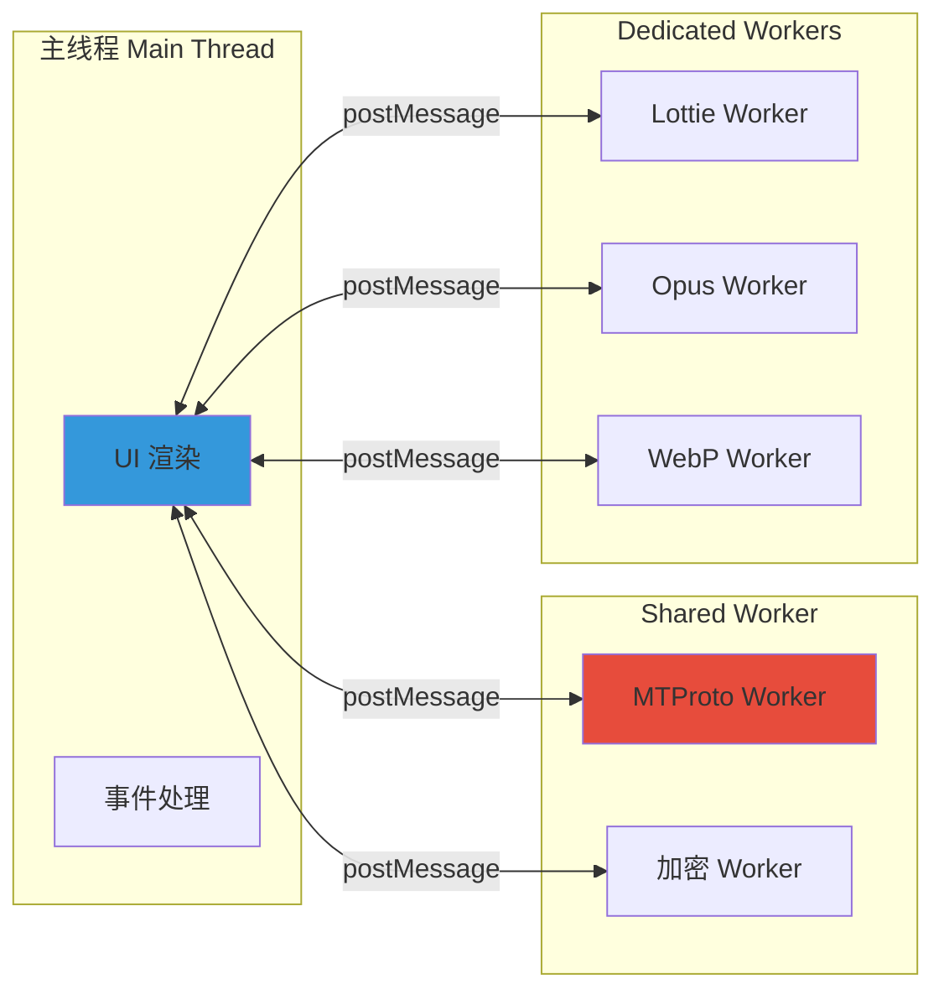

### 10.2 Shared Worker 通信

```typescript
// 使用 Shared Worker 处理 MTProto
// 支持多标签页共享同一连接

class MTProtoWorkerClient {
  private worker: SharedWorker;
  private callbacks: Map<number, Function> = new Map();
  private requestId = 0;

  constructor() {
    this.worker = new SharedWorker('./mtproto.worker.js');
    this.worker.port.onmessage = this.onMessage.bind(this);
    this.worker.port.start();
  }

  private onMessage(event: MessageEvent) {
    const { id, result, error } = event.data;
    const callback = this.callbacks.get(id);
    if (callback) {
      this.callbacks.delete(id);
      if (error) {
        callback(null, error);
      } else {
        callback(result);
      }
    }
  }

  public invokeApi<T>(method: string, params: object): Promise<T> {
    return new Promise((resolve, reject) => {
      const id = ++this.requestId;
      this.callbacks.set(id, (result: T, error?: Error) => {
        if (error) reject(error);
        else resolve(result);
      });

      this.worker.port.postMessage({ id, method, params });
    });
  }
}

// 禁用 Shared Worker (调试用)
// URL: ?noSharedWorker=1
```

---

## 11. WASM 模块集成

Web K 使用 WebAssembly 实现性能敏感功能。

### 11.1 WASM 模块列表

| 模块             | 用途            | 源项目     |
| ---------------- | --------------- | ---------- |
| **rlottie**      | Lottie 动画渲染 | Samsung    |
| **opus**         | Opus 音频编解码 | opus-codec |
| **libwebp**      | WebP 图片编解码 | Google     |
| **cryptography** | 加密加速        | spalt08    |

### 11.2 rlottie 动画渲染

```typescript
// src/lib/rlottie/

interface RLottiePlayer {
  init(canvas: HTMLCanvasElement, data: object): void;
  play(): void;
  pause(): void;
  stop(): void;
  setSpeed(speed: number): void;
  goToAndStop(frame: number): void;
  destroy(): void;
}

class LottieLoader {
  private workers: Worker[] = [];
  private queue: Map<string, LottieJob> = new Map();
  private maxWorkers = navigator.hardwareConcurrency || 4;

  constructor() {
    this.initWorkers();
  }

  private initWorkers(): void {
    for (let i = 0; i < this.maxWorkers; i++) {
      const worker = new Worker('./rlottie.worker.js');
      worker.onmessage = this.onWorkerMessage.bind(this, i);
      this.workers.push(worker);
    }
  }

  public async loadAnimation(
    container: HTMLElement,
    tgsUrl: string,
  ): Promise<RLottiePlayer> {
    // 1. 下载 .tgs 文件 (gzip 压缩的 JSON)
    const response = await fetch(tgsUrl);
    const compressed = await response.arrayBuffer();

    // 2. 解压 (pako)
    const json = pako.inflate(new Uint8Array(compressed), { to: 'string' });
    const animationData = JSON.parse(json);

    // 3. 创建 Canvas
    const canvas = document.createElement('canvas');
    canvas.width = animationData.w;
    canvas.height = animationData.h;
    container.appendChild(canvas);

    // 4. 发送到 Worker 渲染
    return this.createPlayer(canvas, animationData);
  }
}
```

### 11.3 Opus 音频录制

```typescript
// src/lib/opusDecodeController.ts

class OpusRecorder {
  private mediaRecorder: MediaRecorder | null = null;
  private opusWorker: Worker;

  constructor() {
    this.opusWorker = new Worker('./opus.worker.js');
  }

  public async startRecording(): Promise<void> {
    const stream = await navigator.mediaDevices.getUserMedia({ audio: true });

    // 使用 opus-recorder 库
    this.opusWorker.postMessage({
      command: 'init',
      config: {
        sampleRate: 48000,
        numberOfChannels: 1,
        encoderBitRate: 32000,
        encoderApplication: 2049, // VOIP
      },
    });

    const audioContext = new AudioContext({ sampleRate: 48000 });
    const source = audioContext.createMediaStreamSource(stream);
    const processor = audioContext.createScriptProcessor(4096, 1, 1);

    processor.onaudioprocess = (e) => {
      const inputData = e.inputBuffer.getChannelData(0);
      this.opusWorker.postMessage({
        command: 'encode',
        buffers: [inputData.buffer],
      });
    };

    source.connect(processor);
    processor.connect(audioContext.destination);
  }

  public stopRecording(): Promise<Blob> {
    return new Promise((resolve) => {
      this.opusWorker.onmessage = (e) => {
        if (e.data.command === 'done') {
          const blob = new Blob([e.data.buffer], { type: 'audio/ogg' });
          resolve(blob);
        }
      };
      this.opusWorker.postMessage({ command: 'finish' });
    });
  }
}
```

---

## 12. Solid.js 集成

Web K 近期引入了 Solid.js 用于部分新组件开发。

### 12.1 混合架构

```text
┌─────────────────────────────────────────────────────────────┐
│                     Web K 组件架构                           │
├─────────────────────────────────────────────────────────────┤
│                                                              │
│   ┌──────────────────────┐    ┌──────────────────────────┐  │
│   │   原生 Class 组件     │    │    Solid.js 组件         │  │
│   │   (主体架构)          │    │    (新特性)              │  │
│   │                      │    │                          │  │
│   │  • Chat              │    │  • 新 UI 组件            │  │
│   │  • Bubbles           │    │  • 响应式表单            │  │
│   │  • Sidebar           │    │  • 动态列表              │  │
│   └──────────────────────┘    └──────────────────────────┘  │
│              │                           │                   │
│              └───────────┬───────────────┘                   │
│                          │                                   │
│                  ┌───────▼───────┐                          │
│                  │  RootScope    │                          │
│                  │  (事件总线)    │                          │
│                  └───────────────┘                          │
└─────────────────────────────────────────────────────────────┘
```

### 12.2 Solid.js 组件示例

```typescript
// src/lib/solidjs/ 下的组件

import { createSignal, createEffect, onCleanup } from 'solid-js';

// 响应式组件示例
function MessageInput(props: { peerId: PeerId }) {
  const [text, setText] = createSignal('');
  const [isSending, setIsSending] = createSignal(false);

  const handleSend = async () => {
    if (!text().trim() || isSending()) return;

    setIsSending(true);
    try {
      await appMessagesManager.sendMessage(props.peerId, { message: text() });
      setText('');
    } finally {
      setIsSending(false);
    }
  };

  // 订阅外部事件
  createEffect(() => {
    const handler = () => setText('');
    rootScope.addEventListener('chat_changed', handler);
    onCleanup(() => rootScope.removeEventListener('chat_changed', handler));
  });

  return (
    <div class="message-input">
      <input
        value={text()}
        onInput={(e) => setText(e.currentTarget.value)}
        placeholder="Type a message..."
        disabled={isSending()}
      />
      <button onClick={handleSend} disabled={isSending()}>
        Send
      </button>
    </div>
  );
}
```

---

## 13. 构建系统 (Vite)

Web K 使用 Vite 作为构建工具。

### 13.1 构建配置

```typescript
// vite.config.ts (简化版)

import { defineConfig } from 'vite';
import solidPlugin from 'vite-plugin-solid';

export default defineConfig({
  plugins: [solidPlugin()],

  build: {
    target: 'esnext',
    minify: 'terser',
    sourcemap: true, // 生产环境也保留 source map
    rollupOptions: {
      output: {
        manualChunks: {
          vendor: ['pako', 'big-integer'],
          mtproto: ['./src/lib/mtproto/index.ts'],
          rlottie: ['./src/lib/rlottie/index.ts'],
        },
      },
    },
  },

  worker: {
    format: 'es', // Worker 使用 ES Module
  },

  server: {
    port: 8080,
    proxy: {
      '/api': {
        target: 'https://venus.web.telegram.org',
        changeOrigin: true,
      },
    },
  },
});
```

### 13.2 开发命令

```bash
# 安装依赖
pnpm install

# 开发模式
pnpm start      # 启动 http://localhost:8080

# 生产构建
node build      # 输出到 public/

# Docker 开发
docker-compose up tweb.develop

# Docker 生产
docker-compose up tweb.production
```

---

## 14. 国际化 (i18n) 系统

### 14.1 语言包架构

```typescript
// src/lib/langPack.ts

interface LangPackString {
  key: string;
  value: string;
  pluralRules?: {
    zero?: string;
    one?: string;
    two?: string;
    few?: string;
    many?: string;
    other: string;
  };
}

class LangPack {
  private strings: Map<string, LangPackString> = new Map();
  private currentLang = 'en';

  public async loadLanguage(langCode: string): Promise<void> {
    // 从服务器获取语言包
    const langPack = await mtproto.invokeApi('langpack.getLangPack', {
      lang_pack: 'web',
      lang_code: langCode,
    });

    for (const string of langPack.strings) {
      this.strings.set(string.key, string);
    }

    this.currentLang = langCode;
    rootScope.dispatchEvent('lang_changed');
  }

  public get(key: string, args?: Record<string, string | number>): string {
    const str = this.strings.get(key);
    if (!str) return key;

    let value = str.value;

    // 替换参数 {name}
    if (args) {
      for (const [k, v] of Object.entries(args)) {
        value = value.replace(`{${k}}`, String(v));
      }
    }

    return value;
  }

  // 复数形式
  public getPlural(
    key: string,
    count: number,
    args?: Record<string, string | number>,
  ): string {
    const str = this.strings.get(key);
    if (!str?.pluralRules) return this.get(key, args);

    const rule = new Intl.PluralRules(this.currentLang).select(count);
    const template = str.pluralRules[rule] || str.pluralRules.other;

    return template.replace('{count}', String(count));
  }
}

export const langPack = new LangPack();

// 使用
// langPack.get('Chat.Members', { count: 5 })
// langPack.getPlural('Messages.Count', 3)
```

### 14.2 语言检测

```typescript
// src/lib/tinyld/ - 语言检测

import { detect } from 'tinyld';

// 检测消息语言
function detectMessageLanguage(text: string): string {
  return detect(text); // 返回 ISO 语言代码
}
```

---

## 15. 音视频通话 (Calls)

### 15.1 通话架构

```mermaid
sequenceDiagram
    participant A as 用户 A
    participant S as Telegram Server
    participant B as 用户 B

    A->>S: phone.requestCall
    S->>B: updatePhoneCall (ringing)
    B->>S: phone.acceptCall
    S->>A: updatePhoneCall (accepted)

    Note over A,B: SRTP 密钥交换

    A->>S: phone.confirmCall
    S->>B: 完整通话参数

    Note over A,B: 直连或 relay

    A<-->B: WebRTC (P2P / Relay)
```

### 15.2 WebRTC 集成

```typescript
// src/lib/calls/

class CallController {
  private peerConnection: RTCPeerConnection | null = null;
  private localStream: MediaStream | null = null;

  public async initiateCall(userId: UserId): Promise<void> {
    // 1. 获取本地媒体
    this.localStream = await navigator.mediaDevices.getUserMedia({
      audio: true,
      video: false,
    });

    // 2. 创建 PeerConnection
    this.peerConnection = new RTCPeerConnection({
      iceServers: [
        { urls: 'stun:stun.telegram.org:443' },
        // Telegram relay servers
      ],
    });

    // 3. 添加本地轨道
    this.localStream.getTracks().forEach((track) => {
      this.peerConnection!.addTrack(track, this.localStream!);
    });

    // 4. 创建 Offer
    const offer = await this.peerConnection.createOffer();
    await this.peerConnection.setLocalDescription(offer);

    // 5. 发送到 Telegram 服务器
    await mtproto.invokeApi('phone.requestCall', {
      user_id: userId,
      protocol: {
        min_layer: 92,
        max_layer: 92,
        udp_p2p: true,
        udp_reflector: true,
        library_versions: ['5.0.0'],
      },
      // ... encryption parameters
    });
  }
}
```

---

## 16. HLS 流媒体

Web K 支持 HLS 直播流播放。

```typescript
// src/lib/hls/

class HLSPlayer {
  private video: HTMLVideoElement;
  private hls: Hls | null = null;

  constructor(video: HTMLVideoElement) {
    this.video = video;
  }

  public async loadStream(url: string): Promise<void> {
    if (Hls.isSupported()) {
      this.hls = new Hls({
        enableWorker: true,
        lowLatencyMode: true,
      });

      this.hls.loadSource(url);
      this.hls.attachMedia(this.video);

      this.hls.on(Hls.Events.MANIFEST_PARSED, () => {
        this.video.play();
      });
    } else if (this.video.canPlayType('application/vnd.apple.mpegurl')) {
      // Safari 原生支持
      this.video.src = url;
      this.video.play();
    }
  }

  public destroy(): void {
    this.hls?.destroy();
    this.hls = null;
  }
}
```

---

## 17. 密码锁 (Passcode)

Web K 支持本地密码锁保护。

```typescript
// src/lib/passcode/

class PasscodeManager {
  private isLocked = false;
  private passcodeHash: string | null = null;

  public async setPasscode(passcode: string): Promise<void> {
    // 使用 PBKDF2 派生密钥
    const salt = crypto.getRandomValues(new Uint8Array(16));
    const key = await this.deriveKey(passcode, salt);

    // 存储哈希 (不存储原始密码)
    this.passcodeHash = await this.hashKey(key);
    localStorage.setItem('passcode_salt', btoa(String.fromCharCode(...salt)));
    localStorage.setItem('passcode_hash', this.passcodeHash);
  }

  public async verifyPasscode(passcode: string): Promise<boolean> {
    const saltStr = localStorage.getItem('passcode_salt');
    if (!saltStr) return false;

    const salt = new Uint8Array([...atob(saltStr)].map((c) => c.charCodeAt(0)));
    const key = await this.deriveKey(passcode, salt);
    const hash = await this.hashKey(key);

    return hash === this.passcodeHash;
  }

  private async deriveKey(
    passcode: string,
    salt: Uint8Array,
  ): Promise<CryptoKey> {
    const encoder = new TextEncoder();
    const keyMaterial = await crypto.subtle.importKey(
      'raw',
      encoder.encode(passcode),
      'PBKDF2',
      false,
      ['deriveBits', 'deriveKey'],
    );

    return crypto.subtle.deriveKey(
      {
        name: 'PBKDF2',
        salt,
        iterations: 100000,
        hash: 'SHA-256',
      },
      keyMaterial,
      { name: 'AES-GCM', length: 256 },
      true,
      ['encrypt', 'decrypt'],
    );
  }

  public lock(): void {
    this.isLocked = true;
    rootScope.dispatchEvent('passcode_locked');
  }

  public unlock(): void {
    this.isLocked = false;
    rootScope.dispatchEvent('passcode_unlocked');
  }
}
```

---

## 18. 调试与开发

### 18.1 调试参数

| 参数               | 说明               | 示例                      |
| ------------------ | ------------------ | ------------------------- |
| `test=1`           | 使用测试 DC        | `localhost:8080/?test=1`  |
| `debug=1`          | 启用详细日志       | `localhost:8080/?debug=1` |
| `noSharedWorker=1` | 禁用 Shared Worker | 方便调试 MTProto          |
| `http=1`           | 强制 HTTP 传输     | 绕过 WebSocket            |

### 18.2 全局调试函数

```javascript
// 在浏览器控制台可用

// 查看所有图标
showIconLibrary();

// 获取 Manager 实例 (绑定到 window)
appMessagesManager;
appUsersManager;
appChatsManager;

// 源码映射
// 生产环境也包含 source map，方便调试
```

### 18.3 本地存储快照

```bash
# 使用快照工具保存/恢复 IndexedDB 状态
cd snapshot-server
npm install
npm start

# 访问 http://localhost:3000 管理快照
```

---

## 19. 核心依赖库

注：大多数依赖在 `package.json` 中定义为 `devDependencies`，构建时打包。

| 依赖/模块        | 包名 (npm)                            | 用途                    |
| :--------------- | :------------------------------------ | :---------------------- |
| **Solid.js**     | `solid-js`                            | 响应式 UI 库            |
| **Vite**         | `vite`                                | 构建工具                |
| **Cryptography** | `@cryptography/aes`, `sha1`, `sha256` | 加密算法实现            |
| **BigInt**       | `big-integer`                         | MTProto 大数运算        |
| **Pako**         | `pako`                                | Gzip 压缩/解压          |
| **HLS**          | `hls.js`                              | 流媒体播放              |
| **Media**        | `mp4-muxer`, `fast-png`               | 视频/图片处理           |
| **WebCrypto**    | `@peculiar/webcrypto`                 | Web Crypto API Polyfill |
| **Language**     | `tinyld`                              | 语言检测                |
| **Testing**      | `vitest`                              | 单元测试                |

---

## 20. 源码学习路径

1. **入门**：从 `src/index.ts` 开始，理解应用启动流程
2. **MTProto**：深入 `src/lib/mtproto/`，理解协议实现
3. **存储**：研究 `src/lib/storages/`，理解 IndexedDB 封装
4. **组件**：阅读 `src/components/chat/bubbles.ts`，理解 DOM 组件模式
5. **滚动**：分析 `src/helpers/scrollable.ts`，学习虚拟滚动
6. **事件**：查看 `src/lib/rootScope.ts`，理解发布-订阅模式
7. **Worker**：研究 `sw.ts` 和 `src/lib/serviceWorker/`，理解 PWA 实现
8. **WASM**：查看 `src/lib/rlottie/` 和 `src/lib/webp/`，理解 WASM 集成
9. **通话**：分析 `src/lib/calls/`，学习 WebRTC 实现
10. **Solid**：查看 `src/lib/solidjs/` 和 `src/solid/`，理解混合架构

---

> **🔗 源码参考**：
>
> - [tweb (Web K)](https://github.com/morethanwords/tweb)
> - [Telegram Web K 官方](https://webk.telegram.org)
