# Telegram Web Z (telegram-tt) 前端架构深度解析

> 事无巨细地剖析 Telegram Web Z 的前端工程实现，适合前端开发者深度学习

**📚 相关文档**：

- [← 返回 Telegram 客户端架构总览](./client-architecture.md)
- [Web K 架构深度解析 →](./web-k-architecture.md)

---

## 概述

**Web Z** (也称 Web A / telegram-tt) 是 Telegram 在 2019 年 Lightweight Client
Contest 中获得**第一名**的作品，现已成为官方 Web 客户端之一。

| 属性         | 值                                                        |
| ------------ | --------------------------------------------------------- |
| **访问地址** | `web.telegram.org/a` 或 `/z`                              |
| **仓库**     | [Ajaxy/telegram-tt](https://github.com/Ajaxy/telegram-tt) |
| **开发者**   | Ajaxy                                                     |
| **核心框架** | Teact (自研)                                              |
| **语言组成** | TypeScript (~68%), SCSS, Rust (WASM)                      |
| **协议实现** | GramJS (定制版)                                           |

### 整体架构图

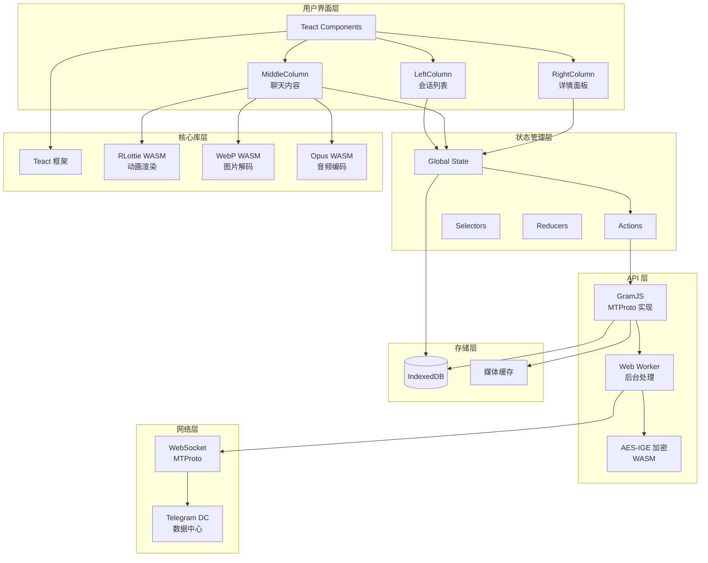

### 技术栈分层

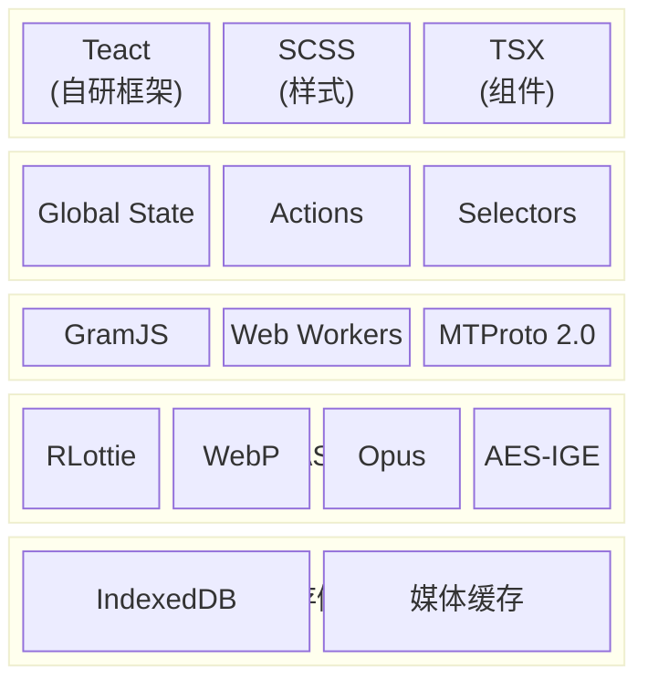

### 请求响应数据流

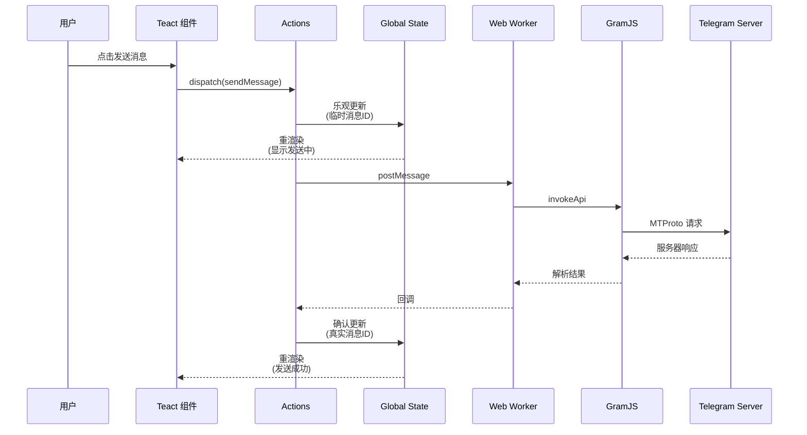

---

## 1. 项目结构

```text
telegram-tt/
├── src/
│   ├── @types/                  # 全局类型扩展
│   ├── api/                      # API 层 (业务封装)
│   │   ├── gramjs/                   # GramJS 业务集成
│   │   │   ├── apiBuilders/              # API 请求构建器
│   │   │   ├── methods/                  # 业务方法封装 (Auth/Chats/Msgs)
│   │   │   ├── worker/                   # Web Worker 通信适配
│   │   │   └── provider.ts               # Provider 定义
│   │   └── types/                    # API 类型定义
│   │
│   ├── components/               # UI 组件 (Teact JSX)
│   │   ├── common/                   # 通用组件
│   │   │   ├── Avatar.tsx
│   │   │   ├── Button.tsx
│   │   │   ├── Loading.tsx
│   │   │   └── Modal.tsx
│   │   ├── left/                     # 左侧面板 (会话列表)
│   │   │   ├── LeftColumn.tsx
│   │   │   ├── ChatList.tsx
│   │   │   └── search/
│   │   ├── middle/                   # 中间区域 (聊天内容)
│   │   │   ├── MiddleColumn.tsx
│   │   │   ├── MessageList.tsx
│   │   │   ├── message/
│   │   │   │   ├── Message.tsx
│   │   │   │   ├── MessageContent.tsx
│   │   │   │   └── MessageMeta.tsx
│   │   │   └── composer/
│   │   │       └── Composer.tsx
│   │   ├── right/                    # 右侧面板 (详情)
│   │   │   └── RightColumn.tsx
│   │   └── ui/                       # 基础 UI 元素
│   │
│   ├── global/                   # 全局状态管理
│   │   ├── actions/                  # Actions 定义
│   │   │   ├── api/                      # API 相关 actions
│   │   │   └── ui/                       # UI 相关 actions
│   │   ├── reducers/                 # Reducers
│   │   ├── selectors/                # Selectors (派生状态)
│   │   ├── initialState.ts           # 初始状态
│   │   └── index.ts                  # 状态管理入口
│   │
│   ├── hooks/                    # 自定义 Hooks
│   │   ├── useFlag.ts
│   │   ├── usePrevious.ts
│   │   ├── useIntersectionObserver.ts
│   │   └── useVirtualBackdrop.ts
│   │
│   ├── lib/                      # 核心库
│   │   ├── teact/                    # Teact 框架 core
│   │   │   ├── teact.ts                  # 核心 API (createElement, Component)
│   │   │   ├── teact-dom.ts              # DOM 渲染器 (render, patch)
│   │   │   └── teactn.tsx                # 全局状态管理 (Global State)
│   │   ├── rlottie/                  # RLottie WASM 绑定
│   │   ├── webp/                     # WebP WASM 解码
│   │   └── gramjs/                   # GramJS 核心库 (Vendored)
│   │
│   ├── util/                     # 工具函数
│   │   ├── buildClassName.ts
│   │   ├── fastSmoothScroll.ts
│   │   ├── schedulers.ts
│   │   └── signals.ts
│   │
│   ├── assets/                   # 静态资源与本地化
│   │   ├── localization/             # 语言包与初始文案
│   │   ├── icons/                    # 图标资源
│   │   └── fonts/                    # 字体资源
│   │
│   ├── bundles/                  # 代码分割入口
│   │   ├── auth.ts                  # 登录/注册相关
│   │   ├── calls.ts                 # 通话功能模块
│   │   ├── extra.ts                 # 次要功能集合
│   │   ├── main.ts                  # 主应用入口
│   │   └── stars.ts                 # Stars/付费相关
│   │
│   ├── serviceWorker/            # PWA/离线与推送
│   │   ├── assetCache.ts             # 资源缓存策略
│   │   ├── download.ts               # 下载管理
│   │   ├── pushNotification.ts       # 推送通知
│   │   ├── share.ts                  # Web Share 集成
│   │   └── index.ts                  # SW 入口
│   │
│   ├── styles/                   # 全局样式
│   │   ├── _variables.scss
│   │   ├── _mixins.scss
│   │   └── index.scss
│   │
│   ├── types/                    # 业务类型定义
│   ├── config.ts                 # 全局配置与常量
│   ├── limits.ts                 # 运行时限制与阈值
│   ├── versionNotification.txt   # 版本提示文案
│   ├── index.html                # 页面模板
│   └── index.tsx                 # 应用入口
│
├── public/
│   ├── site.webmanifest          # PWA manifest
│   ├── favicon.svg               # 站点图标
│   ├── icon-192x192.png          # 安装图标
│   ├── notification.mp3          # 通知音效
│   ├── rlottie/                  # WASM 文件
│   │   └── rlottie-wasm.wasm
│   └── opus/                     # Opus 编码器
│
├── webpack.config.ts             # Webpack 配置
├── tsconfig.json                 # TypeScript 配置
└── package.json                  # 依赖管理 (React 为 devDependency 用于兼容)
```

---

### 1.1 代码分割入口（bundles）

`src/bundles/` 定义拆包入口，用于按功能加载主包与功能模块：

- `auth.ts`：登录/注册流程与初始加载
- `main.ts`：主应用入口与核心路由
- `calls.ts`：通话相关 UI 与依赖
- `stars.ts`：Stars/付费能力
- `extra.ts`：次要功能集合

### 1.2 Service Worker 与 PWA

`src/serviceWorker/` 负责离线缓存、下载管理、推送通知与分享：

- `assetCache.ts`：静态资源与版本缓存策略
- `download.ts`：下载任务与断点处理
- `pushNotification.ts`：推送通知事件处理
- `share.ts`：Web Share 与分享分发
- `index.ts`：Service Worker 入口

`public/` 中的 `site.webmanifest` 与图标资源配合 PWA 安装与离线体验。

### 1.3 本地化与语言包

`src/assets/localization/`
存放初始文案与 fallback 语言包，与运行时语言包缓存结合，支持多语言切换与离线回退。

### 1.4 配置与限制参数

- `src/config.ts`：环境变量、缓存 key、并发限制、功能开关
- `src/limits.ts`：阈值/分页/限流等运行时参数
- `src/versionNotification.txt`：版本提示文案

这些参数共同控制多账号上限、缓存分区、分页大小与刷新周期等。

### 1.5 公共资源与媒体

`public/` 中包含通知音效、图标、manifest 与兼容性资源； `src/assets/`
管理应用内图标、字体、背景与品牌素材。

---

### 1.6 Service Worker 细节（按文件）

**入口与路由**（`src/serviceWorker/index.ts`）：

- `install`：`skipWaiting()` 立即接管。
- `activate`：`clearAssetCache()` + `clients.claim()`，并用 `pause(3000)`
  兜底，规避 iOS 上可能的 UI 卡顿。
- `fetch`：仅处理当前 scope 内请求；路由规则：
  - `/progressive/` → `respondForProgressive`
  - `/download/` → `respondForDownload`
  - `/share/` → `respondForShare`
  - `*.wasm` / `*.html` → network-first
  - 资源 hash 命中（`/[\da-f]{20}.*\.(js|css|woff2?|svg|png|jpg|jpeg|tgs|json|wasm)$/`）→
    cache-first
- 事件：`push` / `notificationclick` / `message` 交由对应 handler。

**缓存策略**（`src/serviceWorker/assetCache.ts`）：

- `respondWithCacheNetworkFirst`：先走网络，失败则回退缓存；成功会写入缓存。
- `respondWithCache`：cache-first，命中错误响应会删除缓存并回源。
- `withTimeout`：统一 3s 超时防卡死。
- `ASSET_CACHE_NAME` 来自 `src/config.ts`。

**通知处理**（`src/serviceWorker/pushNotification.ts`）：

- push data 解析后生成 `NotificationData` （含 `chatId` / `messageId` /
  `isSilent`）。
- `mute === True` 时直接忽略。
- 通过 `tag` 合并同一聊天通知；支持 `playNotificationSound`。
- 点击通知：
  - 若存在窗口 client：`focusMessage` 并尝试聚焦窗口。
  - 无窗口则 `openWindow(appUrl)` 并缓存点击数据，等待 `clientReady`。
- 通过 `showMessageNotification` / `closeMessageNotifications`
  与客户端协作，解决“本地已展示通知不重复显示”的问题。
- `sync` 事件更新 `lastSyncAt`，用于“首批通知不分组”的逻辑。

**下载与分片**（`src/serviceWorker/download.ts`）：

- 先请求小片段探测 `fullSize` 与 `mimeType`。
- 使用 `ReadableStream` 分片拉取（1MB/片，队列长度 8）并拼接输出。
- 写入 `Content-Disposition` 触发浏览器下载。

**渐进式媒体**（`src/serviceWorker/progressive.ts`）：

- 对 Range 请求做分片，默认 0.5MB/片；仅缓存前 2MB。
- Safari 特殊优化：`bytes=0-1` 时返回 206 + headers。
- 使用多账号缓存分区（`MEDIA_PROGRESSIVE_CACHE_NAME_${accountSlot}`）。
- 通过 `postMessage` 回调客户端请求真实文件片段。

**分享**（`src/serviceWorker/share.ts`）：

- 处理 `POST` FormData（`title/text/url/files`），通过 `clientReady`
  机制把分享内容投递到主页面。

---

### 1.7 Bundles 代码分割（按入口）

**入口职责**（`src/bundles/*.ts`）：

- `auth.ts`：只暴露登录/注册相关组件（`AuthCode` / `AuthPassword` /
  `AuthRegister`）。
- `main.ts`：主 UI 容器（`Main` / `LockScreen`），并在 DEBUG 下输出加载日志。
- `calls.ts`：通话组件，Safari/iOS 首次点击时初始化音效。
- `extra.ts`：大量 modal / 工具组件的延迟加载集合。
- `stars.ts`：Stars、礼物与支付相关 modal。

**使用方式**：主入口按业务触发 `import()` 这些 bundles，实现功能级拆包。

---

### 1.8 本地化与语言包加载

**初始文案**（`src/assets/localization/initialKeys.ts`）：

- 定义登录态最小语言键集合，用于首屏可用性与快速渲染。

**初始 fallback**（`src/assets/localization/initialStrings.ts`）：

- 由脚本生成（`dev/generateInitialLangFallback.ts`），保证最早期英文可用。

**完整 fallback**（`src/assets/localization/fallback.strings`）：

- 提供更广覆盖的默认英文字符串，用于语言包缺失/失败场景。

**缓存与 key**：语言包缓存 key 与版本号在 `src/config.ts` 中定义。

---

### 1.9 全局配置与运行时阈值

**配置入口**（`src/config.ts`）：

- `APP_CODE_NAME` / `APP_NAME`、`PRODUCTION_URL`、`BASE_URL` 等环境与入口配置。
- 调试开关 `DEBUG/DEBUG_MORE`，以及 `DEBUG_LOG_FILENAME`。
- 多账号上限 `MULTIACCOUNT_MAX_SLOTS`。
- 缓存 key：`GLOBAL_STATE_CACHE_PREFIX`、`LANG_CACHE_NAME`、 `MEDIA_CACHE_NAME`
  等。
- 请求并发：`DOWNLOAD_WORKERS` / `UPLOAD_WORKERS`。
- 列表切片：`MESSAGE_LIST_SLICE` / `CHAT_LIST_SLICE` 等。
- 刷新周期与去抖：`APP_CONFIG_REFETCH_INTERVAL` / `DRAFT_DEBOUNCE`。

**默认限制**（`src/limits.ts`）：

- 定义 `DEFAULT_LIMITS` 与 `DEFAULT_APP_CONFIG`，用于没有后端配置时的兜底。
- 包含上传分片、收藏、文件夹、频道、反应数等限制。

---

### 1.10 入口模板与运行时引导

**HTML 模板**（`src/index.html`）：

- CSP 由 `htmlWebpackPlugin.options.csp` 注入。
- 多端 Web App meta、manifest 与图标配置。
- `redirect.js` 与 `compatTest.js` 作为早期引导脚本。
- `noscript` 兜底展示视频与提示文案。

**公共资源**（`public/`）：

- `site*.webmanifest` 与多尺寸图标用于安装与桌面图标。
- `notification.mp3` 等音效用于通知/通话。

---

## 2. Teact 框架深度剖析

Teact 是 Telegram 专为 Web
Z 开发的**零依赖**轻量级 UI 框架，重新实现了 React 的核心范式。

### Teact 渲染流程

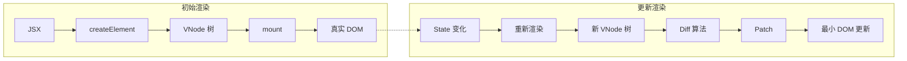

### Teact vs React 对比

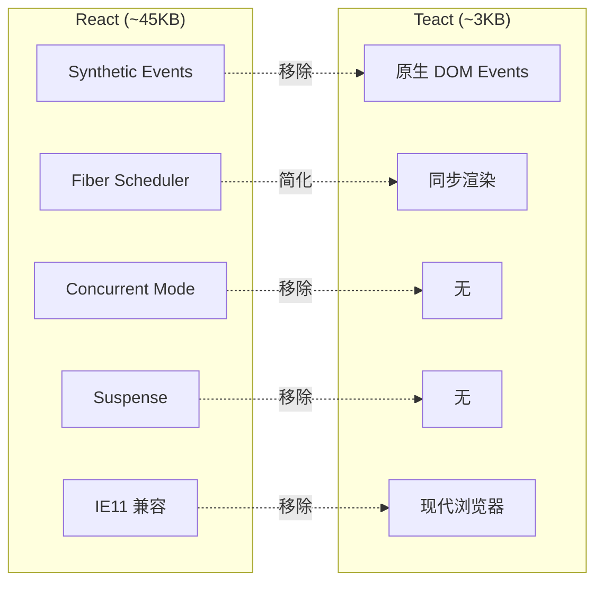

### 2.1 为什么自研框架？

| React 痛点                 | Teact 解决方案        |
| -------------------------- | --------------------- |
| 包体积大 (~45KB gzipped)   | 极致轻量 (~3KB)       |
| 兼容 IE11 等旧浏览器的代码 | 只支持现代浏览器      |
| 合成事件系统开销           | 直接使用原生 DOM 事件 |
| Fiber 调度器复杂性         | 简化的同步渲染        |
| 需要 ReactDOM              | Teact 自包含          |

### 2.2 核心 API 实现

```typescript
// src/lib/teact/teact.ts
// Teact 的核心导出，API 与 React 几乎一致

export {
  // 组件类型
  FC,

  // Hooks
  useState,
  useEffect,
  useMemo,
  useCallback,
  useRef,
  useReducer,
  useLayoutEffect,

  // 工具函数
  memo,
  Fragment,
  createElement,
};
```

### 2.3 Virtual DOM 结构

```typescript
// VNode (Virtual Node) 的数据结构
interface VirtualElement {
  type: string | Function; // 标签名或组件函数
  props: {
    children?: VirtualElement[];
    [key: string]: any;
  };
  key?: string | number;

  // 内部状态
  $el?: Element; // 真实 DOM 引用
  $children?: VirtualElement[];
  $componentInstance?: ComponentInstance;
}

// 组件实例
interface ComponentInstance {
  state: any[]; // useState 的状态数组
  effects: Effect[]; // useEffect 的副作用
  refs: any[]; // useRef 的引用
  isMounted: boolean;
}
```

### 2.4 Hooks 实现原理

Teact 的 Hooks 实现遵循 React 的**调用顺序规则**：

```typescript
// useState 的简化实现
let currentComponent: ComponentInstance | null = null;
let hookIndex = 0;

export function useState<T>(initialValue: T): [T, (v: T) => void] {
  const component = currentComponent!;
  const index = hookIndex++;

  // 首次渲染时初始化
  if (component.state[index] === undefined) {
    component.state[index] = initialValue;
  }

  const setState = (newValue: T) => {
    if (component.state[index] !== newValue) {
      component.state[index] = newValue;
      scheduleUpdate(component); // 触发重渲染
    }
  };

  return [component.state[index], setState];
}

// useEffect 的简化实现
export function useEffect(effect: () => void | (() => void), deps?: any[]) {
  const component = currentComponent!;
  const index = hookIndex++;

  const prevEffect = component.effects[index];
  const hasChanged =
    !prevEffect || !deps || deps.some((dep, i) => dep !== prevEffect.deps?.[i]);

  if (hasChanged) {
    // 清理上一次的副作用
    prevEffect?.cleanup?.();

    // 调度新的副作用（异步执行）
    queueMicrotask(() => {
      const cleanup = effect();
      component.effects[index] = { deps, cleanup };
    });
  }
}
```

### 2.5 调和算法 (Reconciliation)

Teact 使用简化的 Diff 算法：

```typescript
// src/lib/teact/reconciliation.ts

function reconcileChildren(
  parentEl: Element,
  prevChildren: VNode[],
  nextChildren: VNode[],
) {
  const maxLength = Math.max(prevChildren.length, nextChildren.length);

  for (let i = 0; i < maxLength; i++) {
    const prev = prevChildren[i];
    const next = nextChildren[i];

    if (!next) {
      // 删除多余节点
      unmount(prev);
    } else if (!prev) {
      // 新增节点
      mount(next, parentEl);
    } else if (prev.type !== next.type) {
      // 类型不同，替换
      replace(prev, next, parentEl);
    } else if (prev.key !== next.key) {
      // Key 不同，替换
      replace(prev, next, parentEl);
    } else {
      // 更新现有节点
      patch(prev, next);
    }
  }
}

function patch(prev: VNode, next: VNode) {
  // 复用 DOM 节点
  next.$el = prev.$el;

  // 更新属性
  updateProps(prev.$el, prev.props, next.props);

  // 递归更新子节点
  if (typeof next.type === 'string') {
    reconcileChildren(next.$el, prev.props.children, next.props.children);
  }
}
```

### 2.6 memo 优化

```typescript
// memo 实现 - 浅比较 props 跳过重渲染
export function memo<P>(
  Component: FC<P>,
  areEqual?: (prev: P, next: P) => boolean,
): FC<P> {
  const compare = areEqual || shallowEqual;

  return function MemoizedComponent(props: P) {
    const prevProps = useRef<P>();
    const prevResult = useRef<VNode>();

    if (prevProps.current && compare(prevProps.current, props)) {
      return prevResult.current!;
    }

    prevProps.current = props;
    prevResult.current = Component(props);
    return prevResult.current;
  };
}

function shallowEqual(a: any, b: any): boolean {
  if (a === b) return true;

  const keysA = Object.keys(a);
  const keysB = Object.keys(b);

  if (keysA.length !== keysB.length) return false;

  return keysA.every((key) => a[key] === b[key]);
}
```

---

## 3. 全局状态管理

Telegram Web Z 使用自研的**类 Redux**状态管理系统，但更轻量。

### 状态流转图

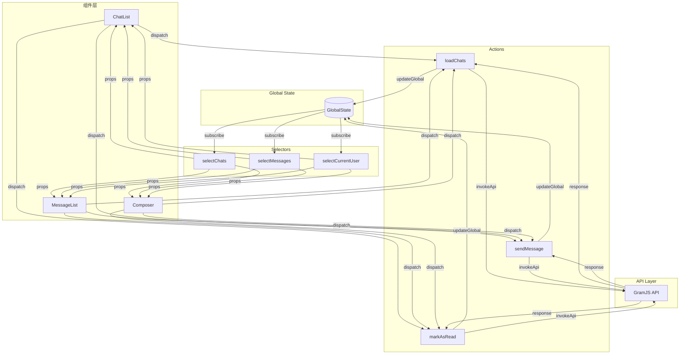

### 单向数据流

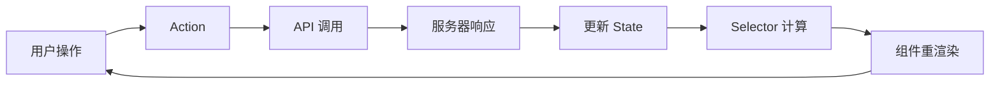

### 3.1 架构概览

```text
┌─────────────────────────────────────────────────────────┐
│                     GlobalState                          │
│  {                                                       │
│    users: Map<userId, User>,                            │
│    chats: Map<chatId, Chat>,                            │
│    messages: Map<chatId, Message[]>,                    │
│    currentUserId: string,                               │
│    activeChatId: string,                                │
│    ...                                                   │
│  }                                                       │
└──────────────────────┬──────────────────────────────────┘
                       │
         ┌─────────────┼─────────────┐
         ▼             ▼             ▼
┌─────────────┐ ┌─────────────┐ ┌─────────────┐
│   Actions   │ │  Reducers   │ │  Selectors  │
│             │ │             │ │             │
│ • sendMsg   │ │ • messages  │ │ • getChat   │
│ • loadChats │ │ • chats     │ │ • getUser   │
│ • openChat  │ │ • ui        │ │ • getMsgs   │
└─────────────┘ └─────────────┘ └─────────────┘
```

### 3.2 核心 API

```typescript
// src/global/index.ts

// 获取全局状态
export function getGlobal(): GlobalState {
  return globalState;
}

// 更新全局状态
export function setGlobal(newState: GlobalState): void {
  globalState = newState;
  notifyListeners();  // 通知所有订阅者
}

// 部分更新（类似 immer）
export function updateGlobal(updater: (state: GlobalState) => GlobalState): void {
  setGlobal(updater(getGlobal()));
}

// 连接组件到状态
export function withGlobal<P, S>(
  mapStateToProps: (global: GlobalState, ownProps: P) => S
) {
  return (Component: FC<P & S>) => {
    return function ConnectedComponent(props: P) {
      const [mappedState, setMappedState] = useState(() =>
        mapStateToProps(getGlobal(), props)
      );

      useEffect(() => {
        return subscribeToGlobal(() => {
          const newState = mapStateToProps(getGlobal(), props);
          if (!shallowEqual(mappedState, newState)) {
            setMappedState(newState);
          }
        });
      }, [props]);

      return <Component {...props} {...mappedState} />;
    };
  };
}
```

### 3.3 Actions 定义

```typescript
// src/global/actions/api/messages.ts

export async function sendMessage({
  chatId,
  text,
  replyToMessageId,
}: {
  chatId: string;
  text: string;
  replyToMessageId?: number;
}) {
  const global = getGlobal();

  // 1. 乐观更新 - 立即显示消息（本地临时ID）
  const localMessage = createLocalMessage(chatId, text);
  updateGlobal((state) => ({
    ...state,
    messages: {
      ...state.messages,
      [chatId]: [...(state.messages[chatId] || []), localMessage],
    },
  }));

  // 2. 发送到服务器
  try {
    const result = await callApi('sendMessage', {
      chat: buildInputPeer(chatId),
      message: text,
      replyTo: replyToMessageId,
    });

    // 3. 用服务器返回的真实消息替换本地消息
    updateGlobal((state) => {
      const messages = state.messages[chatId].map((msg) =>
        msg.id === localMessage.id ? result : msg,
      );
      return { ...state, messages: { ...state.messages, [chatId]: messages } };
    });
  } catch (error) {
    // 4. 失败时标记消息为发送失败
    markMessageFailed(localMessage.id);
  }
}
```

### 3.4 Selectors（派生状态）

```typescript
// src/global/selectors/messages.ts

// 使用 memoization 避免重复计算
export const selectChatMessages = memoize(
  (global: GlobalState, chatId: string): Message[] => {
    return global.messages[chatId] || [];
  },
);

export const selectVisibleMessages = memoize(
  (
    global: GlobalState,
    chatId: string,
    viewportTop: number,
    viewportBottom: number,
  ): Message[] => {
    const messages = selectChatMessages(global, chatId);

    // 只返回可见区域内的消息
    return messages.filter((msg) => {
      const top = msg.offsetTop;
      const bottom = top + msg.height;
      return bottom > viewportTop && top < viewportBottom;
    });
  },
);
```

---

## 4. Web Worker 架构

GramJS（MTProto 实现）运行在独立的 Web Worker 中，避免阻塞主线程。

### 主线程与 Worker 通信时序

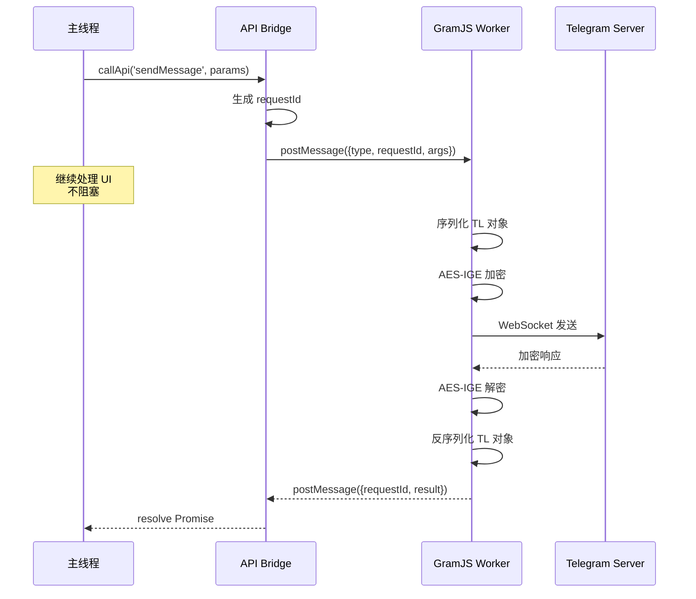

### Worker 线程分工

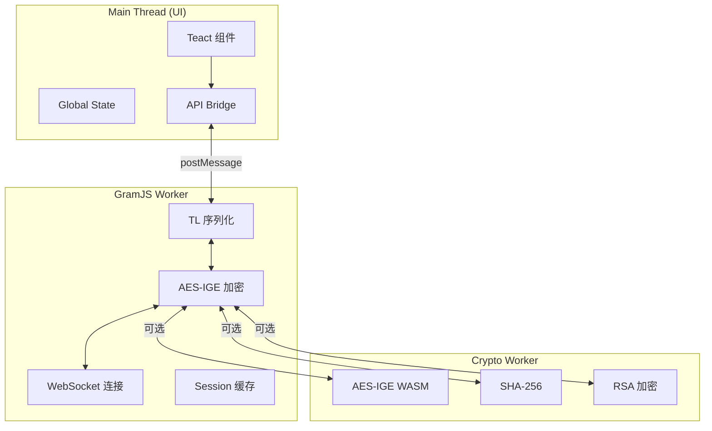

### 4.1 架构图

```text
┌────────────────────────────────────────────────────────┐
│                     Main Thread                         │
│                                                         │
│  ┌─────────────┐  ┌─────────────┐  ┌─────────────┐    │
│  │    Teact    │  │   Global    │  │     UI      │    │
│  │  Component  │  │    State    │  │  Rendering  │    │
│  └──────┬──────┘  └──────┬──────┘  └─────────────┘    │
│         │                │                              │
│         │  callApi()     │                              │
│         ▼                ▼                              │
│  ┌───────────────────────────────────────────────────┐ │
│  │              API Bridge (src/api/gramjs/)          │ │
│  │                                                     │ │
│  │  const result = await callApi('sendMessage', {     │ │
│  │    chat: ...,                                       │ │
│  │    message: text,                                   │ │
│  │  });                                                │ │
│  └──────────────────────┬────────────────────────────┘ │
└─────────────────────────┼──────────────────────────────┘
                          │ postMessage()
                          ▼
┌─────────────────────────────────────────────────────────┐
│                    API Worker                            │
│                                                          │
│  ┌───────────────────────────────────────────────────┐  │
│  │                    GramJS                          │  │
│  │  ┌─────────────────────────────────────────────┐  │  │
│  │  │  TelegramClient                              │  │  │
│  │  │  • MTProto 2.0 协议                          │  │  │
│  │  │  • AES-256-IGE 加密                          │  │  │
│  │  │  • WebSocket 连接                            │  │  │
│  │  │  • 自动重连机制                              │  │  │
│  │  └─────────────────────────────────────────────┘  │  │
│  └───────────────────────────────────────────────────┘  │
└─────────────────────────────────────────────────────────┘
```

### 4.2 Worker 通信协议

```typescript
// 主线程 → Worker
interface ApiRequest {
  type: 'callMethod';
  messageId: number; // 用于匹配响应
  name: string; // API 方法名
  args: any[]; // 参数
}

// Worker → 主线程
interface ApiResponse {
  type: 'methodResponse';
  messageId: number;
  result?: any;
  error?: string;
}

interface ApiUpdate {
  type: 'update';
  update: TelegramUpdate; // 服务器推送的更新
}
```

### 4.3 callApi 实现

```typescript
// src/api/gramjs/provider.ts

const pendingRequests = new Map<
  number,
  {
    resolve: (value: any) => void;
    reject: (error: Error) => void;
  }
>();

let messageIdCounter = 0;

export function callApi<T>(name: string, ...args: any[]): Promise<T> {
  return new Promise((resolve, reject) => {
    const messageId = ++messageIdCounter;

    pendingRequests.set(messageId, { resolve, reject });

    worker.postMessage({
      type: 'callMethod',
      messageId,
      name,
      args,
    });
  });
}

// 监听 Worker 响应
worker.onmessage = (event: MessageEvent) => {
  const { data } = event;

  if (data.type === 'methodResponse') {
    const pending = pendingRequests.get(data.messageId);
    if (pending) {
      pendingRequests.delete(data.messageId);
      if (data.error) {
        pending.reject(new Error(data.error));
      } else {
        pending.resolve(data.result);
      }
    }
  } else if (data.type === 'update') {
    // 处理服务器推送的更新
    handleUpdate(data.update);
  }
};
```

### 4.4 Worker 端实现

```typescript
// src/api/gramjs/worker/index.ts

import { TelegramClient } from 'telegram';
import { StringSession } from 'telegram/sessions';

let client: TelegramClient | null = null;

self.onmessage = async (event: MessageEvent<ApiRequest>) => {
  const { type, messageId, name, args } = event.data;

  if (type === 'callMethod') {
    try {
      const method = methods[name];
      if (!method) {
        throw new Error(`Unknown method: ${name}`);
      }

      const result = await method(client!, ...args);

      self.postMessage({
        type: 'methodResponse',
        messageId,
        result,
      });
    } catch (error) {
      self.postMessage({
        type: 'methodResponse',
        messageId,
        error: error.message,
      });
    }
  }
};

// 监听服务器更新
client.addEventHandler((update) => {
  self.postMessage({
    type: 'update',
    update: serializeUpdate(update),
  });
});
```

---

## 5. 消息列表虚拟滚动

聊天消息列表是 Telegram 的核心，Web Z 实现了高性能的虚拟滚动。

### 虚拟滚动原理图

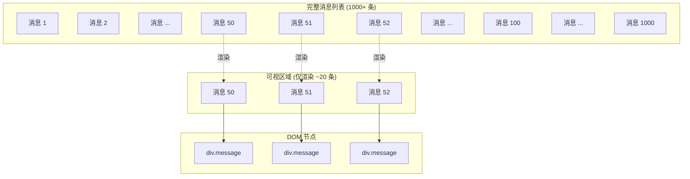

### 滚动事件处理流程

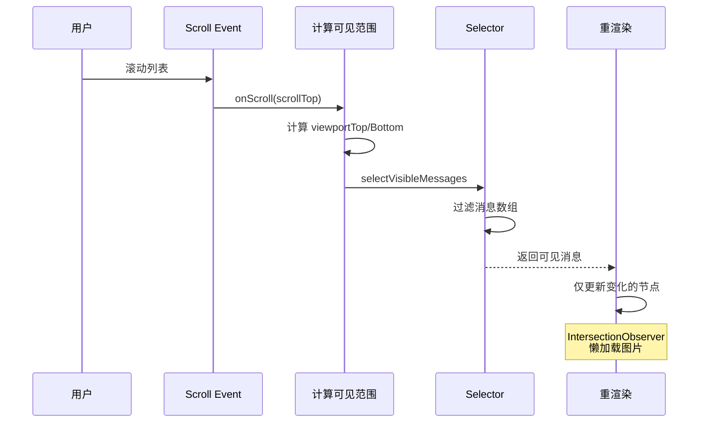

### 5.1 核心组件结构

```typescript
// src/components/middle/MessageList.tsx

const MessageList: FC<Props> = ({ chatId }) => {
  const containerRef = useRef<HTMLDivElement>(null);
  const [viewportOffset, setViewportOffset] = useState({ top: 0, bottom: 0 });

  // 只获取可见区域的消息
  const visibleMessages = useSelector((global) =>
    selectVisibleMessages(global, chatId, viewportOffset.top, viewportOffset.bottom)
  );

  // 监听滚动
  const handleScroll = useCallback(() => {
    const container = containerRef.current!;
    setViewportOffset({
      top: container.scrollTop,
      bottom: container.scrollTop + container.clientHeight,
    });
  }, []);

  // 使用 IntersectionObserver 懒加载
  useIntersectionObserver(containerRef, handleIntersection);

  return (
    <div
      ref={containerRef}
      className="MessageList"
      onScroll={handleScroll}
    >
      {/* 顶部占位符 - 表示上方未渲染的消息 */}
      <div style={{ height: topPlaceholderHeight }} />

      {/* 只渲染可见消息 */}
      {visibleMessages.map(message => (
        <Message
          key={message.id}
          message={message}
        />
      ))}

      {/* 底部占位符 */}
      <div style={{ height: bottomPlaceholderHeight }} />
    </div>
  );
};
```

### 5.2 消息高度计算

```typescript
// 消息高度预估和缓存
const messageHeightCache = new Map<number, number>();

function estimateMessageHeight(message: Message): number {
  // 先检查缓存
  if (messageHeightCache.has(message.id)) {
    return messageHeightCache.get(message.id)!;
  }

  // 根据内容类型估算
  let height = 40; // 基础高度（头像、边距等）

  if (message.text) {
    // 估算文本行数
    const lines = Math.ceil(message.text.length / 40);
    height += lines * 20;
  }

  if (message.photo) {
    height += message.photo.height * (300 / message.photo.width);
  }

  if (message.video) {
    height += 200;
  }

  return height;
}

// 渲染后记录真实高度
function onMessageRendered(messageId: number, element: HTMLElement) {
  const realHeight = element.getBoundingClientRect().height;
  messageHeightCache.set(messageId, realHeight);
}
```

### 5.3 滚动位置保持

```typescript
// 加载旧消息时保持滚动位置
function loadOlderMessages() {
  const container = containerRef.current!;
  const scrollHeightBefore = container.scrollHeight;

  // 加载更多消息
  await loadMessages({ offsetId: firstMessageId, limit: 50 });

  // 恢复滚动位置
  requestAnimationFrame(() => {
    const scrollHeightDiff = container.scrollHeight - scrollHeightBefore;
    container.scrollTop += scrollHeightDiff;
  });
}
```

---

## 6. SCSS 样式系统

### 6.1 CSS 变量定义

```scss
// src/styles/_variables.scss

:root {
  // 颜色系统
  --color-primary: #3390ec;
  --color-primary-shade: #2b7cd3;
  --color-success: #4fae4e;
  --color-error: #e53935;
  --color-warning: #ffa726;

  // 背景色
  --color-background: #ffffff;
  --color-background-secondary: #f4f4f5;
  --color-background-own-message: #eeffde;

  // 文字颜色
  --color-text: #000000;
  --color-text-secondary: #707579;
  --color-text-meta: #9e9e9e;

  // 尺寸
  --border-radius-messages: 0.75rem;
  --border-radius-cards: 0.5rem;

  // 动画
  --transition-standard: 0.15s ease-out;

  // 阴影
  --shadow-popup: 0 0.25rem 0.5rem rgba(0, 0, 0, 0.12);
}

// 暗色主题
html.theme-dark {
  --color-primary: #8774e1;
  --color-background: #212121;
  --color-background-secondary: #181818;
  --color-text: #ffffff;
}
```

### 6.2 Mixins

```scss
// src/styles/_mixins.scss

// 文本截断
@mixin text-ellipsis {
  overflow: hidden;
  text-overflow: ellipsis;
  white-space: nowrap;
}

// 多行截断
@mixin line-clamp($lines) {
  display: -webkit-box;
  -webkit-line-clamp: $lines;
  -webkit-box-orient: vertical;
  overflow: hidden;
}

// 点击效果
@mixin clickable {
  cursor: pointer;
  user-select: none;

  &:active {
    transform: scale(0.98);
  }
}

// 触摸反馈 (移动端)
@mixin touch-ripple {
  position: relative;
  overflow: hidden;

  &::after {
    content: '';
    position: absolute;
    inset: 0;
    background: currentColor;
    opacity: 0;
    transition: opacity 0.2s;
  }

  &:active::after {
    opacity: 0.05;
  }
}
```

### 6.3 组件样式示例

```scss
// src/components/middle/message/Message.module.scss

.Message {
  display: flex;
  padding: 0.25rem 0.5rem;

  &.own {
    flex-direction: row-reverse;

    .bubble {
      background: var(--color-background-own-message);
    }
  }

  .avatar {
    width: 2.25rem;
    height: 2.25rem;
    border-radius: 50%;
    flex-shrink: 0;
  }

  .bubble {
    max-width: 30rem;
    padding: 0.375rem 0.5rem;
    border-radius: var(--border-radius-messages);
    background: var(--color-background-secondary);

    // 消息尾巴
    &::before {
      content: '';
      position: absolute;
      // ... 三角形尾巴样式
    }
  }

  .content {
    .text {
      word-break: break-word;
      white-space: pre-wrap;
    }

    .media {
      max-width: 100%;
      border-radius: 0.5rem;
    }
  }

  .meta {
    display: flex;
    align-items: center;
    gap: 0.25rem;
    font-size: 0.75rem;
    color: var(--color-text-meta);

    .time {
      @include text-ellipsis;
    }

    .status {
      display: flex;

      // 双勾动画
      .check {
        &:nth-child(2) {
          margin-left: -0.25rem;
          animation: checkAppear 0.2s ease-out;
        }
      }
    }
  }
}

@keyframes checkAppear {
  from {
    opacity: 0;
    transform: translateX(-4px);
  }
  to {
    opacity: 1;
    transform: translateX(0);
  }
}
```

---

## 7. Webpack 构建配置

### 7.1 核心配置

```typescript
// webpack.config.ts

import path from 'path';
import webpack from 'webpack';
import HtmlWebpackPlugin from 'html-webpack-plugin';
import MiniCssExtractPlugin from 'mini-css-extract-plugin';
import TerserPlugin from 'terser-webpack-plugin';
import CssMinimizerPlugin from 'css-minimizer-webpack-plugin';

const isDev = process.env.NODE_ENV === 'development';

const config: webpack.Configuration = {
  entry: './src/index.tsx',

  output: {
    path: path.resolve(__dirname, 'dist'),
    filename: isDev ? '[name].js' : '[name].[contenthash].js',
    chunkFilename: isDev ? '[name].chunk.js' : '[name].[contenthash].chunk.js',
    publicPath: '/',
    clean: true,
  },

  resolve: {
    extensions: ['.ts', '.tsx', '.js', '.jsx'],
    alias: {
      '@': path.resolve(__dirname, 'src'),
    },
  },

  module: {
    rules: [
      // TypeScript
      {
        test: /\.tsx?$/,
        use: 'ts-loader',
        exclude: /node_modules/,
      },

      // SCSS Modules
      {
        test: /\.module\.scss$/,
        use: [
          isDev ? 'style-loader' : MiniCssExtractPlugin.loader,
          {
            loader: 'css-loader',
            options: {
              modules: {
                localIdentName: isDev ? '[name]__[local]' : '[hash:base64:8]',
              },
            },
          },
          'sass-loader',
        ],
      },

      // 全局 SCSS
      {
        test: /\.scss$/,
        exclude: /\.module\.scss$/,
        use: [
          isDev ? 'style-loader' : MiniCssExtractPlugin.loader,
          'css-loader',
          'sass-loader',
        ],
      },

      // WebAssembly
      {
        test: /\.wasm$/,
        type: 'asset/resource',
      },

      // Worker
      {
        test: /\.worker\.ts$/,
        use: {
          loader: 'worker-loader',
          options: { inline: 'no-fallback' },
        },
      },
    ],
  },

  plugins: [
    new HtmlWebpackPlugin({
      template: './public/index.html',
    }),

    !isDev &&
      new MiniCssExtractPlugin({
        filename: '[name].[contenthash].css',
      }),

    new webpack.DefinePlugin({
      'process.env.NODE_ENV': JSON.stringify(process.env.NODE_ENV),
    }),
  ].filter(Boolean),

  optimization: {
    splitChunks: {
      chunks: 'all',
      cacheGroups: {
        vendor: {
          test: /[\\/]node_modules[\\/]/,
          name: 'vendors',
          priority: 10,
        },
        gramjs: {
          test: /[\\/]lib[\\/]gramjs[\\/]/,
          name: 'gramjs',
          priority: 20,
        },
        teact: {
          test: /[\\/]lib[\\/]teact[\\/]/,
          name: 'teact',
          priority: 20,
        },
      },
    },

    minimizer: [
      new TerserPlugin({
        terserOptions: {
          compress: {
            drop_console: true,
          },
        },
      }),
      new CssMinimizerPlugin(),
    ],
  },

  devServer: {
    port: 1234,
    hot: true,
    historyApiFallback: true,
  },
};

export default config;
```

### 7.2 代码分割策略

```typescript
// 路由级懒加载
const Settings = lazy(() => import('./components/settings/Settings'));
const MediaViewer = lazy(() => import('./components/media/MediaViewer'));

// 功能级懒加载
async function loadEmojiData() {
  const { default: emojiData } = await import('./lib/emoji/data');
  return emojiData;
}

// WASM 模块懒加载
async function initRLottie() {
  const rlottieModule = await import('./lib/rlottie/rlottie.wasm');
  await rlottieModule.default();
}
```

---

## 8. 性能优化技巧

### 性能优化策略全景

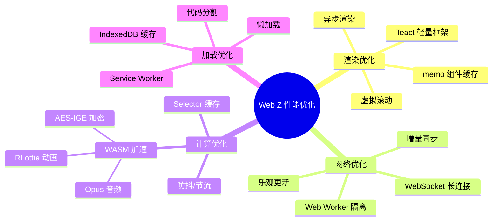

### 登录认证流程

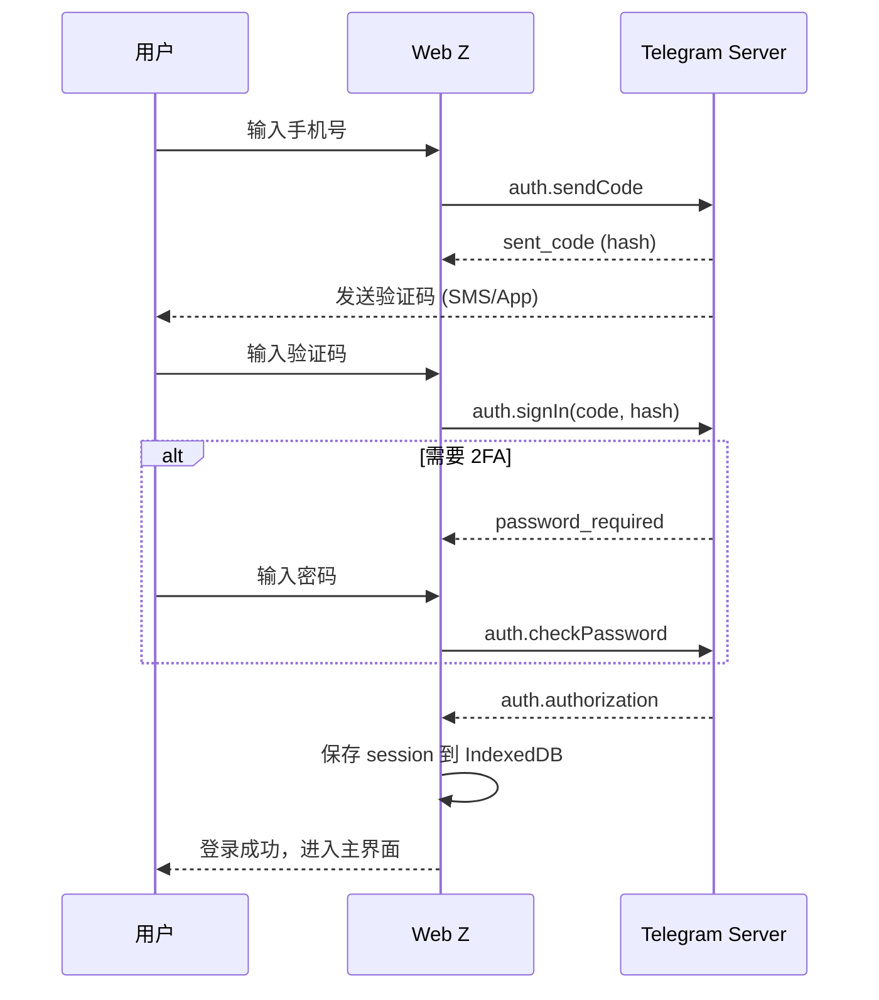

### 消息发送完整流程

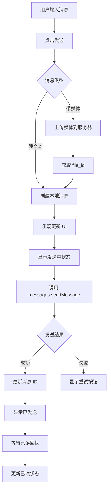

### 8.1 调度器设计

```typescript
// src/util/schedulers.ts

// 使用 requestIdleCallback 执行低优先级任务
export function onIdle(callback: () => void): void {
  if ('requestIdleCallback' in window) {
    requestIdleCallback(callback);
  } else {
    setTimeout(callback, 100);
  }
}

// 使用 requestAnimationFrame 执行视觉更新
export function onNextFrame(callback: () => void): void {
  requestAnimationFrame(callback);
}

// 防抖
export function debounce<T extends (...args: any[]) => void>(
  fn: T,
  ms: number,
): T {
  let timeoutId: number;

  return ((...args: any[]) => {
    clearTimeout(timeoutId);
    timeoutId = window.setTimeout(() => fn(...args), ms);
  }) as T;
}

// 节流
export function throttle<T extends (...args: any[]) => void>(
  fn: T,
  ms: number,
): T {
  let lastCall = 0;

  return ((...args: any[]) => {
    const now = Date.now();
    if (now - lastCall >= ms) {
      lastCall = now;
      fn(...args);
    }
  }) as T;
}
```

### 8.2 图片懒加载

```typescript
// src/hooks/useIntersectionObserver.ts

export function useIntersectionObserver(
  ref: RefObject<HTMLElement>,
  callback: (entry: IntersectionObserverEntry) => void,
  options?: IntersectionObserverInit
) {
  useEffect(() => {
    const element = ref.current;
    if (!element) return;

    const observer = new IntersectionObserver(
      (entries) => entries.forEach(callback),
      {
        rootMargin: '100px', // 提前 100px 开始加载
        ...options,
      }
    );

    observer.observe(element);

    return () => observer.disconnect();
  }, [ref, callback, options]);
}

// 使用示例
const LazyImage: FC<{ src: string }> = ({ src }) => {
  const [isVisible, setIsVisible] = useState(false);
  const ref = useRef<HTMLDivElement>(null);

  useIntersectionObserver(ref, (entry) => {
    if (entry.isIntersecting) {
      setIsVisible(true);
    }
  });

  return (
    <div ref={ref} className="LazyImage">
      {isVisible ? (
        
      ) : (
        <div className="placeholder" />
      )}
    </div>
  );
};
```

### 8.3 快速平滑滚动

```typescript
// src/util/fastSmoothScroll.ts

export function fastSmoothScroll(
  container: HTMLElement,
  element: HTMLElement,
  position: 'start' | 'center' | 'end' = 'center',
) {
  const containerRect = container.getBoundingClientRect();
  const elementRect = element.getBoundingClientRect();

  let targetTop: number;

  switch (position) {
    case 'start':
      targetTop = element.offsetTop;
      break;
    case 'center':
      targetTop =
        element.offsetTop -
        container.clientHeight / 2 +
        element.clientHeight / 2;
      break;
    case 'end':
      targetTop =
        element.offsetTop - container.clientHeight + element.clientHeight;
      break;
  }

  // 使用 CSS scroll-behavior 或 JS 平滑滚动
  if ('scrollBehavior' in document.documentElement.style) {
    container.scrollTo({ top: targetTop, behavior: 'smooth' });
  } else {
    animateScroll(container, targetTop, 300);
  }
}

function animateScroll(
  element: HTMLElement,
  targetTop: number,
  duration: number,
) {
  const startTop = element.scrollTop;
  const diff = targetTop - startTop;
  const startTime = performance.now();

  function step(currentTime: number) {
    const elapsed = currentTime - startTime;
    const progress = Math.min(elapsed / duration, 1);
    const eased = easeOutQuad(progress);

    element.scrollTop = startTop + diff * eased;

    if (progress < 1) {
      requestAnimationFrame(step);
    }
  }

  requestAnimationFrame(step);
}

function easeOutQuad(t: number): number {
  return t * (2 - t);
}
```

---

## 9. 关键设计模式总结

| 模式              | 应用场景         | 优势               |
| ----------------- | ---------------- | ------------------ |
| **自研框架**      | Teact 替代 React | 极致轻量、完全控制 |
| **Web Worker**    | MTProto 协议处理 | 不阻塞主线程       |
| **虚拟滚动**      | 消息列表         | 支持无限消息       |
| **乐观更新**      | 发消息           | 即时反馈           |
| **CSS Variables** | 主题系统         | 运行时切换         |
| **代码分割**      | 路由/功能        | 减小首屏加载       |
| **WASM**          | 加密/动画        | 接近原生性能       |

---

## 10. 源码学习路径

1. **入门**：从 `src/index.tsx` 开始，理解应用入口
2. **框架**：深入 `src/lib/teact/`，理解 Teact 实现
3. **状态**：研究 `src/global/`，理解状态管理
4. **通信**：分析 `src/api/gramjs/worker/`，理解 Worker 架构
5. **组件**：阅读 `src/components/middle/MessageList.tsx`，理解虚拟滚动
6. **样式**：查看 `src/styles/`，学习 SCSS 组织方式

---

> **🔗 源码参考**：
>
> - [telegram-tt (Web Z)](https://github.com/Ajaxy/telegram-tt)
> - [Teact 框架](https://github.com/nicedayc/nicedayc)
